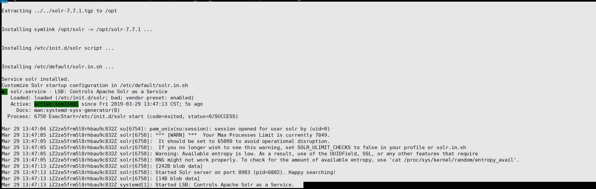
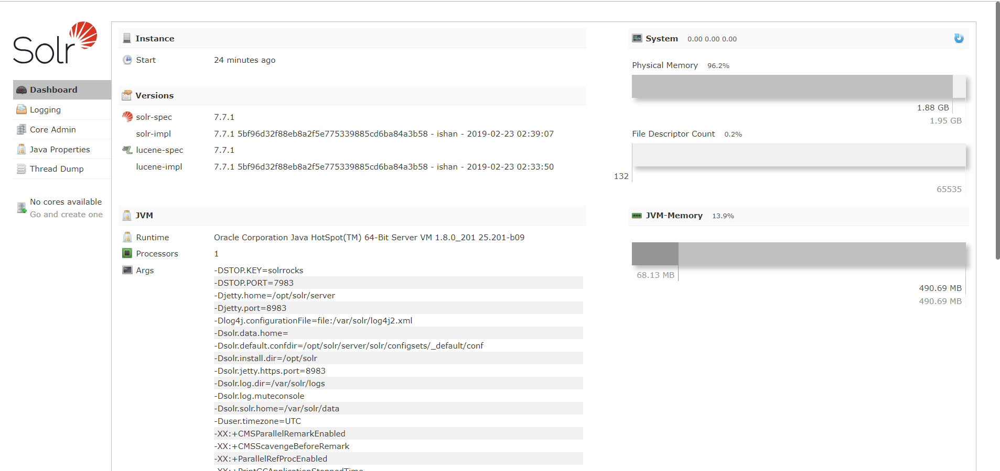

Solr的版本一直都在变化(比如之前我在博客园写的关于Linux安装solr，那个solr为7.6版本，此时已经不在了)。
大家可以去这个地址下载对应的版本:http://mirror.bit.edu.cn/apache/lucene/solr/
<!--more-->
## 1.下载solr(我是进入到/usr/local目录下执行这个命令的)
```
wget http://mirror.bit.edu.cn/apache/lucene/solr/7.7.1/solr-7.7.1.tgz

```

## 2.解压
```
tar -xzvf solr-7.7.1.tgz

```

## 3.进入bin目录执行该脚本
```
cd solr-7.7.1/bin
./install_solr_service.sh ../../solr-7.7.1.tgz

```

如果没有按照3这样做，就可能出现如下报错:
```
ERROR: Must specify the path to the Solr installation archive, such as solr-5.0.0.tgz


Usage: install_solr_service.sh <path_to_solr_distribution_archive> [OPTIONS]

  The first argument to the script must be a path to a Solr distribution archive, such as solr-5.0.0.tgz
    (only .tgz or .zip are supported formats for the archive)

  Supported OPTIONS include:

    -d     Directory for live / writable Solr files, such as logs, pid files, and index data; defaults to /var/solr

    -i     Directory to extract the Solr installation archive; defaults to /opt/
             The specified path must exist prior to using this script.

    -p     Port Solr should bind to; default is 8983

    -s     Service name; defaults to solr

    -u     User to own the Solr files and run the Solr process as; defaults to solr
             This script will create the specified user account if it does not exist.

    -f     Upgrade Solr. Overwrite symlink and init script of previous installation.

    -n     Do not start Solr service after install, and do not abort on missing Java

 NOTE: Must be run as the root user


```

## 4.成功的标识


接下来就可以通过http://IP地址:8983 访问到solr后台管理界面,如下图所示:



