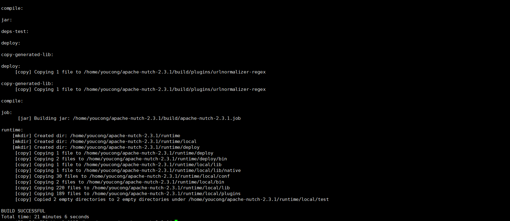

## 1.下载Nutch
```
wget http://mirrors.shu.edu.cn/apache/nutch/2.3.1/apache-nutch-2.3.1-src.zip

```

## 2.解压
```
unzip apache-nutch-2.3.1-src.zip

```

## 3.进入apache-nutch-2.3.1
```
cd apache-nutch-2.3.1

```
<!--more-->
## 4.使用ant编译
```
ant

```
编译成功，如下(不过需要比较多的时间，大概20分钟左右):



参考资料:
Ubuntu环境下搭建nutch环境(包含使用):https://blog.csdn.net/u010317005/article/details/51090175