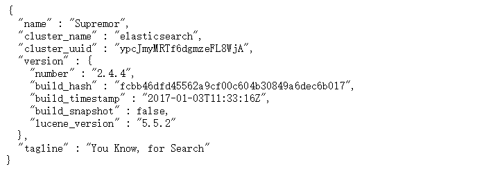

## 1.下载es
```
wget https://download.elastic.co/elasticsearch/release/org/elasticsearch/distribution/tar/elasticsearch/2.4.4/elasticsearch-2.4.4.tar.gz

```
<!--more-->
## 2.解压并将其放到/usr/local目录下
```
tar -xzvf elasticsearch-2.4.4.tar.gz -C /usr/local
cd /usr/local/elasticsearch-2.4.4

```

## 3.修改es配置文件
```
cd config
vim elasticsearch.yml
```

在elasticsearch.yml添加如下内容:
```
bootstrap.memory_lock: true
index.cache.field.max_size: 50000
index.cache.field.expire: 30m
index.cache.field.type: soft

network.host: 0.0.0.0

action.disable_delete_all_indices : true

```


## 4.启动
```
cd ../bin

//直接启动ElasticSearch
./elasticsearch 

//或者使用后台方式进行启动
./elasticsearch -d

```


## 查看端口占用
```
netstat -anp|grep 9200 或lsof -i:9200 //看该进程是否正常运行

```


出现的问题:
Exception in thread "main" Java.lang.RuntimeException: don't run elasticsearch as root.
at org.elasticsearch.bootstrap.Bootstrap.initializeNatives(Bootstrap.java:93)
at org.elasticsearch.bootstrap.Bootstrap.setup(Bootstrap.java:144)
at org.elasticsearch.bootstrap.Bootstrap.init(Bootstrap.java:270)
at org.elasticsearch.bootstrap.Elasticsearch.main(Elasticsearch.java:35)

解决办法一:
添加用户并授权
```
user add test
chown -R test /usr/local/elasticsearch-2.4.4

```

解决办法二:
```
./elasticsearch -Des.insecure.allow.root=true
或者
vi elasticsearch

// 找到ES_JAVA_OPTS在其后追加
ES_JAVA_OPTS="-Des.insecure.allow.root=true" 

```

本人建议使用第一种方法，因为最好不要习惯用root用户，否则一旦不慎执行某些操作，后果很严重。


## 5.网站访问
http://IP地址:9200
出现如图所示:



参考资料:
【Linux进阶】Ubuntu 16.04安装ElasticSearch:https://blog.csdn.net/u011404265/article/details/72870166

