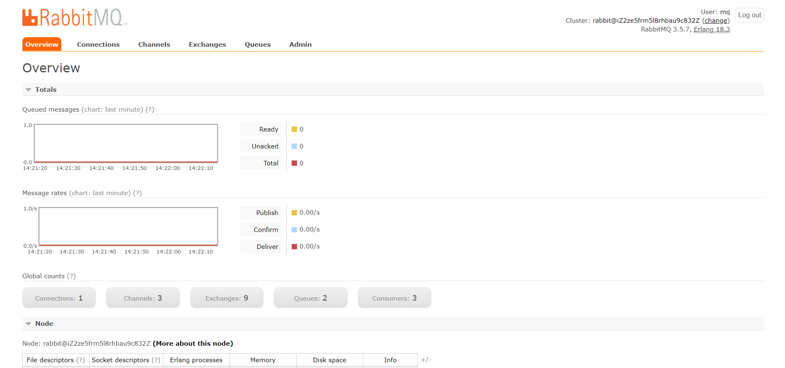

### 1.RabbitMQ安装前需要erlang环境
```
apt-get install erlang-nox     # 安装erlang
erl    # 查看relang语言版本，成功执行则说明relang安装成功

```
<!--more-->
### 2.添加公钥
```
wget -O- https://www.rabbitmq.com/rabbitmq-release-signing-key.asc | sudo apt-key add -

```

### 3.更新软件包
```
apt-get update

```

### 4.安装 RabbitMQ
```
apt-get install rabbitmq-server  #安装成功自动启动

```

### 5.查看RabbitMQ状态
```
systemctl status rabbitmq-server   #Active: active (running) 说明处于运行状态

# service rabbitmq-server status 用service指令也可以查看，同systemctl指令

```

### 6.启动、停止、重启命令
```
service rabbitmq-server start    # 启动
service rabbitmq-server stop     # 停止
service rabbitmq-server restart  # 重启 

```

### 7.启用 web端可视化操作界面，我们还需要配置Management Plugin插件
```
rabbitmq-plugins enable rabbitmq_management   # 启用插件
service rabbitmq-server restart    # 重启

```

效果图如下:


### 8.查看用户
```
rabbitmqctl list_users

```

### 9.添加管理用户
```
rabbitmqctl add_user admin yourpassword   # 增加普通用户
rabbitmqctl set_user_tags admin administrator    # 给普通用户分配管理员角色 

```

### 10.设置mq用户的权限，指定允许访问的vhost以及write/read
```
rabbitmqctl set_permissions -p "/" admin ".*" ".*" ".*"

```

### 11.查看vhost（/）允许哪些用户访问
```
rabbitmqctl list_permissions -p /

```


最后关于如何和SpringBoot整合，可以参考我的博客:[SpringBoot实战(八)之RabbitMQ](https://www.cnblogs.com/youcong/p/9387611.html)