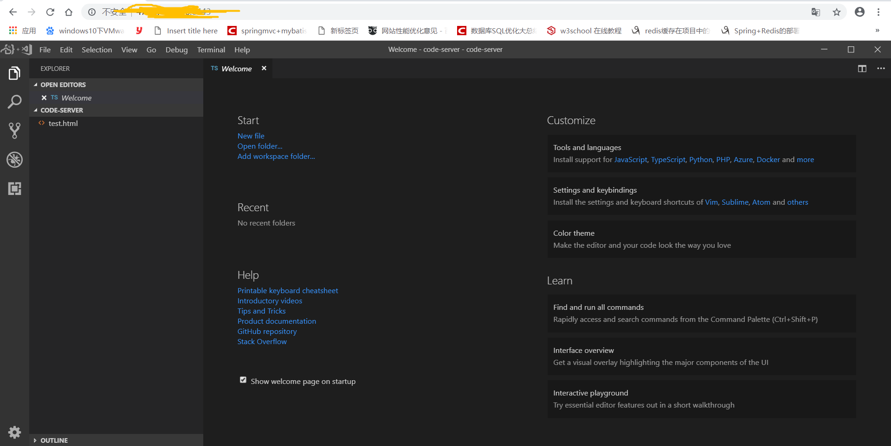

VsCode的云端版与客户端简直是一模一样。

官网地址为:https://coder.com/
<!--more-->
安装命令:
```
docker run -t -p 127.0.0.1:8443:8443 -v "${PWD}:/root/project" codercom/code-server code-server --allow-http --no-auth
```
注意安装的前提是要先安装docker，否则不能使用该命令。
如果你要远程访问请将127.0.0.1改为0.0.0.0即可
Ubuntu16.04安装docker十分容易，一条命令，如sudo apt-get install docker.io

VsCode云端版本展示效果图如下:

