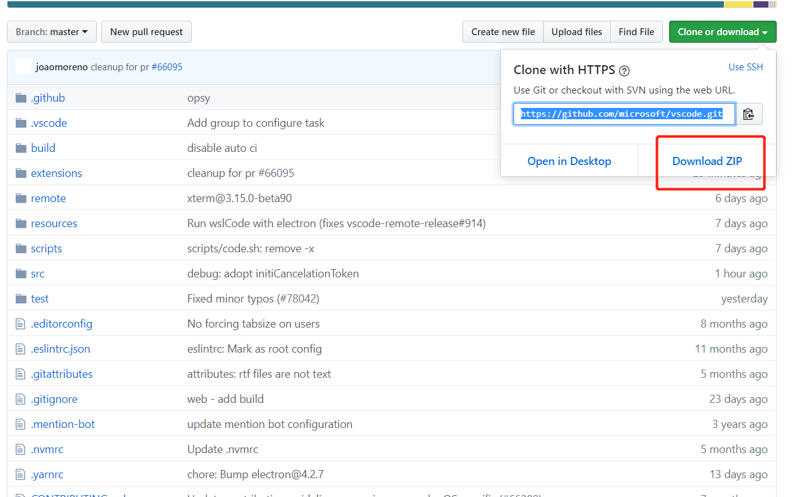
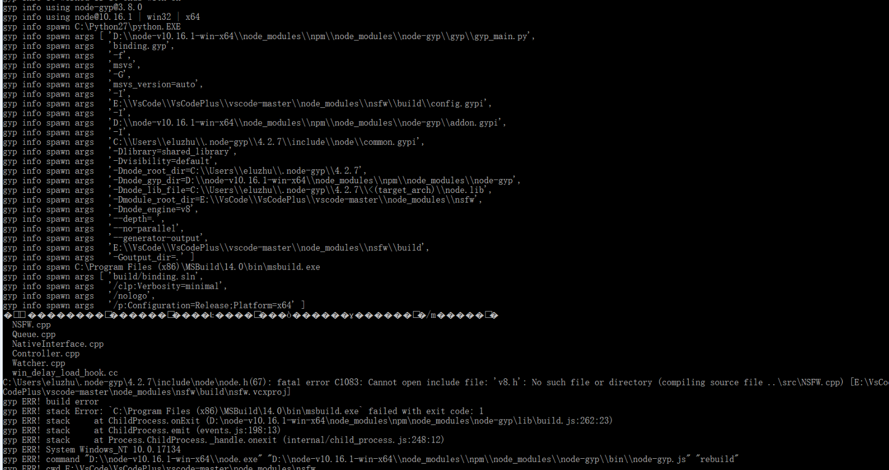
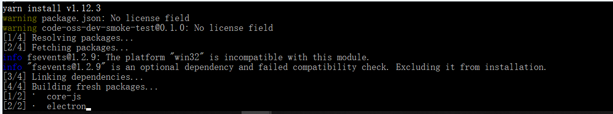

针对VsCode二次开发，有时常与官方VsCode保持更新的必要。
由于目前我们没有想到更好的办法，就通过手动的方式进行更新。
<!--more-->
更新步骤如下:

## git clone或者下载源代码
```
git clone https://github.com/microsoft/vscode.git

```
或者点击红色方块内容


通常建议点击红色方块内容下载会更快


## 重新编译、运行一遍

注意:最新版VsCode对Node.js及相关的Python环境有一定的要求，切不可忽略，不然会导致不必要的麻烦。

通常可以参考如下文档保持获取最新信息:
https://github.com/Microsoft/vscode/wiki/How-to-Contribute#build-and-run


构建运行步骤如下:
```
yarn

yarn watch

.\script\code.bat

```


通常在执行yarn的时候就可能出现问题，如图所示:


产生这个问题的原因:
我怀疑与路径的特殊字符有关，比如我之前的是:E://VsCode//VsCodePlus/vscode-master
然后我将其替换为E://VsCode//VsCodePlus/vscode 就没有出现这个问题。

但是针对其显示gyp问题，我对此下意识的使用了npm install node-gyp命令安装相关的库。

然后在执行yarn，最后会出现如下延迟:


这种延迟通常是因为网络问题，对此的解决方案如下:
(1)换个网络好的环境(至少带宽大于等于100m及其以上);
(2)当网络环境足够好的时候，还是延迟，这时恐怕你就得翻墙一下;


最后这种手动更新的方式令人讨厌，因为即便跑通了后，但是由于我们的VsCode与官方不一样(可能官方相关的写法变了，以及部分API可能不用了，导致我们会有不同程度的修改，这是一个很让人讨厌的问题，作为一个工程师是不能容忍这样的问题，只得等到工作日程不那么紧急的时候再将其攻克掉)
