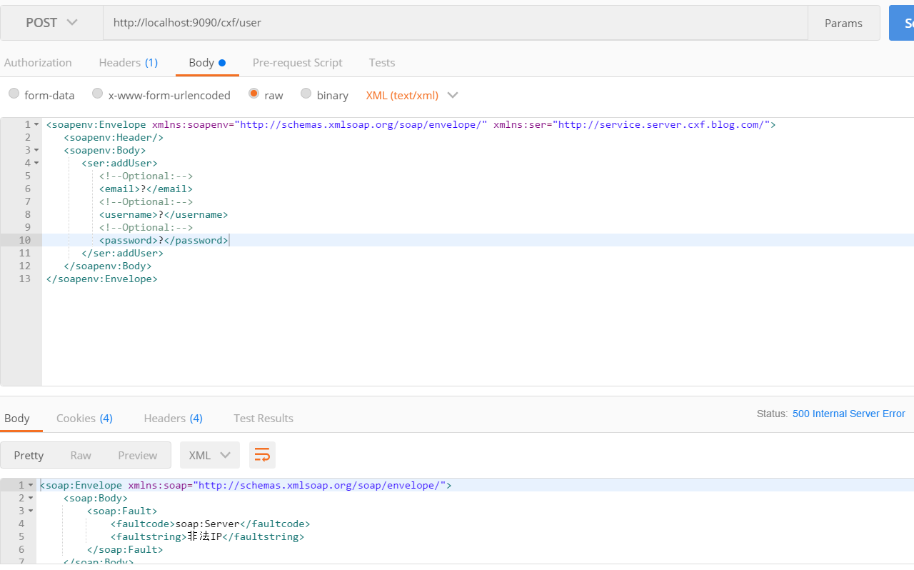
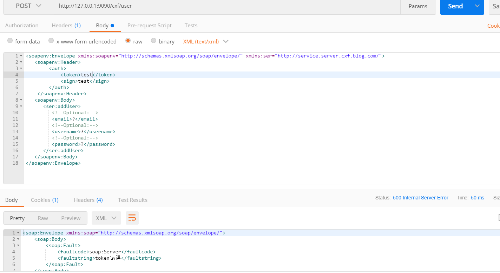
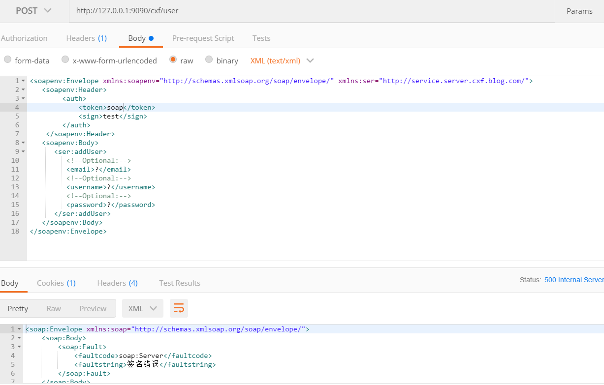
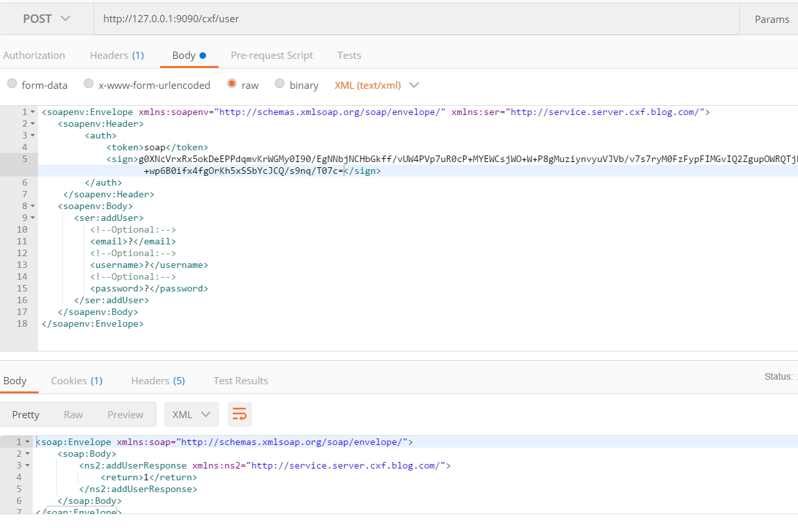

近来因业务需要，需要研究webservice，于是便有这篇文章:
[SpringBoot整合Apache-CXF实践](https://www.cnblogs.com/youcong/p/13874940.html)
<!--more-->
## 一、WebService是什么?
WebService是一个平台独立的、低耦合的、自包含的、基于可编程的web的应用程序，可使用开放的XML（标准通用标记语言下的一个子集）标准来描述、发布、发现、协调和配置这些应用程序，用于开发分布式的交互操作的应用程序。

简单概括如下:
**WebService是一种跨平台，跨语言的规范，用于不同平台，不同语言开发的应用之间的交互**。

## 二、Webservice安全机制有哪些？
由于我之前从未实际接触过WebService，对于它的安全机制不了解。于是通过搜索，**我得到了关于它的安全机制一些建议**:

- (1)对webservice发布的方法，方法名称和参数不要使用望文生义的描述；

- (2)对webservice发布的方法，在入参中增加一个或多个字符串序列(这里的字符串可以要求必须满足指定的格式，同时字符串可以再通过客户端传参数的时候加密，服务端解密)；

- (3)对webservice发布的方法，入参中加上用户名和密码，然后服务端通过数据库校验；

- (4)对webservice发布的方法，通过handler/chain方式来实现验证(用户名&密码校验/IP地址校验等)；

- (5)对webservice发布的方法，采用webservice的users.lst来进行验证；

- (6)对webservice发布的服务，通过servlet的Filter来实现验证；

- (7)对webservice传输过程中的数据进行加密；

- (8)自己写校验框架来实现webservice的安全；

- (9)其它方式.

上述是搜索方面出现毕竟频繁的，也是webservice比较普遍的方式之一。

我思虑再三决定结合以往开发HTTP应用安全经验和现有参考WebService安全机制结合起来。

**于是便有了如下的安全机制方案:**
- Token鉴权机制;
- 公私钥签名校验;
- IP白名单校验.

## 三、如何实现Token鉴权、公私钥签名校验、IP白名单校验等WebService安全方案呢？

本次代码已同步到我的Apache CXF代码例子里了，Github地址为:
https://github.com/developers-youcong/blog-cxf


### 核心代码，关键在于拦截器
```
package com.blog.cxf.server.interceptor;

import cn.hutool.core.util.StrUtil;
import com.blog.cxf.server.security.SecretKey;
import com.blog.cxf.server.utils.IpUtils;
import lombok.extern.slf4j.Slf4j;
import org.apache.cxf.binding.soap.SoapMessage;
import org.apache.cxf.headers.Header;
import org.apache.cxf.interceptor.Fault;
import org.apache.cxf.message.Message;
import org.apache.cxf.phase.AbstractPhaseInterceptor;
import org.apache.cxf.phase.Phase;
import org.apache.cxf.phase.PhaseInterceptorChain;
import org.apache.cxf.transport.http.AbstractHTTPDestination;
import org.springframework.stereotype.Component;
import org.w3c.dom.Element;
import org.w3c.dom.Node;
import org.w3c.dom.NodeList;

import javax.servlet.http.HttpServletRequest;
import java.util.HashSet;
import java.util.List;
import java.util.Properties;
import java.util.Set;

/**
 * @description: 认证鉴权拦截器
 * @author: youcong
 * @time: 2020/10/31 17:07
 */
@Slf4j
@Component
public class AuthInterceptor extends AbstractPhaseInterceptor<SoapMessage> {


    public AuthInterceptor() {
        super(Phase.PRE_INVOKE);
    }


    public void handleMessage(SoapMessage msg) throws Fault {


        Message ipVerify = PhaseInterceptorChain.getCurrentMessage();

        HttpServletRequest request = (HttpServletRequest) ipVerify.get(AbstractHTTPDestination.HTTP_REQUEST);

        //处理IP
        handleIp(request);

        Header authHeader = null;
        //获取验证头
        List<Header> headers = msg.getHeaders();

        if (headers.isEmpty()) {
            throw new Fault(new Exception("请求头为空"));
        }


        for (Header h : headers) {

            log.info("h:" + h.getName().toString().contains("auth"));
            if (h.getName().toString().contains("auth")) {
                authHeader = h;
                break;
            } else {
                throw new Fault(new Exception("请求头需包含auth"));
            }

        }

        Element auth = (Element) authHeader.getObject();

        NodeList childNodes = auth.getChildNodes();

        Set<String> reqHeader = new HashSet<String>();
        for (int i = 0; i < childNodes.getLength(); i++) {
            //处理节点
            handleNode(childNodes.item(i), reqHeader);
        }
        //处理请求Key
        handleSOAPReqHeader(reqHeader);


    }

    //处理IP
    private void handleIp(HttpServletRequest request) {


        String[] ip_arr = new String[]{"127.0.0.1", "192.168.52.50"};

        for (String str : ip_arr) {
            System.out.println("ip:" + str);
        }

        Set<String> ipSet = new HashSet<String>();

        for (String item : ip_arr) {

            ipSet.add(item);
            if (ipSet.contains(IpUtils.getIpAddr(request))) {
                log.info("合法IP:" + item);
            } else {
                throw new Fault(new Exception("非法IP"));
            }
        }


    }

    //处理节点
    private void handleNode(Node items, Set<String> reqHeader) {

        Node item = items;

        //存储请求头Key
        if (item.getLocalName() != null) {
            String str = new String(item.getLocalName());
            reqHeader.add(str);
        }

        //获取请求头token
        if (item.getNodeName().contains("token")) {
            String tokenValue = item.getTextContent();

            if (!StrUtil.isEmpty(tokenValue)) {

                if ("soap".equals(tokenValue)) {

                    log.info("token Value:" + tokenValue);
                } else {
                    throw new Fault(new Exception("token错误"));
                }

            } else {
                throw new Fault(new Exception("token不能为空"));
            }

        }

        //获取请求头sign
        if (item.getNodeName().contains("sign")) {

            String signValue = item.getTextContent();

            if (!StrUtil.isEmpty(signValue)) {

                //原数据
                String originData = "test_webservice_api_2020";

                try {

                    //比对签名
                    boolean verifySign = SecretKey.verifySign(originData, signValue);

                    log.info("verifySign:" + verifySign);

                    if (verifySign) {
                        log.info("sign Value:" + signValue);
                    } else {
                        throw new Fault(new Exception("签名错误"));
                    }
                } catch (Exception e) {
                    throw new Fault(new Exception("签名错误"));
                }


            } else {
                throw new Fault(new Exception("签名不能为空"));
            }
        }
    }

    //处理SOAP请求头Key
    private void handleSOAPReqHeader(Set<String> reqHeader) {

        if (reqHeader.contains("token")) {
            log.info("包含token");
        } else {
            throw new Fault(new Exception("请求头auth需包含token"));
        }

        if (reqHeader.contains("sign")) {
            log.info("包含sign");
        } else {
            throw new Fault(new Exception("请求头auth需包含sign"));
        }

    }


}


```

#### 1.Token鉴权的目的是什么？
每个用户生成的token不一样，获取token的接口是需要对应的用户名和密码，通过用户名和密码产生token，token放在请求头里，后台可根据token识别是哪个用户请求哪个接口，后面日志存储会提到的。

#### 2.Token的生成有哪些方案？
可以参考我写的这篇文章:[SpringCloud之Security](https://www.cnblogs.com/youcong/p/13086991.html)
这篇文章我结合了JWT。

除此之外还可以结合某种规则(用户名+密码+特殊UUID+用户注册码)生成加密的token。

#### 3.签名的目的是什么？
为了数据安全和防止重复提交。

#### 4.如何实现签名？
签名的规则有很多，可以增加某种证书公私钥，也可以时间戳。

#### 5.为什么需要IP白名单校验？
主要是为了安全，防止非法IP不停的请求，造成恶意攻击(如DOS攻击和DDOS攻击等)。

#### 6.IP白名单校验有哪些方案？
可以将IP白名单放在对应的数据表中，也可以将其放到配置文件里，还可以将其存一个数组中(就像我在上述代码所写的那样)。

#### 7.开始测试

##### (1)非法IP请求(不在数组内的IP)


##### (2)携带错误的Token请求


##### (3)携带错误的签名请求


##### (4)正确请求(token正确、签名正确、IP合法)


#### 8.证书生成方案(公私钥)
这一块我主要参考了这篇文章，这篇文章很完整，大家可以参考一下:
[Java 证书(keytool实例)代码实现加解密、加签、验签](https://www.cnblogs.com/molao-doing/articles/9704278.html)

生成证书核心两条命令，如下(注意，其中的密码之类的，改成自己的):
```
## 生成私钥
keytool -genkey -alias yunbo2 -keypass 123456 -keyalg RSA -keysize 1024 -validity 3650 -keystore merKey.jks -storepass abc@2018 -dname "CN=localhost,OU=localhost, O=localhost, L=深圳, ST=广东, C=CN"

## 生成公钥
keytool -export -alias yunbo2 -keystore merKey.jks -file yunbo2.cer

```

#### 9.数据加密
数据加密主要体现在对请求体内的数据进行base64加密或者是其他的加密方式。

#### 10.补充说明
之前搜索了不少文章提到过，请求头或者请求体传输用户名和密码，我个人觉得用户名和密码传输太过频繁并不安全，因此我选择了token，选择了多一步（通过用户名和密码拿到token,再通过token请求对其它业务webservice等）。

## 四、总结
技术往往有很多相似之处，可以复用和借鉴。之前在研究Apache CXF安全机制的时候，发现并没有那么多的资料可供参考，于是我换了一个思路，Apache CXF框架本质上就是对WebService简化，方便开发人员使用而不用配置一堆东西。我把核心聚焦在webservice安全，然后在发散，就有了这篇文章。
简单的概括一点:
**遇到难题不要钻牛角尖，可以尝试换一个思路(发散自己的思维)来解决这个难题。**


