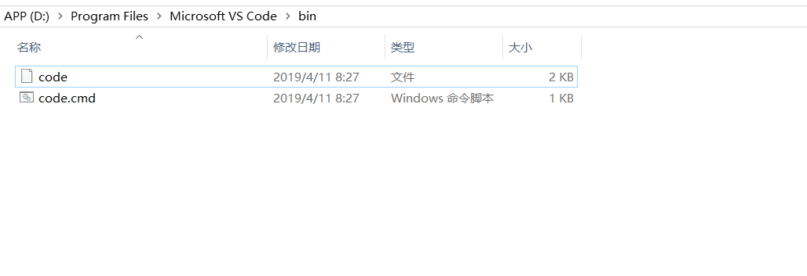

错误信息:code: command not found'

解决办法:
配置VsCode环境变量
<!--more-->
首先找到VsCode点击其属性，查看路径

进入这个路径后

将D:\Program Files\Microsoft VS Code\bin添加到环境变量即可

code这个命令很重要，比如最近我做的一个叫作根据vscode插件名称去对应的插件市场下载插件就需要用到code命令。