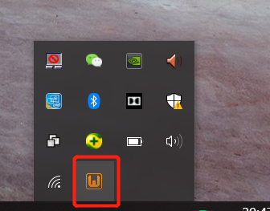
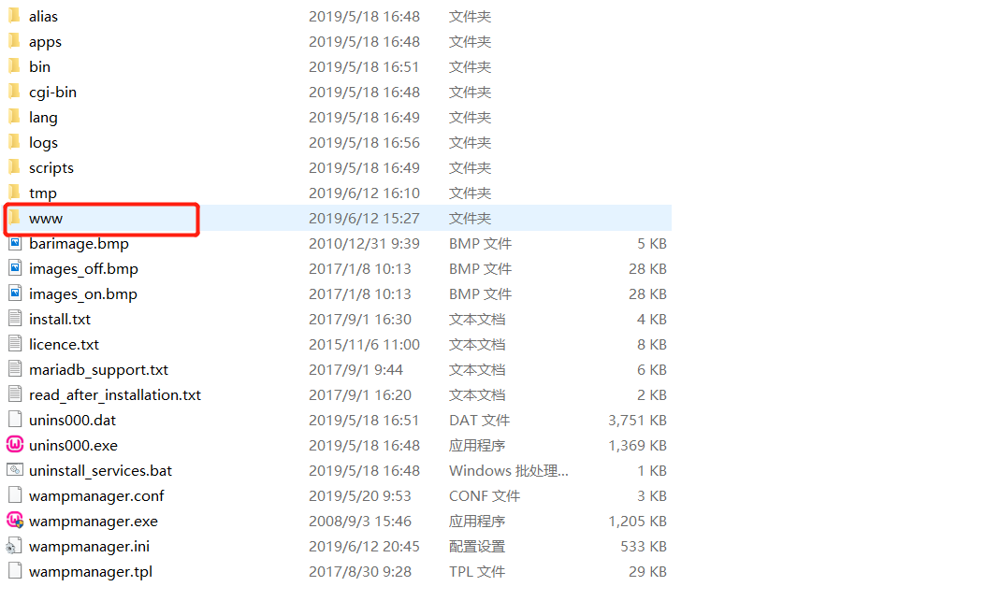
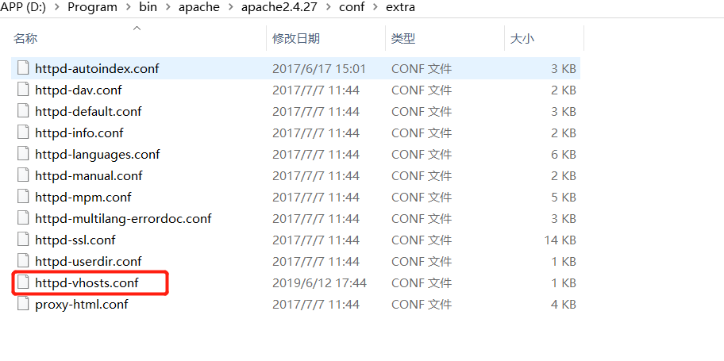
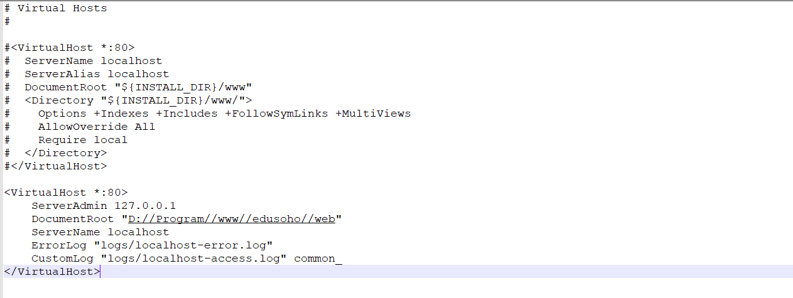
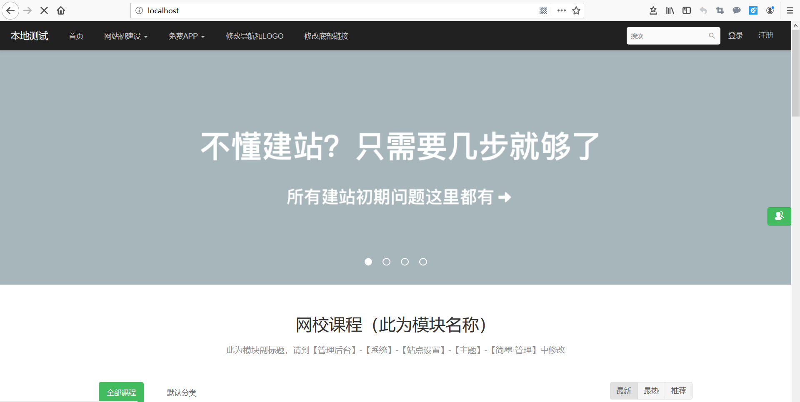

Windows搭建Edusoho比Linux还要轻松的多。因为有很多环境集成工具如xampp、wampserver、phpstudy等。
基本上安装号wampserver工具，直接将edusoho项目扔到www目录地下并配置即可。

**另外为什么要本地搭建呢？**
本地搭建的目的是方便调试。当然了也不排除有部分公司在Linux系统上完全使用命令行的方式开发应用程序。

步骤如下:
<!--more-->
## 去官方网站下载最新的源码包
官方网站地址为http://www.edusoho.com/open/show

## Windows搭建LAMP/LNMP环境
环境就没有必要从头开始搭建了，文章开头说过已经有很多工具帮你集成这一套了。
我在这里使用的是WanmpServer。WampServer大家可以使用360软件管家去下载。
或者去官网下载也行，官网地址为http://www.wampserver.com/

## 启动WampServer，双击即可(会弹出小黑窗，然后就消失了，同时在右下角会有个显示,有显示表示OK)


## 接下来将下载并已经解压的edusoho放在该目录下


## 修改apache的配置文件
找到这个文件，如图所示:


并在该文件里添加如下内容:
```
# Virtual Hosts
#

#<VirtualHost *:80>
#  ServerName localhost
#  ServerAlias localhost
#  DocumentRoot "${INSTALL_DIR}/www"
#  <Directory "${INSTALL_DIR}/www/">
#    Options +Indexes +Includes +FollowSymLinks +MultiViews
#    AllowOverride All
#    Require local
#  </Directory>
#</VirtualHost>

<VirtualHost *:80>
    ServerAdmin 127.0.0.1
    DocumentRoot "D://Program//www//edusoho//web"
    ServerName localhost
    ErrorLog "logs/localhost-error.log"
    CustomLog "logs/localhost-access.log" common_
</VirtualHost>

```

我的httpd-vhosts.conf配置文件内容，如图所示:


## 修改完配置文件，记得重启(重启很简单，将电脑桌面右下角的WampServer关闭，然后再重新打开)
效果图如下:

