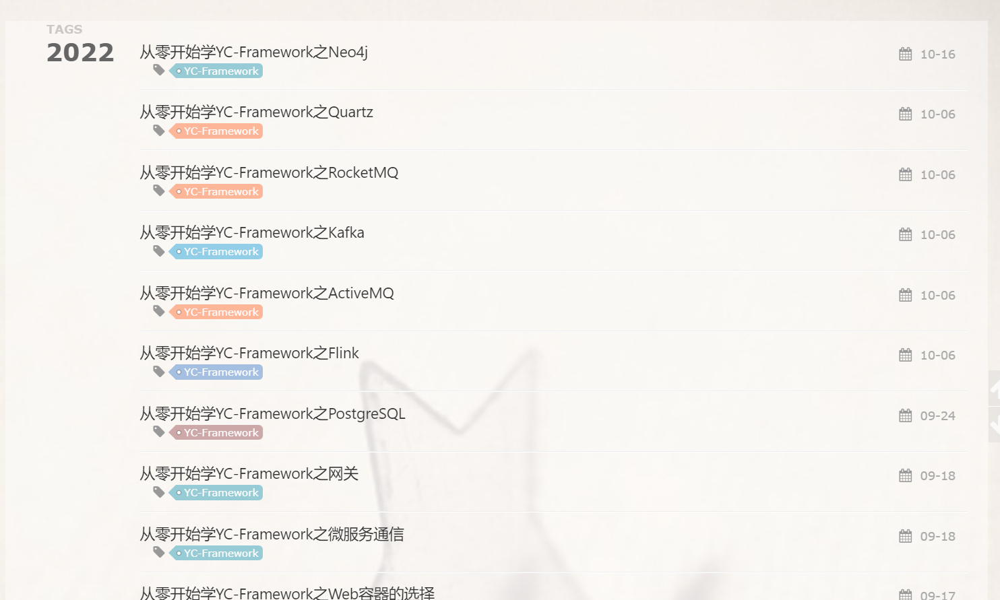
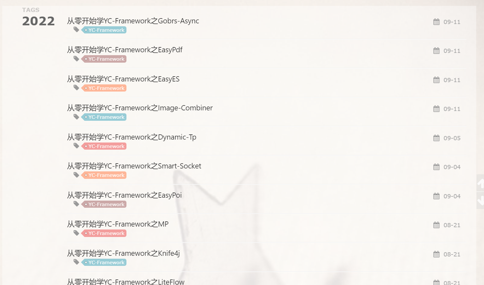
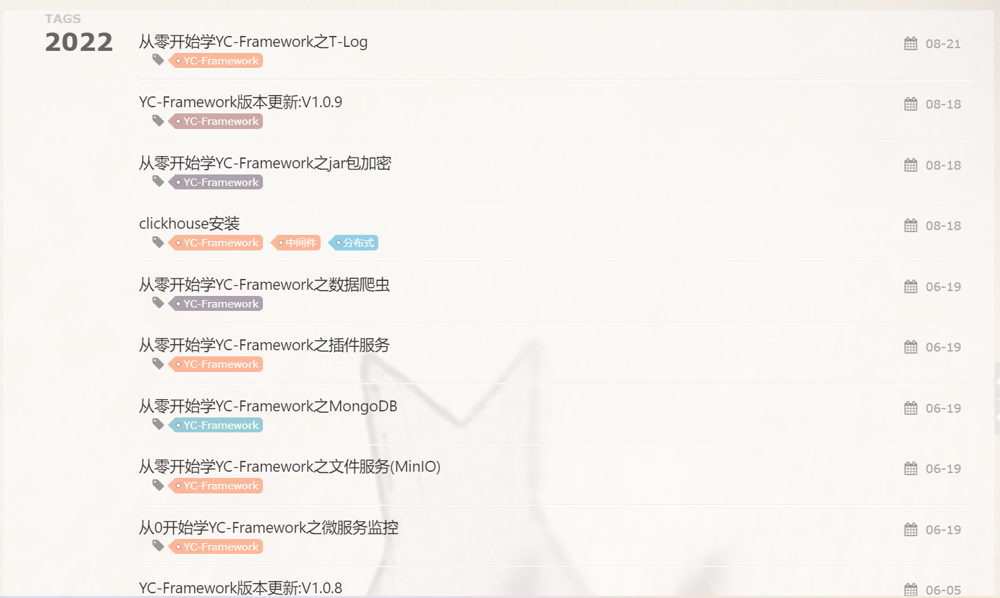

[分布式微服务框架:YC-Framework](https://mp.weixin.qq.com/s?__biz=MzUxODk0ODQ3Ng==&mid=2247485813&idx=1&sn=daa6e8447409672c28f07dbe094c4f28&chksm=f9805a66cef7d37061b15154a900c840da4bfdedd77cd0ea5865aee740bd1f2c01bb5cc37127&token=1774829840&lang=zh_CN&scene=21#wechat_redirect)版本更新V1.0.10！！！
<!--more-->

**本文主要内容:**

1.V1.0.10版本更新主要内容
2.YC-Framework相关系列文章分享

## 一、V1.0.10版本更新主要内容
- 1.精简与完善Example
- 2.鉴权体系精确到接口级别
- 3.文档全面更新
- 4.增加JWT插件
- 5.修复若干bug
- 6.增加国密算法(SM2 SM3 SM4)
- 7.升级:
    - (1)LiteFlow升级2.9.3
    - (2)Sa-Token升级1.32.0
    - (3)Wx-Java升级4.4.0
    - (4)Smart-Socket升级1.6.0
    - (5)ShedLock升级4.42.0
    - (6)T-Log升级1.5.0
    - (7)IJPay升级2.9.4
    - (8)Image Combiner升级2.3.7
    - (9)Gobrs Async升级1.2.3-RELEASE
    - (10)ElasticJob升级3.0.2
    - (11)Easy-Poi升级4.4.0
    - (12)Dynamic-Tp升级1.0.9
    - (13)Easy-ES升级1.0.3
    - (14)Dubbo升级3.1.2
    - (15)WebMagic升级0.7.6

## 二、YC-Framework相关系列文章分享
关于YC-Framework系列技术文章(含源代码、理论概念、实践等)一共40篇文章(后面还有一部分即将发布)，涵盖分布式微服务应用实战大部分技术(拥抱Apache、Spring、Alibaba、Dromara、Baomidou等开源系列，对于大家当下或许能带来不一样的启发或帮助):
[我的分布式微服务框架:YC-Framework](https://mp.weixin.qq.com/s?__biz=MzUxODk0ODQ3Ng==&mid=2247485813&idx=1&sn=daa6e8447409672c28f07dbe094c4f28&chksm=f9805a66cef7d37061b15154a900c840da4bfdedd77cd0ea5865aee740bd1f2c01bb5cc37127&scene=21#wechat_redirect)

[分布式架构之初步](https://mp.weixin.qq.com/s?__biz=MzUxODk0ODQ3Ng==&mid=2247486092&idx=1&sn=40dedeb6ad64a384ab5b2a3908be69c3&chksm=f980599fcef7d089be3a842d8098b95590a666ed302c6fff410c18f69692ba2c255de201015e&scene=21#wechat_redirect)

[分布式架构之规则引擎](https://mp.weixin.qq.com/s?__biz=MzUxODk0ODQ3Ng==&mid=2247486297&idx=1&sn=a78c791e013cb42a686e506cc53f15c4&chksm=f980584acef7d15c211cb40db0e0e67e9f7d67dc7e702f28df9c6ea854b4352db15630e79d62&scene=21#wechat_redirect)

[轻松搭建SpringCloud Eureka架构体系](https://mp.weixin.qq.com/s?__biz=MzUxODk0ODQ3Ng==&mid=2247486525&idx=1&sn=a9f3b93349f99178d8bdcc81a1755ba7&chksm=f9805f2ecef7d63834899555ecba5f25d271861a916aac5c27a8f79ad26f2a4f4c635568cf52&scene=21#wechat_redirect)

[轻松搭建Dubbo架构体系](https://mp.weixin.qq.com/s?__biz=MzUxODk0ODQ3Ng==&mid=2247486743&idx=1&sn=9a9c4a6c998b4a9bfa8d14ecac742fd3&chksm=f9805e04cef7d7126b8d9ec88fcf2e723acf1d431bb67ab6aab5abc98dbfc4a480fe41e9d8c5&scene=21#wechat_redirect)

[深入浅出分布式爬虫框架之WebMagic](https://mp.weixin.qq.com/s?__biz=MzUxODk0ODQ3Ng==&mid=2247486890&idx=1&sn=a3b50987755a29044100910e2b95dcf7&chksm=f9805eb9cef7d7afae78372a5979cb652d95ab1bb1df3d6ead7709e2eafe35ef6bc7c720c603&scene=21#wechat_redirect)

[深入浅出NoSQL之Redis](https://mp.weixin.qq.com/s?__biz=MzUxODk0ODQ3Ng==&mid=2247487009&idx=1&sn=37713fcb8ebb792438ed80031f15782f&chksm=f9805d32cef7d424a569136403e396618ec5a1d2f5699fa1d71cae3fe7bba9d778f1c48c5959&scene=21#wechat_redirect)

[深入浅出分布式事务之Tx-LCN](https://mp.weixin.qq.com/s?__biz=MzUxODk0ODQ3Ng==&mid=2247487010&idx=1&sn=b4bf59765c5f162633b4d2775cb35eb5&chksm=f9805d31cef7d42717b6b76472ffdfc44ee2eb27f4fe95647a4cc0a4b5ab9b5c7ce21d4e5723&scene=21#wechat_redirect)

[深入浅出分布式定时任务之ShedLock](https://mp.weixin.qq.com/s?__biz=MzUxODk0ODQ3Ng==&mid=2247487101&idx=1&sn=995dd9518f0106cd753098b520f5f4e2&chksm=f9805d6ecef7d478b47b39874af100d84865e00bfee4ba1bbd508fa6a46e2e2b804f32d76a12&scene=21#wechat_redirect)

[深入浅出分布式事务之Seata](https://mp.weixin.qq.com/s?__biz=MzUxODk0ODQ3Ng==&mid=2247487116&idx=1&sn=42b0672962b6620e8ba16cf4e26f1ce9&chksm=f9805d9fcef7d489d7aafe8087d624a1a9083f7cf81c8fde3220e6ba1d516d7658501131229d&scene=21#wechat_redirect)

[深入浅出分布式搜索引擎之ElastiSearch](https://mp.weixin.qq.com/s?__biz=MzUxODk0ODQ3Ng==&mid=2247487157&idx=1&sn=2fa82f194769e3f75ae014867de6a052&chksm=f9805da6cef7d4b01a186558381605ae3bb6b85fbce854dd2b8c1385062063c29afa955feba0&scene=21#wechat_redirect)

[分布式架构之网关](https://mp.weixin.qq.com/s?__biz=MzUxODk0ODQ3Ng==&mid=2247486879&idx=1&sn=e15ebfa8dddcfff6955cebcecd41a8a8&chksm=f9805e8ccef7d79a16ea7d58b40038c90fdc1e1f7994f126ef137d68f75efa63718621b31255&scene=21#wechat_redirect)

[分布式架构之网关(Plus)](https://mp.weixin.qq.com/s?__biz=MzUxODk0ODQ3Ng==&mid=2247487736&idx=1&sn=406c7d272b2070eaf6eb52303ed9079f&chksm=f98043ebcef7cafd72afce0b29f68baa4be3f1a8124fc750b76e72934a1461b4c4f0a93572ef&scene=21#wechat_redirect)

[分布式架构之微服务通信](https://mp.weixin.qq.com/s?__biz=MzUxODk0ODQ3Ng==&mid=2247487737&idx=1&sn=214055e3ed44c152dd08cc4ffe24337a&chksm=f98043eacef7cafc56bc6bdde3cd7eaffe6be902ffab13e9a9cd7920bef8a754be8398f0b74d&scene=21#wechat_redirect)

[分布式架构之服务注册中心](https://mp.weixin.qq.com/s?__biz=MzUxODk0ODQ3Ng==&mid=2247487006&idx=1&sn=0ced81f81a7b702d4f28a16d7cd4f12c&chksm=f9805d0dcef7d41b19af3630cacd2a67f19c4abca7ca64b3830b4b43986bb2e1330ffcbadc25&scene=21#wechat_redirect)

[分布式架构之鉴权](https://mp.weixin.qq.com/s?__biz=MzUxODk0ODQ3Ng==&mid=2247487088&idx=1&sn=b105eae4fe9990748dbd9fb9d7a67902&chksm=f9805d63cef7d47511929cd9fec1f38b8a6032de93e65892c681b03eecac991266d4bb33a0ed&scene=21#wechat_redirect)

[分布式架构之链路追踪实践](https://mp.weixin.qq.com/s?__biz=MzUxODk0ODQ3Ng==&mid=2247487193&idx=1&sn=fb5472f001ca8b07d465a513997d7674&chksm=f9805dcacef7d4dc44504af8868737e7ec5bb8a878f2aee3ab6bd997aa4e622dbc586a17b99b&scene=21#wechat_redirect)

[分布式架构之微服务监控](https://mp.weixin.qq.com/s?__biz=MzUxODk0ODQ3Ng==&mid=2247487228&idx=1&sn=c7a42d9eb84881bf52081510b215138e&chksm=f9805defcef7d4f9b78966cb443aca32154a4dcd7140a49a018db4c04491c36bbc0f8ae137c8&scene=21#wechat_redirect)

[分布式架构之文件存储MinIO](https://mp.weixin.qq.com/s?__biz=MzUxODk0ODQ3Ng==&mid=2247487302&idx=1&sn=f1400bc5ac2a8be6b76c53a6e8ca97cb&chksm=f9805c55cef7d5439a4bbd87b9440e207679ccb7a15ec69d4d3c4d58a471e3a9e859720fb1e1&scene=21#wechat_redirect)

[分布式架构之MongoDB](https://mp.weixin.qq.com/s?__biz=MzUxODk0ODQ3Ng==&mid=2247487305&idx=1&sn=9a2b970dcd5949940ddd0936129fcddb&chksm=f9805c5acef7d54c3aed778a62391c024095ecce08ec4acef7cf94b0547099bbdebd58ef8f8d&scene=21#wechat_redirect)

[分布式架构之数据爬虫实践落地](https://mp.weixin.qq.com/s?__biz=MzUxODk0ODQ3Ng==&mid=2247487306&idx=1&sn=b4b7dcac057dae12900cbd9951afb094&chksm=f9805c59cef7d54f0fd61aabc52c99df2607c386e5398f4ce9f30300adceffd47d687fb28ba2&scene=21#wechat_redirect)

[分布式架构之jar包加密](https://mp.weixin.qq.com/s?__biz=MzUxODk0ODQ3Ng==&mid=2247487570&idx=1&sn=2dee61377aea8087ed8382efce83d47f&chksm=f9804341cef7ca57f67bbc6e2783b2b19a291917d11b2bbe157af9ed0bce1b8ae62506821610&scene=21#wechat_redirect)

[分布式架构之TLog](https://mp.weixin.qq.com/s?__biz=MzUxODk0ODQ3Ng==&mid=2247487573&idx=1&sn=66f2e4215ad9154e8067d2a7bcd63f91&chksm=f9804346cef7ca504ce426bd3efc45ab8d9991f7426bc280d5db75f5b179aa0dac623df37885&scene=21#wechat_redirect)

[分布式架构之LiteFlow](https://mp.weixin.qq.com/s?__biz=MzUxODk0ODQ3Ng==&mid=2247487575&idx=1&sn=3a4d35d89ba89ca515b7c93cd7ce9c89&chksm=f9804344cef7ca5237bd5445ab623df0841c70ed149eab92b4b36175a507c26f5d6d4b8c6736&scene=21#wechat_redirect)

[分布式架构之MP](https://mp.weixin.qq.com/s?__biz=MzUxODk0ODQ3Ng==&mid=2247487579&idx=1&sn=d7aab9a7d46226c6e5f19d53658e7223&chksm=f9804348cef7ca5ea73429f1d91853cd49dc10ca70eea8cb26b869f3d74254a883b1f8136fb2&scene=21#wechat_redirect)

[分布式架构之Knife4j](https://mp.weixin.qq.com/s?__biz=MzUxODk0ODQ3Ng==&mid=2247487589&idx=1&sn=5a22aa528c7953984f8a1e77a693c950&chksm=f9804376cef7ca602c95064f981702982b6527c0b639b9f3ca4283bfb1224edb7498c1eb2eb3&scene=21#wechat_redirect)

[分布式架构之EasyES](https://mp.weixin.qq.com/s?__biz=MzUxODk0ODQ3Ng==&mid=2247487701&idx=1&sn=9cc4d9cf24b68ff4c1eebc3fc3aa83e6&chksm=f98043c6cef7cad0f86e98bc8390c3b88aff90f28a4a05351800815dd9842cc77bb2b87bb76c&scene=21#wechat_redirect)

[分布式架构之Gobrs-Async](https://mp.weixin.qq.com/s?__biz=MzUxODk0ODQ3Ng==&mid=2247487702&idx=1&sn=6a361c8e1ad0e39368a05f0d836b5a44&chksm=f98043c5cef7cad3a7f746f256cb61280f9ca28e82715c929ec57f6f390fa283157f6204fd3c&scene=21#wechat_redirect)

[分布式架构之Smart-Socket](https://mp.weixin.qq.com/s?__biz=MzUxODk0ODQ3Ng==&mid=2247487704&idx=1&sn=0f559ec42790189c33379d25119c5118&chksm=f98043cbcef7caddf0cf3f45e734c995049a760209f36c964ee3721b49a8d12a299584d16970&scene=21#wechat_redirect)

[分布式架构之Dynamic-Tp](https://mp.weixin.qq.com/s?__biz=MzUxODk0ODQ3Ng==&mid=2247487705&idx=1&sn=bdaa07b9a625ad42c7bf76130e1ac9d9&chksm=f98043cacef7cadc22a9a6754772034760b5aa9c01e863c75c7e59a2603724553be7dfb5392d&scene=21#wechat_redirect)

[分布式架构之Web容器的选择](https://mp.weixin.qq.com/s?__biz=MzUxODk0ODQ3Ng==&mid=2247487738&idx=1&sn=c7dd82603fbf3d08fb77136fb239d286&chksm=f98043e9cef7cafff06bb9f12651d0fc16483640cc49465c8129627c40a7d74d3147f70d74d1&scene=21#wechat_redirect)

[分布式架构之Image-Combiner](https://mp.weixin.qq.com/s?__biz=MzUxODk0ODQ3Ng==&mid=2247487739&idx=1&sn=002f5c9414caabef153a6befcc5f494b&chksm=f98043e8cef7cafeb65cc6a98270a9defde0d1552fc69f9d9e7b7d043e83a7d78df8987ed048&scene=21#wechat_redirect)

[分布式架构之EasyPoi](https://mp.weixin.qq.com/s?__biz=MzUxODk0ODQ3Ng==&mid=2247487750&idx=1&sn=17090e5ec0664dd4415dec18f50f2568&chksm=f9804215cef7cb03a84695a39f08b8d57cdb95822920e3c242ceac9e6640a01628cbfc3e2852&scene=21#wechat_redirect)

[分布式架构之PostgreSQL](https://mp.weixin.qq.com/s?__biz=MzUxODk0ODQ3Ng==&mid=2247487751&idx=1&sn=6c5bfffe65de127ceabd437c719b31c0&chksm=f9804214cef7cb025c0f1435321a890a02085833a5025d47614cb42da8092ae612ae4529649f&scene=21#wechat_redirect)

[分布式架构之EasyPdf](https://mp.weixin.qq.com/s?__biz=MzUxODk0ODQ3Ng==&mid=2247487752&idx=1&sn=53c85c6411188172b8e40724eebcee89&chksm=f980421bcef7cb0d58849cab71dfc01f03f7c461a2f732148c5aa8d7d748f7d1fe6d0dc273c6&scene=21#wechat_redirect)

[分布式架构之Flink](https://mp.weixin.qq.com/s?__biz=MzUxODk0ODQ3Ng==&amp;mid=2247487830&amp;idx=1&amp;sn=43d5841922724cee8eb37b7af7786a42&amp;chksm=f9804245cef7cb531e80ef4f862757710e2a5cf0713866cb0608aceb8fe4b12cb53472c18200&token=1529163421&lang=zh_CN#rd)

[分布式架构之Kafka](https://mp.weixin.qq.com/s?__biz=MzUxODk0ODQ3Ng==&amp;mid=2247487831&amp;idx=1&amp;sn=f9f32114b831fcf30b4dc1118e85cae8&amp;chksm=f9804244cef7cb5211246f41258e5fe1f536eee26e0bcb1e431a67f23e099964f34b4a759d80&token=1529163421&lang=zh_CN#rd)

[分布式架构之RocketMQ](https://mp.weixin.qq.com/s?__biz=MzUxODk0ODQ3Ng==&amp;mid=2247487834&amp;idx=1&amp;sn=1f5165f1371ba412d5afe6193557a08b&amp;chksm=f9804249cef7cb5f3d68b38d99b0e42b6622504fd29d145ce6f300d2223fa14c28c3d633e3d6&token=1529163421&lang=zh_CN#rd)

[分布式架构之ActiveMQ](https://mp.weixin.qq.com/s?__biz=MzUxODk0ODQ3Ng==&amp;mid=2247487835&amp;idx=1&amp;sn=926cb9946fcae923e70dfd071452b7b8&amp;chksm=f9804248cef7cb5e71bf9fcb9169d9bc2855c74abb37081052c1397c45628c001dd6381d0573&token=1529163421&lang=zh_CN#rd)

[分布式架构之Neo4j](https://mp.weixin.qq.com/s?__biz=MzUxODk0ODQ3Ng==&amp;mid=2247487869&amp;idx=1&amp;sn=5d4790a938238f4746146ed1e2e6c640&amp;chksm=f980426ecef7cb78c10e205e3872010ea2340aa1c3558ec410fa9e81bfd5cf1ed3cbc1a6d118&token=1529163421&lang=zh_CN#rd)

如果觉得公众号阅读效果不是特别好的话，可访问如下链接，直接跳转到我个人博客上的YC-Framework专题系列文章列表:
https://youcongtech.com/tags/YC-Framework/

效果图如下所示:

官方网站:
http://framework.youcongtech.com/

GitHub源代码地址:
https://github.com/developers-youcong/yc-framework

Gitee源代码地址:
https://gitee.com/developers-youcong/yc-framework

历史版本查看:
https://github.com/developers-youcong/yc-framework/releases