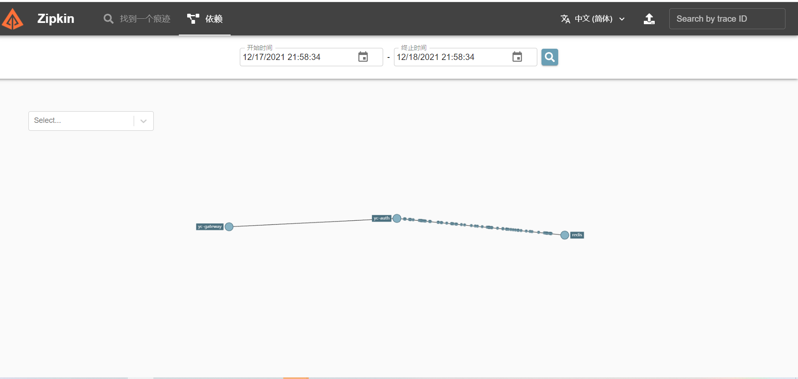
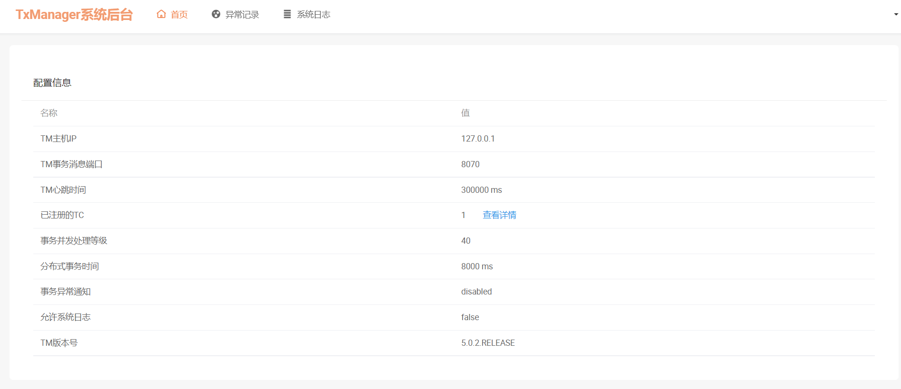
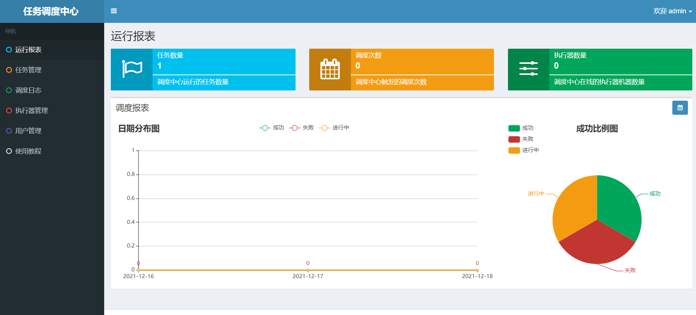
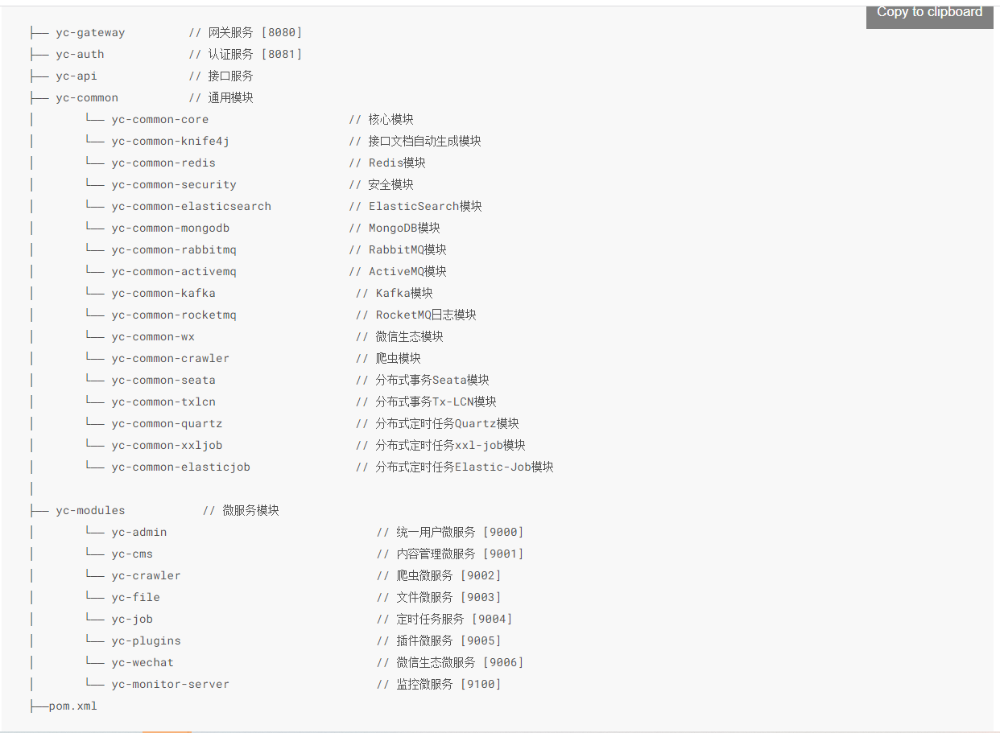

[分布式微服务框架:YC-Framework](https://youcongtech.com/2021/12/04/%E6%88%91%E7%9A%84%E5%88%86%E5%B8%83%E5%BC%8F%E5%BE%AE%E6%9C%8D%E5%8A%A1%E6%A1%86%E6%9E%B6-YC-Framework/)版本更新V1.0.3！！！
<!--more-->
### 本次版本V1.0.3更新
- 集成分布式事务Seata；
- 集成分布式事务Tx-LCN；
- 集成Kafka；
- 集成RocketMQ；
- 集成分布式定时任务Xxl-Job；
- 微信生态方案模块化；
- 集成分布式定时任务Elastic-Job；
- Quartz定时任务模块化；
- 爬虫模块化；
- 集成Zipkin+Sleuth分布式链路追踪；
- 部分问题修复；
- 文档更新1.0.3。

最新代码可访问对应的代码仓库:
https://github.com/developers-youcong/yc-framework

最新文档访问官方网站:
http://framework.youcongtech.com/

历史版本查看:
https://github.com/developers-youcong/yc-framework/releases

关于YC-Framework，你有任何问题可前往[issues](https://github.com/developers-youcong/yc-framework/issues)进行提问

本次版本更新部分相应的效果图:

此次v1.0.3版本更新将是2021年的最后一次更新(因为接下来的13天我需要和团队小伙伴并肩作战打通"最后一公里"，保障项目的顺利交付)，2022年将继续每周或每两周保障更新一次，解决开源爱好者朋友或使用者朋友所反馈的问题。

为了更好的收集和解决问题，我将成立微信群，收集技术爱好者朋友的意见，以此来不断改进和完善分布式微服务框架:YC-Framework。

对于即将来临的2022年，YC-Framework继续践行这样的理念(这也是YC-Framework的愿景):
**致力于打造一款优秀的分布式微服务解决方案**

**这样的理念最终衡量的标准:**

- 让开发更简单；
- 让运维更简单；
- 模块化与轻量级；
- 集成众多经过实际验证的优秀解决方案；
- 更贴近具体的业务场景；
- 三高(高性能、高并发、高可用)是标准。

**YC-Framework开源技术群:**
