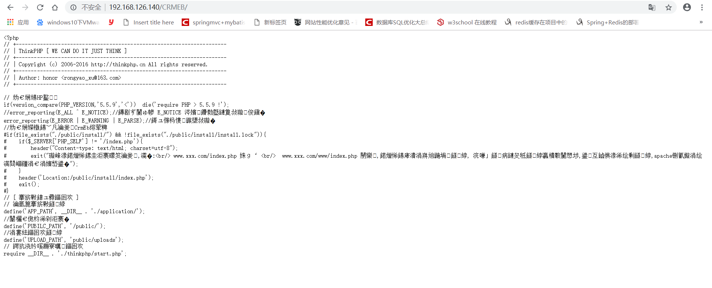

---

title: apache不能解析php之解决办法

date: 2019-05-06 15:15:09

tags: "Linux"

---

记录一下Ubuntu16.04下的apache服务器不能解析php的问题，如图所示:



<!--more-->

对于这个Ubuntu16.04最直接最快速的解决办法就是执行如下命令:

```

sudo apt-get install libapache2-mod-php


```


