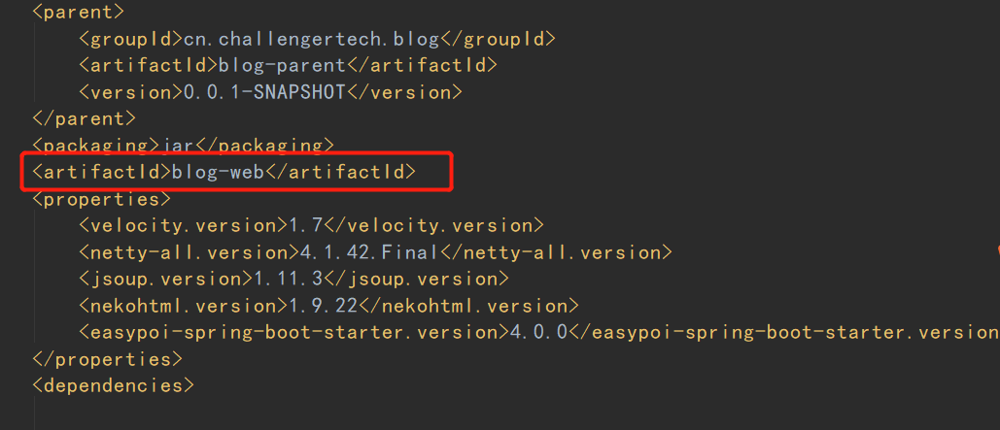

错误背景:
本地能够正常启动和调试应用，就是打包构建失败。
<!--more-->

详细错误信息如下:
```
[ERROR] [ERROR] Some problems were encountered while processing the POMs:
[FATAL] 'artifactId' is missing. @ line 2, column 109
[WARNING] 'build.plugins.plugin.(groupId:artifactId)' must be unique but found duplicate declaration of plugin org.springframework.boot:spring-boot-maven-plugin @ line 90, column 21
[WARNING] 'dependencies.dependency.scope' for org.springframework.boot:spring-boot-devtools:jar must be one of [provided, compile, runtime, test, system] but is 'true'. @ line 253, column 11
 @ 
[ERROR] The build could not read 1 project -> [Help 1]
[ERROR]   
[ERROR]   The project cn.challengertech.blog:[unknown-artifact-id]:[unknown-version] (/home/test/blog/blog-web/pom.xml) has 1 error
[ERROR]     'artifactId' is missing. @ line 2, column 109
[ERROR] 
[ERROR] To see the full stack trace of the errors, re-run Maven with the -e switch.
[ERROR] Re-run Maven using the -X switch to enable full debug logging.
[ERROR] 
[ERROR] For more information about the errors and possible solutions, please read the following articles:
[ERROR] [Help 1] http://cwiki.apache.org/confluence/display/MAVEN/ProjectBuildingException


```

最关键的信息如下:
```
[ERROR]     'artifactId' is missing. @ line 2, column 109

```

错误原因:
子pom文件不经意间操作不小心去除了artifactId，导致项目构建打包时找不到对应的子模块，从而无法构建，导致报错。

解决方式:
加上即可,如下图所示:
