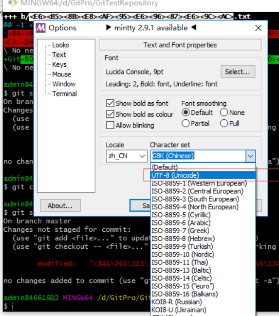

解决办法:
右击左上方git标识，然后进入到如图中，点击Text，进行操作。

<!--more-->

操作完毕后，关闭git bash，然后再重新打开，执行ls或ll命令，查看对应的以中文作为目录或文件名是否显示乱码，如果之前是乱码，现在打开查看显示正常，那么就表示该问题已解决。

本文主要参考链接:[Git Bash终端中文输出显示乱码解决方案](https://jingyan.baidu.com/article/c35dbcb0b12d848917fcbc5b.html)
