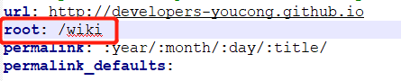
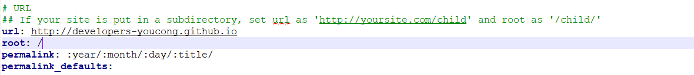

详细错误信息:
```
FATAL Cannot read property 'replace' of null
TypeError: Cannot read property 'replace' of null
    at fs.exists.then.then.then.config (E:\Hexo\node_modules\hexo\lib\hexo\load_config.js:34:31)
    at tryCatcher (E:\Hexo\node_modules\bluebird\js\release\util.js:16:23)
    at Promise._settlePromiseFromHandler (E:\Hexo\node_modules\bluebird\js\release\promise.js:512:31)
    at Promise._settlePromise (E:\Hexo\node_modules\bluebird\js\release\promise.js:569:18)
    at Promise._settlePromise0 (E:\Hexo\node_modules\bluebird\js\release\promise.js:614:10)
    at Promise._settlePromises (E:\Hexo\node_modules\bluebird\js\release\promise.js:694:18)
    at _drainQueueStep (E:\Hexo\node_modules\bluebird\js\release\async.js:138:12)
    at _drainQueue (E:\Hexo\node_modules\bluebird\js\release\async.js:131:9)
    at Async._drainQueues (E:\Hexo\node_modules\bluebird\js\release\async.js:147:5)
    at Immediate.Async.drainQueues (E:\Hexo\node_modules\bluebird\js\release\async.js:17:14)
    at runCallback (timers.js:810:20)
    at tryOnImmediate (timers.js:768:5)
    at processImmediate [as _immediateCallback] (timers.js:745:5)


```

关键信息: Cannot read property 'replace' of null

问题原因:
我为了将我的wiki链接到hexo修改了root路径，如下图所示:


解决办法(将root改为原来的/即可解决这个问题):



这个/相当于默认指向developers-youcong.github.io

参考解决办法:
[hexo 报错 Cannot read property 'replace' of null](https://www.jianshu.com/p/449accb044b4)