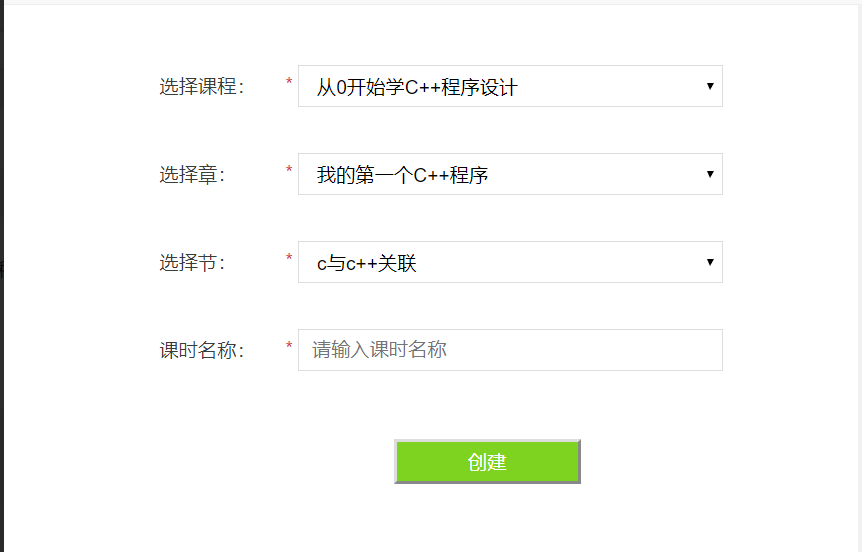

效果图如下:



代码逻辑梳理:
层层递进，比如选择了课程后，将对应的课程id保存，然后点击选择章时自动触发对应的时间，根据这个课程ID获取其下面的章信息。
其它的如节等，同理。

代码说明:
如下代码不规范，可以参考功能实现，切不可照搬照抄(当然了，可以作为一个反面代码案例以告诫后来学习者，代码严谨和规范的重要性)。
比如与像一些通用的js和css等可以放在CDN上。
比如<script></script>这样的标签，如果像源代码中掺杂大量的js代码时，强烈建议将其抽出为一个外部js文件，主要方便管理和维护及其未来扩展。
<!--more-->
源代码:
```
<!DOCTYPE html>
<html>
<head>
<meta charset="UTF-8">

<title>创建课时</title>
<link rel="stylesheet" href="../css/app.min.css"/>
<link rel="stylesheet" href="../layui/css/layui.css"  media="all">
 

</head>
<body>

    <div class="rel alert-reg alert-reg2">
      <div style="margin-left:90px;">
        <table class="alert-tb tdh70" width="100%" cellpadding="0" cellspacing="0" border="0">
            <tr>
                <td><em class="ico2 ico2-phone"></em></td>
                <td><label for="regPhone_">选择课程：</label></td>
                <td>
                	<span class="red">*</span> 
                	<select id="course_list" name="course_list"  class="vi fctr_label_2" style="height:20px;">
	                    <option value="" id="course_val">请选择课程</option>
	                </select>
                </td>
                <td></td>
            </tr>
            
            
            <tr>
                <td><em class="ico2 ico2-phone"></em></td>
                <td><label for="regPhone_">选择章：</label></td>
                <td>
                	<span class="red">*</span> 
                	<select onmouseover="chapterList()" id="chapter_list" class="vi fctr_label_2" style="height:20px;">
	                    <option value="" id="chapter_val">请选择章</option>
	                </select>
                </td>
                <td></td>
            </tr>
            
            <tr>
                <td><em class="ico2 ico2-phone"></em></td>
                <td><label for="regPhone_">选择节：</label></td>
                <td>
                	<span class="red">*</span> 
                	<select onmouseover="quarterList()" id="quarter_list" class="vi fctr_label_2" style="height:20px;">
	                    <option value="" id="quarter_val">请选择节</option>
	                </select>
                </td>
                <td></td>
            </tr>
            
                       
                    
            <tr>
                <td><em class="ico2 ico2-phone"></em></td>
                <td><label for="regPhone_">课时名称：</label></td>
                <td>
                	<span class="red">*</span> 
                	<input class="vi fctr_label_2" type="text" id="quarter_name" placeholder="请输入课时名称" maxlength="40"/>
                </td>
                <td></td>
            </tr>
            


          
        </table>
        <br>
        <br>
        <div align="center" >
			<button type="button" id="create_quarter"  style="background-color: #7ED321;width: 150px;height: 36px;color: #FFFFFF">创建</button>  
		</div>
		
		<br />
	
      </div>
    </div>
	
<script src="../js/jquery-1.11.3.min.js"></script>
<script src="../layui/layui.js" charset="utf-8"></script>
<script src="../js/layer/layer-v3.1.1/layer/mobile/layer.js" type="text/javascript"></script>
<script src="../js/common.js" charset="utf-8"></script>
<script type="text/javascript">

	$(function () {
		
		courseListInfo();
		
		$("#create_quarter").click(function(){
	    	
			var courseId = $("#course_list").val();

			var chapterId = $('#quarter_list option:selected') .val();
			
			var quarterName = $("#quarter_name").val();
			
			
			
			//alert("userCode = " + userCode)
	 		
			if(courseId==null || courseId==""){
	        	
	        	layer.open({
	   			   content: '课程不能为空，请选择课程' ,
	   			   skin: 'msg',
	   			   time: 3 //3秒后自动关闭
	   			 });
	        	
	        	return false;
	        }else if(chapterId==null || chapterId==""){
	        	
	        	layer.open({
	   			   content: '章节不能为空，请选择章节' ,
	   			   skin: 'msg',
	   			   time: 3 //3秒后自动关闭
	   			 });
	        	
	        	return false;
	        }else if(quarterName==null || quarterName==""){
	        	
	        	layer.open({
	   			   content: '课时名称不能为空' ,
	   			   skin: 'msg',
	   			   time: 3 //3秒后自动关闭
	   			 });
	        	
	        	return false;
	        } else if(quarterName.length > 40){
	        	
	        	layer.open({
	   			   content: '课时名称太长' ,
	   			   skin: 'msg',
	   			   time: 3 //3秒后自动关闭
	   			 });
	        	
	        	return false;
	        }else{
	 			
	 			$.ajax({
	            	async:false,
	            	url:RouterAPI.url.api.course_add_chapter,
	            	type:"POST",
	            	data : {"parentId":chapterId, "title":quarterName,"type":"lesson"},
	            	dataType : 'json',
	            	success:function(data){
	            	
	            	
	            		if(data.code=="000000"){
	            			layui.use('layer', function(){
	            				  var layer = layui.layer;
	            				  
	            				  layer.alert("创建成功，返回课程管理页面",{icon:1});
	          	  			});
	            			
	            			setTimeout(() => {
	            				
	            				parent.location.reload(); 
	                        	
							}, 600);
	            			
	            			return true;
	            		}else{
	            			layui.use('layer', function(){
	            				  var layer = layui.layer;
	            				  
	            				  layer.alert(data.msg,{icon:5});
	          	  			});
	            			return false;
	            		}
	            		
	          
	            	  
	            	},error:function(XMLHttpRequest, textStatus, errorThrown){
	            		alert("失败");
	            		  // 状态码
	                   alert(XMLHttpRequest.status);
	                    // 状态
	                    alert(XMLHttpRequest.readyState);
	                    // 错误信息   
	                    alert(textStatus);
	                    return false;
	            	}
	            	
	            });
	        }
			
		});	
		
	});
	
		//课程选择发生变化
	function courseListInfo(){
	
		var creator = getMyCookie("userId");
		
		
		$.ajax({
        	async:false,
        	url:RouterAPI.url.api.course_list,
        	type:"GET",
        	data : {"creator":creator},
        	dataType : 'json',
        	success:function(data){
        	
        		if(data.code=="000000"){
        			
        			if (data.data.length > 0) {
        	            for (var i = 0; i < data.data.length; i++) {
        	                var item = data.data[i];
        	                console.log(data.data[i].id);
        	               $("#course_list").append('<option value="' + data.data[i].id + '">' + data.data[i].title + '</option>');
		
        	            }
        	        }
        			
        			return true;
        		}else{
        			
        			layui.use('layer', function(){
        				  var layer = layui.layer;
        				  
        				  layer.alert(data.msg,{icon:5});
      	  			});
        		}
        		
      
        	  
        	},error:function(XMLHttpRequest, textStatus, errorThrown){
        		alert("失败");
        		  // 状态码
               alert(XMLHttpRequest.status);
                // 状态
                alert(XMLHttpRequest.readyState);
                // 错误信息   
                alert(textStatus);
                return false;
        	}
        	
        });
		
	}
	
	

	//章选择发生变化
	function chapterList(){
		
		var parentId = $('#course_list option:selected') .val();

		var type="chapter";
		
		$.ajax({
	    	url : RouterAPI.url.api.course_chapter_list,
	        type : "GET",
	        data : {
	        	parentId : parentId,
	        	type : type
	        },
	        success:function(result) {
	        	
	        	
	        	
	        		$("#chapter_list option[value != '']").remove(); 
	        		
	        		for (var i = 0; i < result.data.length; i++) {
	        			
	        	        $("#chapter_list").append("<option id='chapter_val' value='" + result.data[i].id + " '>" + result.data[i].title + "</option>");
	        	    }
	        		
	        	
	        	
	        }
		});
		
	}
	
	//节选择变化
	function quarterList(){
		
		var parentId = $('#chapter_list option:selected') .val();
	
		var type="unit";
		
		$.ajax({
	    	url : RouterAPI.url.api.course_chapter_list,
	        type : "GET",
	        data : {
	        	parentId : parentId,
	        	type : type
	        },
	        success:function(result) {
	        	
	        	
	        	
	        		$("#quarter_list option[value != '']").remove(); 
	        		
	        		for (var i = 0; i < result.data.length; i++) {
	        			
	        	        $("#quarter_list").append("<option id='chapter_val' value='" + result.data[i].id + " '>" + result.data[i].title + "</option>");
	        	    }
	        		
	        	
	        	
	        }
		});
	}
	
	
	
	
	function getQueryString(name) {
        var result = window.location.search.match(new RegExp("[\?\&]" + name + "=([^\&]+)", "i"));
        if (result == null || result.length < 1) {
            return "";
        }
        return result[1];
    }
	
</script> 

	
</body>
</html>

```