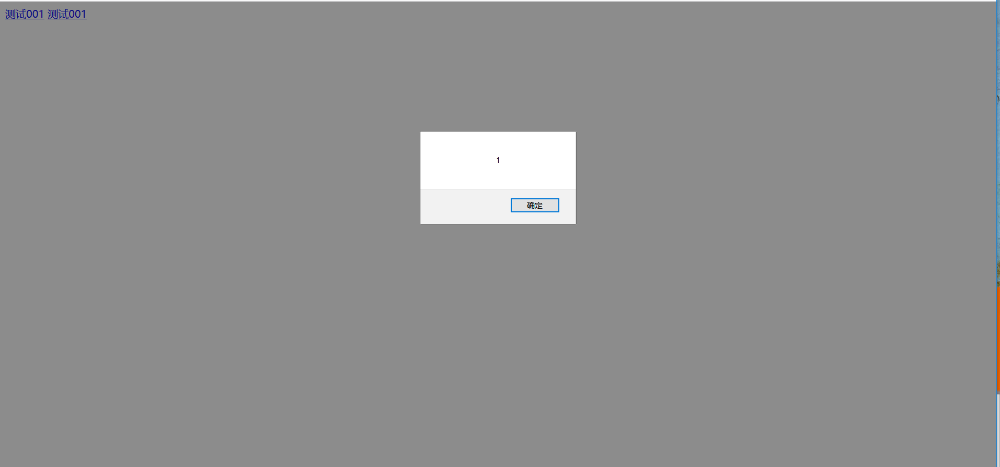
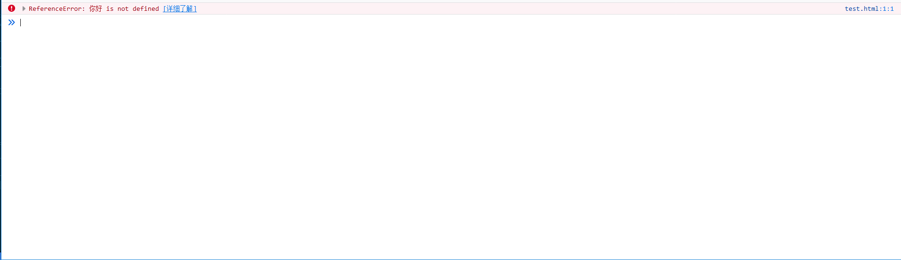
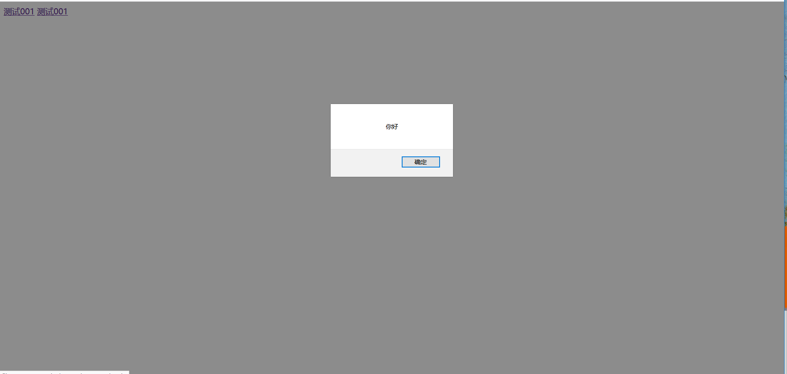

js转义问题有很多场景，比如常见的根据某个字符串删除或者修改以及将某字符串传递至某个页面。
<!--more-->
今天以一个简单的示例代码为例:
```
<html>
<head> 
<meta http-equiv="Content-Type" content="text/html; charset=utf-8" /> 
<title>测试</title> 
</head> 

<body> 
<a href='#' onclick="test001(1)">测试001</a>
<a href='#' onclick="test002(你好)">测试001</a>
<script>
function test001(id){
alert(id);
}

function test002(name){
alert(name);
}
</script>

</body> 
</html> 

```
页面效果图如下:


当我点击测试001时，出现如图:


显然是符合预期结果的。

但是当我点击测试002时，出现如图:

什么也没有出现，于是我通过f12调试了一下，结果如图:

显示某某未定义

那么最终如何解决这个你好 is not defined问题？？？
通常出现未定义问题，是因为我们用了这个变量，但是并没有在对应的js文件中定义。

解决这个你好 is not defined问题，很简单，只需加一个转义符即可。

比如将:
```
<a href='#' onclick="test002(你好)">测试001</a>

```
修改为:
```
<a href='#' onclick="test002('\你好')">测试001</a>

```
接下来，点击测试002，就可以看到对应的效果，如图:


那么为什么会出现这个转义问题?
我搜了一些资料，但是仍然觉得很疑惑。
