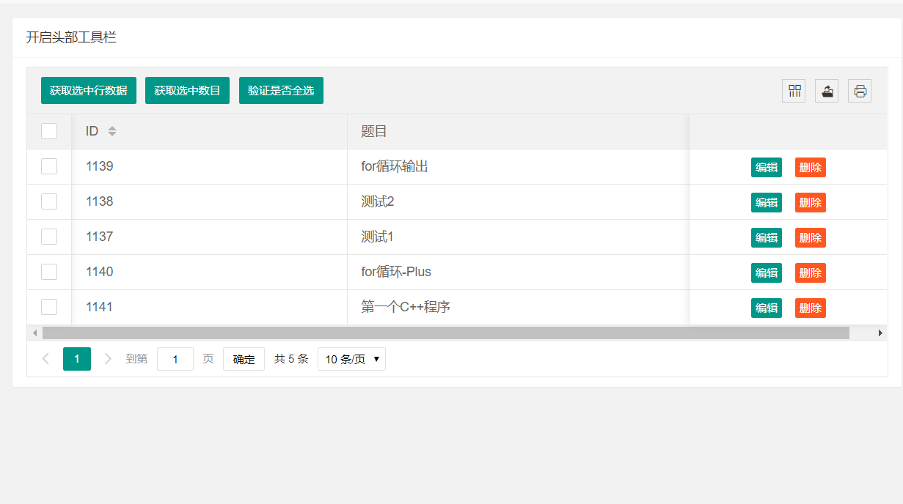

效果图如下:

<!--more-->

前端实现代码如图(完整代码):
```


<!DOCTYPE html>
<html>
<head>
  <meta charset="utf-8">
  <title>数据表格</title>
  <meta name="renderer" content="webkit">
  <meta http-equiv="X-UA-Compatible" content="IE=edge,chrome=1">
  <meta name="viewport" content="width=device-width, initial-scale=1.0, minimum-scale=1.0, maximum-scale=1.0, user-scalable=0">
  <link rel="stylesheet" href="../../layuiadmin/layui/css/layui.css" media="all">
  <link rel="stylesheet" href="../../layuiadmin/style/admin.css" media="all">
</head>
<body>

  <div class="layui-card layadmin-header">
    <div class="layui-breadcrumb" lay-filter="breadcrumb">
      <a lay-href="">主页</a>
      <a><cite>组件</cite></a>
      <a><cite>数据表格</cite></a>
      <a><cite>开启头部工具栏</cite></a>
    </div>
  </div>
  
  <div class="layui-fluid">
    <div class="layui-row layui-col-space15">
      <div class="layui-col-md12">
        <div class="layui-card">
          <div class="layui-card-header">开启头部工具栏</div>
          <div class="layui-card-body">
            <table class="layui-hide" id="test-table-toolbar" lay-filter="test-table-toolbar"></table>
            
            <script type="text/html" id="test-table-toolbar-toolbarDemo">
              <div class="layui-btn-container">
                <button class="layui-btn layui-btn-sm" lay-event="getCheckData">获取选中行数据</button>
                <button class="layui-btn layui-btn-sm" lay-event="getCheckLength">获取选中数目</button>
                <button class="layui-btn layui-btn-sm" lay-event="isAll">验证是否全选</button>
              </div>
            </script>
             
            <script type="text/html" id="test-table-toolbar-barDemo">
              <a class="layui-btn layui-btn-xs" lay-event="edit">编辑</a>
              <a class="layui-btn layui-btn-danger layui-btn-xs" lay-event="del">删除</a>
            </script>
          </div>
        </div>
      </div>
    </div>
  </div>
  
  <script src="../../layuiadmin/layui/layui.js"></script>  
  <script>
  layui.config({
    base: '../../layuiadmin/' //静态资源所在路径
  }).extend({
    index: 'lib/index' //主入口模块
  }).use(['index', 'table'], function(){
    var admin = layui.admin
    ,table = layui.table;
  
    table.render({
      elem: '#test-table-toolbar'
 	  ,url:"http://localhost:8090/program-web/api/magic_change/oj/problem/page_list?userId=youcongtech"
      ,toolbar: '#test-table-toolbar-toolbarDemo'
      ,title: '程序设计题绑定'
	  ,cols: [[
	    {type: 'checkbox', fixed: 'left'},
        {field:'problemId', width:300, title: 'ID', sort: true}
        ,{field:'title', width:400, title: '题目'}
        ,{width:215, align:'center', fixed: 'right', toolbar: '#test-table-toolbar-barDemo'}
      ]]
      ,page: true
    });
    
    //头工具栏事件
    table.on('toolbar(test-table-toolbar)', function(obj){
      var checkStatus = table.checkStatus(obj.config.id);
      switch(obj.event){
        case 'getCheckData':
          var data = checkStatus.data;
          layer.alert(JSON.stringify(data));
        break;
        case 'getCheckLength':
          var data = checkStatus.data;
          layer.msg('选中了：'+ data.length + ' 个');
        break;
        case 'isAll':
          layer.msg(checkStatus.isAll ? '全选': '未全选');
        break;
      };
    });
    
    //监听行工具事件
    table.on('tool(test-table-toolbar)', function(obj){
      var data = obj.data;
      if(obj.event === 'del'){
        layer.confirm('真的删除行么', function(index){
          obj.del();
          layer.close(index);
        });
      } else if(obj.event === 'edit'){
        layer.prompt({
          formType: 2
          ,value: data.email
        }, function(value, index){
          obj.update({
            email: value
          });
          layer.close(index);
        });
      }
    });
  
  });
  </script>
</body>
</html>

```


核心js代码如下:
```
    table.render({
      elem: '#test-table-toolbar'
 	  ,url:"http://localhost:8090/program-web/api/magic_change/oj/problem/page_list?userId=youcongtech"
      ,toolbar: '#test-table-toolbar-toolbarDemo'
      ,title: '程序设计题绑定'
	  ,cols: [[
	    {type: 'checkbox', fixed: 'left'},
        {field:'problemId', width:300, title: 'ID', sort: true}
        ,{field:'title', width:400, title: '题目'}
        ,{width:215, align:'center', fixed: 'right', toolbar: '#test-table-toolbar-barDemo'}
      ]]
      ,page: true
    });

```

要求后台返回数据格式必须为:
```

{
  "msg": "success",
  "code": "0",
  "data": [
    {
      "title": "for循环输出",
      "problemId": 1139
    },
    {
      "title": "测试2",
      "problemId": 1138
    },
    {
      "title": "测试1",
      "problemId": 1137
    },
    {
      "title": "for循环-Plus",
      "problemId": 1140
    },
    {
      "title": "第一个C++程序",
      "problemId": 1141
    }
  ]
}

```

不然的话，会出现相关提示(如code对于的值必须为0，而不能为000000，以及data对应数据必须像上面这样的，不然cols里面不好自动对应上。

后台实现代码如下:
控制层代码(路由)
```
    @GetMapping("/page_list")
	@ApiOperation(value="根据用户ID获取题目分页列表",httpMethod="GET",notes="根据用户ID获取题目分页列表")
	public JSONObject page_list(@RequestParam String userId, @RequestParam (value="page") String pageno, @RequestParam (value="limit") String pagesize) {
		
		System.out.println("userId:"+userId+"|| pageno:"+pageno+"||pagesize:"+pagesize);
		
		JSONObject json = new JSONObject();
		
		//当前页
		Integer page = Integer.parseInt(pageno.trim());
		//每页的数量
		Integer size = Integer.parseInt(pagesize.trim());

		Map<String, Object> paramMap = new HashMap<>();
		paramMap.put("userId", userId);
		paramMap.put("start", (page - 1) * size);  //当前页的数量
		paramMap.put("size", size);  //当前页
		
		List<Problem> problemList = problemService.getProblemPageListInfo(paramMap);
      
		int count =problemService.getProblemPageTotalCount(paramMap);

		if(!problemList.isEmpty()) {

			json.put("msg", "success");
			json.put("code", "0");
			json.put("data", problemList);
			json.put("count", count);
			
		}else {
			
			json.put(CommonEnum.RETURN_MSG, "error");
			json.put(CommonEnum.RETURN_CODE, "222222");
		}
		
		return json;

	}
	
```

Service及其实现类:
Service:
```
public interface ProblemService extends IService<Problem> {

	

	List<Problem> getProblemPageListInfo(Map<String,Object> paramMap);
	

	Integer getProblemPageTotalCount(Map<String,Object> paramMap);

}


```

Service实现类:
```
package com.eluzhu.sass.service.impl;

import com.eluzhu.sass.entity.Problem;
import com.eluzhu.sass.mapper.ProblemDao;
import com.eluzhu.sass.service.ProblemService;
import com.baomidou.mybatisplus.service.impl.ServiceImpl;

import java.util.List;
import java.util.Map;

import org.springframework.beans.factory.annotation.Autowired;
import org.springframework.stereotype.Service;

@Service
public class ProblemServiceImpl extends ServiceImpl<ProblemDao, Problem> implements ProblemService {

	@Autowired
	private ProblemDao problemDao;
	


	@Override
	public List<Problem> getProblemPageListInfo(Map<String, Object> paramMap) {

		return problemDao.getProblemPageListInfo(paramMap);
	}

	@Override
	public Integer getProblemPageTotalCount(Map<String, Object> paramMap) {

		return problemDao.getProblemPageTotalCount(paramMap);
	}

}


```


数据访问类:
```
public interface ProblemDao extends BaseMapper<Problem> {

	

	List<Problem> getProblemPageListInfo(Map<String,Object> paramMap);
	

	Integer getProblemPageTotalCount(Map<String,Object> paramMap);

}

```


ProblemDao.xml:
```
<?xml version="1.0" encoding="UTF-8"?>
<!DOCTYPE mapper PUBLIC "-//mybatis.org//DTD Mapper 3.0//EN" "http://mybatis.org/dtd/mybatis-3-mapper.dtd">
<mapper namespace="com.eluzhu.sass.mapper.ProblemDao">

	<!-- 通用查询映射结果 -->
	<resultMap id="BaseResultMap" type="com.eluzhu.sass.entity.Problem">
		<id column="problem_id" property="problemId" />
		<result column="title" property="title" />
		<result column="description" property="description" />
		<result column="input" property="input" />
		<result column="output" property="output" />
		<result column="sample_input" property="sampleInput" />
		<result column="sample_output" property="sampleOutput" />
		<result column="spj" property="spj" />
		<result column="hint" property="hint" />
		<result column="source" property="source" />
		<result column="in_date" property="inDate" />
		<result column="time_limit" property="timeLimit" />
		<result column="memory_limit" property="memoryLimit" />
		<result column="defunct" property="defunct" />
		<result column="accepted" property="accepted" />
		<result column="submit" property="submit" />
		<result column="solved" property="solved" />


		<result column="p_ladder_level" property="pLadderLevel" />
		<result column="p_ladder_type" property="pLadderType" />
	</resultMap>

	<!-- 通用查询结果列 -->
	<sql id="Base_Column_List">
		problem_id AS problemId, title, description, input, output, sample_input AS
		sampleInput, sample_output AS sampleOutput, spj, hint, source, in_date
		AS inDate, time_limit AS timeLimit, memory_limit AS memoryLimit,
		defunct, accepted, submit, solved
	</sql>


	<select id="getProblemPageListInfo" resultMap="BaseResultMap">
	SELECT DISTINCT problem.problem_id,problem.title FROM privilege AS p LEFT JOIN
		problem ON( REPLACE(p.rightstr,'p','') = problem.problem_id) WHERE
		p.user_id =#{userId} AND problem.problem_id !=0 AND p.rightstr !=
		'problem_editor' AND p.rightstr != 'contenst_creator' limit #{start},#{size}
	</select>

	<select id="getProblemPageTotalCount" resultType="Integer">
		SELECT COUNT(DISTINCT problem.problem_id) FROM privilege AS p LEFT JOIN
		problem ON( REPLACE(p.rightstr,'p','') = problem.problem_id) WHERE
		p.user_id =#{userId} AND problem.problem_id !=0 AND p.rightstr !=
		'problem_editor' AND p.rightstr != 'contenst_creator' 
	</select>
</mapper>


```

实体类:
```
public class Problem extends Model<Problem> {

    private static final long serialVersionUID = 1L;

    @TableId(value = "problem_id", type = IdType.AUTO)
    private Integer problemId;
    private String title;
    private String description;
    private String input;
    private String output;
    @TableField("sample_input")
    private String sampleInput;
    @TableField("sample_output")
    private String sampleOutput;
    private String spj;
    private String hint;
    private String source;
    @TableField("in_date")
    private String inDate;
    @TableField("time_limit")
    private String timeLimit;
    @TableField("memory_limit")
    private String memoryLimit;
    private String defunct;
    private Integer accepted;
    private Integer submit;
    private Integer solved;
    
    @TableField(exist=false)
    private String pLadderLevel;
    
    @TableField(exist=false)
    private String pLadderType;

    

    public Integer getProblemId() {
        return problemId;
    }

    public void setProblemId(Integer problemId) {
        this.problemId = problemId;
    }

    public String getTitle() {
        return title;
    }

    public void setTitle(String title) {
        this.title = title;
    }

    public String getDescription() {
        return description;
    }

    public void setDescription(String description) {
        this.description = description;
    }

    public String getInput() {
        return input;
    }

    public void setInput(String input) {
        this.input = input;
    }

    public String getOutput() {
        return output;
    }

    public void setOutput(String output) {
        this.output = output;
    }

    public String getSampleInput() {
        return sampleInput;
    }

    public void setSampleInput(String sampleInput) {
        this.sampleInput = sampleInput;
    }

    public String getSampleOutput() {
        return sampleOutput;
    }

    public void setSampleOutput(String sampleOutput) {
        this.sampleOutput = sampleOutput;
    }

    public String getSpj() {
        return spj;
    }

    public void setSpj(String spj) {
        this.spj = spj;
    }

    public String getHint() {
        return hint;
    }

    public void setHint(String hint) {
        this.hint = hint;
    }

    public String getSource() {
        return source;
    }

    public void setSource(String source) {
        this.source = source;
    }

    public String getInDate() {
        return inDate;
    }

    public void setInDate(String inDate) {
        this.inDate = inDate;
    }

    public String getTimeLimit() {
        return timeLimit;
    }

    public void setTimeLimit(String timeLimit) {
        this.timeLimit = timeLimit;
    }

    public String getMemoryLimit() {
        return memoryLimit;
    }

    public void setMemoryLimit(String memoryLimit) {
        this.memoryLimit = memoryLimit;
    }

    public String getDefunct() {
        return defunct;
    }

    public void setDefunct(String defunct) {
        this.defunct = defunct;
    }

    public Integer getAccepted() {
        return accepted;
    }

    public void setAccepted(Integer accepted) {
        this.accepted = accepted;
    }

    public Integer getSubmit() {
        return submit;
    }

    public void setSubmit(Integer submit) {
        this.submit = submit;
    }

    public Integer getSolved() {
        return solved;
    }

    public void setSolved(Integer solved) {
        this.solved = solved;
    }

    
    
    public String getpLadderLevel() {
		return pLadderLevel;
	}

	public void setpLadderLevel(String pLadderLevel) {
		this.pLadderLevel = pLadderLevel;
	}

	public String getpLadderType() {
		return pLadderType;
	}

	public void setpLadderType(String pLadderType) {
		this.pLadderType = pLadderType;
	}

	@Override
    protected Serializable pkVal() {
        return this.problemId;
    }

    @Override
	public String toString() {
		return "Problem [problemId=" + problemId + ", title=" + title + ", description=" + description + ", input="
				+ input + ", output=" + output + ", sampleInput=" + sampleInput + ", sampleOutput=" + sampleOutput
				+ ", spj=" + spj + ", hint=" + hint + ", source=" + source + ", inDate=" + inDate + ", timeLimit="
				+ timeLimit + ", memoryLimit=" + memoryLimit + ", defunct=" + defunct + ", accepted=" + accepted
				+ ", submit=" + submit + ", solved=" + solved + ", pLadderLevel=" + pLadderLevel + ", pLadderType="
				+ pLadderType + "]";
	}
}


```