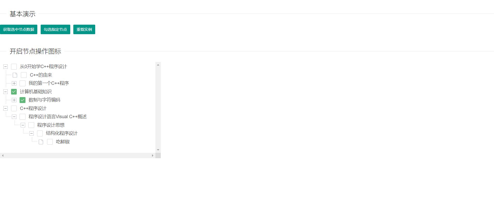

效果图如下:


layui之tree如何使用参考官方文档:https://www.layui.com/doc/modules/tree.html
官方效果展示:https://www.layui.com/demo/tree.html

layui的tree很好接入的，基本上返回data.data.list(请求后台接口返回的数据)，它就会自己加载处理，比较自动化。
它的增、删、改请求操作，可以去官方文档上看，官方文档已经写的比较详细了，我也在下面的示例代码中写了。
<!--more-->

树形结构的应用场景很多，常用的如下:
(1)OA系统或者其他系统的权限控制;
(2)博客系统中的文章标签;


示例代码(来自官方示例，本人做了一定的修改):
```
<!DOCTYPE html>
<html>

	<head>
		<meta charset="utf-8">
		<title>layui</title>
		<meta name="renderer" content="webkit">
		<meta http-equiv="X-UA-Compatible" content="IE=edge,chrome=1">
		<meta name="viewport" content="width=device-width, initial-scale=1, maximum-scale=1">
		<link rel="stylesheet" href="css/layui.css" media="all">
		<!-- 注意：如果你直接复制所有代码到本地，上述css路径需要改成你本地的 -->
	</head>

	<body>
		<fieldset class="layui-elem-field layui-field-title" style="margin-top: 30px;">
			<legend>基本演示</legend>
		</fieldset>
		<div class="layui-btn-container">
			<button type="button" class="layui-btn layui-btn-sm" lay-demo="getChecked">获取选中节点数据</button>
			<button type="button" class="layui-btn layui-btn-sm" lay-demo="setChecked">勾选指定节点</button>
			<button type="button" class="layui-btn layui-btn-sm" lay-demo="reload">重载实例</button>
		</div>

		<div id="test7" class="demo-tree"></div>
		<fieldset class="layui-elem-field layui-field-title" style="margin-top: 30px;">
			<legend>开启节点操作图标</legend>
		</fieldset>

		<div id="test9" class="demo-tree demo-tree-box" style="width: 500px; height: 300px; overflow: scroll;"></div>
		<p id="tree"></p>
		<script src="https://code.jquery.com/jquery-3.4.1.min.js"></script>
		<script src="layui.js" charset="utf-8"></script>
		<!-- 注意：如果你直接复制所有代码到本地，上述js路径需要改成你本地的 -->
		<script>
			$.ajax({

				url: "http://localhost:2019/test-api/api/mc/course/course/list_new",
				type: "POST",
				data: {
					"creator": "35"
				},
				dataType: 'json',
				success: function(data) {


					layui.use(['tree', 'util'], function() {
						var tree = layui.tree,
							layer = layui.layer,
							util = layui.util

						//开启节点操作图标
						tree.render({
							elem: '#test9',
							data: data.data.list,
							showCheckbox: true,
							edit: ['add', 'update', 'del'] //操作节点的图标
								,
							click: function(obj) {
								layer.msg(JSON.stringify(obj.data));

							},
							operate: function(obj){
									var type = obj.type; //得到操作类型：add、edit、del
									var data = obj.data; //得到当前节点的数据
									var elem = obj.elem; //得到当前节点元素
									
									//Ajax 操作
									var id = data.id; //得到节点索引
									
									alert("id:"+id);
									if(type === 'add'){ //增加节点
									  //返回 key 值
									 alert("添加");
									} else if(type === 'update'){ //修改节点
                                      alert("修改")
									  alert(elem.find('.layui-tree-txt').html());
                                    
									  console.log(elem.find('.layui-tree-txt').html()+"||"+id); //得到修改后的内容
									} else if(type === 'del'){ //删除节点
									  alert("删除");
									};
								}
						});
					});

				},
				error: function(XMLHttpRequest, textStatus, errorThrown) {
					alert("失败");
					// 状态码
					alert(XMLHttpRequest.status);
					// 状态
					alert(XMLHttpRequest.readyState);
					// 错误信息   
					alert(textStatus);
					return false;
				}

			});
		</script>

	</body>

</html>

```

Java核心代码:
```
    @PostMapping("/course/list_new")
	@ApiOperation(value="用户课程列表",notes="用户课程列表")
	public JSONObject courseList(String creator) {

	
		JSONObject returnJson = new JSONObject();
		
		EntityWrapper<CourseListMapping> wrapper = new EntityWrapper<CourseListMapping>();
		wrapper.eq("creator", creator);
		List<CourseListMapping> courseListMapping = courseListMappingService.selectList(wrapper);

		List<Map<String,Object>> returnMapList = new ArrayList<Map<String,Object>>();
  		
        for (CourseListMapping courseListMapping2 : courseListMapping) {
        	String id= courseListMapping2.getParentId();//该用户加入的课程id
			
			//获取该课程的章节目录
			List<Map<String,Object>> subList = getCourseList(Integer.parseInt(id));
			
			returnMapList.addAll(subList);
		}
		
		returnJson.put("code", "000000");
		returnJson.put("msg", "成功");
        Map<String, Object> data = new HashMap<String, Object>();
        data.put("list", returnMapList);
        returnJson.put("data", data);
		
        Console.log("获取课程列表返回数据" + returnJson);
		return  returnJson;
		
	}
	
	/**
	 * 
	 * @param id
	 * @return
	 */
	private List<Map<String, Object>> getChapterListNew(int id) {
		EntityWrapper<CourseListMapping> wrapper2 = new EntityWrapper<CourseListMapping>();
		wrapper2.eq("parentId", id);
		List<CourseListMapping> chapterList = courseListMappingService.selectList(wrapper2);
		
		List<Map<String, Object>> returnList = new ArrayList<Map<String, Object>>();//列表
		for (CourseListMapping courseListMapping : chapterList) {
			Map<String, Object> map = new HashMap<String, Object>();
			map.put("id", String.valueOf(courseListMapping.getId()));
			map.put("title", courseListMapping.getTitle());
			map.put("type", courseListMapping.getType());
			
			
			EntityWrapper<CourseListMapping> wrapper3 = new EntityWrapper<CourseListMapping>();
			wrapper3.eq("parentId", courseListMapping.getId());
			List<CourseListMapping> subList = courseListMappingService.selectList(wrapper3);
			
			List<Map<String, Object>> ml = new ArrayList<Map<String, Object>>();//章列表
			for (CourseListMapping courseListMapping2 : subList) {
				Map<String, Object> map2 = new HashMap<String, Object>();
				map2.put("id", String.valueOf(courseListMapping2.getId()));
				map2.put("title", courseListMapping2.getTitle());
				map2.put("type", courseListMapping2.getType());
				
				//获取章下面的题目
				List<Map<String, Object>> taskList = new ArrayList<Map<String, Object>>();//题目列表
				EntityWrapper<CourseListMapping> wrapper4 = new EntityWrapper<CourseListMapping>();
				wrapper4.eq("parentId", courseListMapping2.getId());
				List<CourseListMapping> pList = courseListMappingService.selectList(wrapper4);
				for (CourseListMapping courseListMapping3 : pList) {
					Map<String, Object> map3 = new HashMap<String, Object>();
					map3.put("id", String.valueOf(courseListMapping3.getId()));
					map3.put("title", courseListMapping3.getTitle());
					map3.put("type", courseListMapping3.getType());
					taskList.add(map3);
				}
				
				
				
				map2.put("children", taskList);
				ml.add(map2);
			}
			
			
			map.put("children", ml);
			
			returnList.add(map);
		}
		return returnList;
	}
	
	/*
	 * 获取课程列表
	 */
	private List<Map<String, Object>> getCourseList(Integer parentId){
		EntityWrapper<CourseListMapping> wrapper = new EntityWrapper<CourseListMapping>();
		wrapper.eq("type", "course");
		wrapper.eq("parentId", parentId);
		List<CourseListMapping> courseList = courseListMappingService.selectList(wrapper);
		List<Map<String, Object>> returnList = new ArrayList<Map<String, Object>>();
		for (CourseListMapping courseListMapping : courseList) {
			
			Map<String, Object> map = new HashMap<String, Object>();
			
			//获取章及下面的子节点
			List<Map<String, Object>> subList = getChapterList(courseListMapping.getId());
			map.put("id", courseListMapping.getId());
			map.put("title", courseListMapping.getTitle());
			map.put("type", "course");
			map.put("children", subList);
			returnList.add(map);
		}
		return returnList;
	}
	
	/**
	 * 获取章列表
	 * @param parentId
	 * @return
	 */
	private List<Map<String, Object>> getChapterList(Integer parentId){
		
		EntityWrapper<CourseListMapping> wrapper2 = new EntityWrapper<CourseListMapping>();
		wrapper2.eq("type", "chapter");
		wrapper2.eq("parentId", parentId);
		List<CourseListMapping> chapterList = courseListMappingService.selectList(wrapper2);
		
		
		List<Map<String, Object>> returnList = new ArrayList<Map<String, Object>>();
		for (CourseListMapping courseListMapping : chapterList) {
			Map<String, Object> map = new HashMap<String, Object>();
			map.put("id", courseListMapping.getId());
			map.put("title", courseListMapping.getTitle());
			map.put("type", "chapter");
			//获取节
			List<Map<String, Object>> subList = getUnitList(courseListMapping.getId());
			map.put("children", subList);
			returnList.add(map);
		}
		return returnList;
		
	}
	
	/**
	 * 获取节列表
	 * @param parentId
	 * @return
	 */
	private List<Map<String, Object>> getUnitList(Integer parentId){
		EntityWrapper<CourseListMapping> wrapper = new EntityWrapper<CourseListMapping>();
		wrapper.eq("parentId", parentId);
		wrapper.eq("type", "unit");
		List<CourseListMapping> list = courseListMappingService.selectList(wrapper);
		List<Map<String, Object>> returnList = new ArrayList<Map<String, Object>>();
		
		for (CourseListMapping courseListMapping : list) {
			Map<String, Object> map = new HashMap<String, Object>();
			//节内容
			map.put("id", courseListMapping.getId());
			map.put("title", courseListMapping.getTitle());
			map.put("type", "unit");
			List<Map<String, Object>> subList = getLessonList(courseListMapping.getId());
			map.put("children", subList);
			returnList.add(map);
		}
		return returnList;
		
	}
	/**
	 * 获取课时列表
	 * @param parentId
	 * @return
	 */
	private List<Map<String, Object>> getLessonList(Integer parentId){
		EntityWrapper<CourseListMapping> wrapper4 = new EntityWrapper<CourseListMapping>();
		wrapper4.eq("type", "lesson");
		wrapper4.eq("parentId", parentId);
		List<CourseListMapping> lessonList = courseListMappingService.selectList(wrapper4);
		List<Map<String, Object>> returnList = new ArrayList<Map<String, Object>>();
		for (CourseListMapping courseListMapping4 : lessonList) {
			Map<String, Object> map = new HashMap<String, Object>();
			Console.log(courseListMapping4.getTitle());
			//课时内容
			map.put("id", courseListMapping4.getCourseId());
			map.put("title", courseListMapping4.getTitle());
			map.put("type", "lesson");
			List<Map<String, Object>> subList = getTaskList(courseListMapping4.getId());
			map.put("children", subList);
			returnList.add(map);
		}
		return returnList;
		
	}
	
	

	/**
	 * 获取任务
	 * @param parentId
	 * @return
	 */
	private List<Map<String, Object>> getTaskList(Integer parentId){
		EntityWrapper<CourseListMapping> wrapper4 = new EntityWrapper<CourseListMapping>();
		wrapper4.eq("parentId", parentId);
		wrapper4.eq("type", "task");
		wrapper4.eq("extend1", "0");
		List<CourseListMapping> list = courseListMappingService.selectList(wrapper4);
		List<Map<String, Object>> returnList = new ArrayList<Map<String, Object>>();
		for (CourseListMapping courseListMapping4 : list) {
			Map<String, Object> map = new HashMap<String, Object>();
			Console.log(courseListMapping4.getTitle());
			//任务内容
			map.put("id", courseListMapping4.getCourseId());
			map.put("title", courseListMapping4.getTitle());
			map.put("type", "task");
//			map.put("last", StrUtil.isEmpty(courseListMapping4.getExtend2())? "" : courseListMapping4.getExtend2());//上一个题id
//			map.put("next", StrUtil.isEmpty(courseListMapping4.getExtend3())? "" : courseListMapping4.getExtend3());//下一个题id
			returnList.add(map);
		}
		return returnList;
		
	}

```
