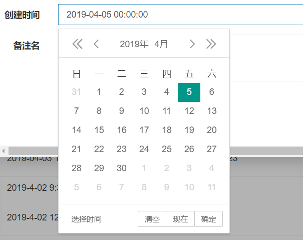
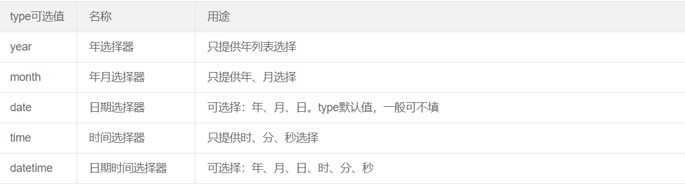

参考文档:https://www.layui.com/doc/modules/laydate.html
代码片段如下:
```
			layui.use('laydate', function(){
					  var laydate = layui.laydate;

					  laydate.render({
					    elem: '#createDate', // 指定元素
					    type:'datetime'
					  });
					});

```
<!--more-->
效果图如下:



其中type默认值为date(年月日)，有如下几个可选值:

