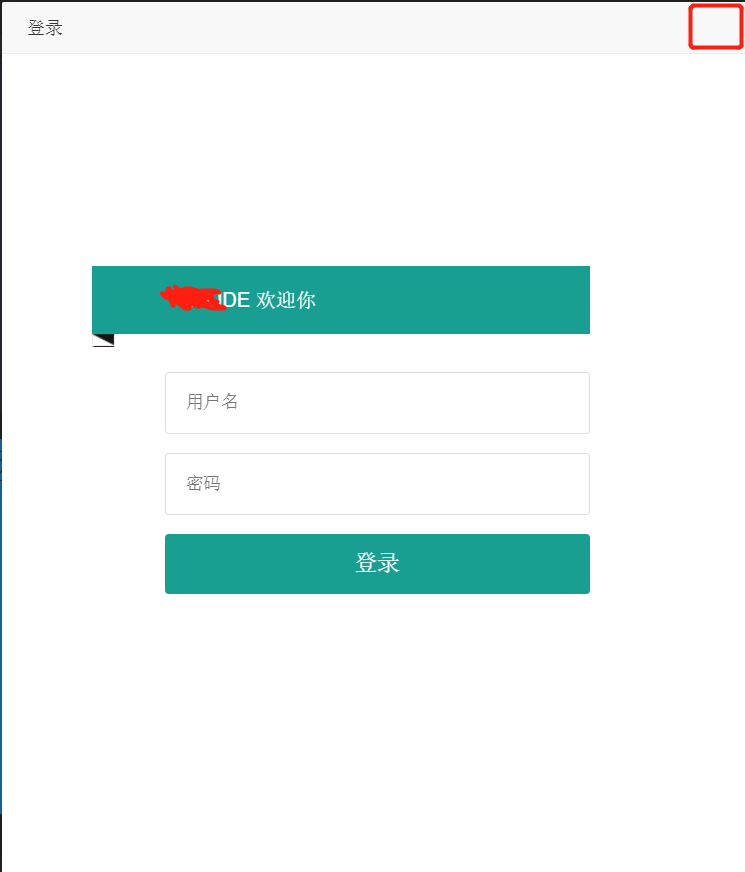

layui默认弹出层是带有关闭按钮的，但是在某些场景我们不需要layui的关闭按钮，这时只需添加`closeBtn :0`即可
<!--more-->
效果图如下:


示例代码如下:
```
layui.use('layer', function () {

		var layer = layui.layer;

		layer.open({
			skin: 'demo-class',
			type: 1,
			title: '登录',
			area: ['600px', '700px'],
			closeBtn :0,
			content: $('.login')//这里content是一个普通的String
		});
	});


```

更多详细资料可参考[layui官方文档](https://www.layui.com/)

