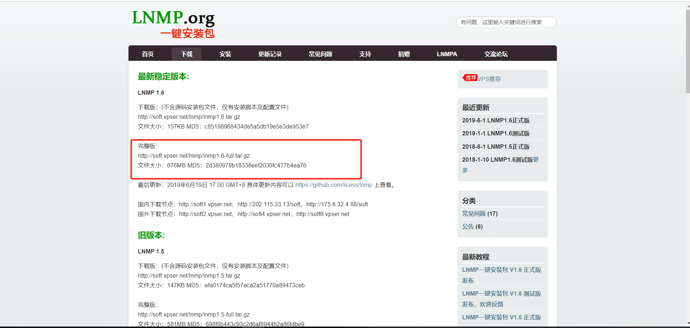
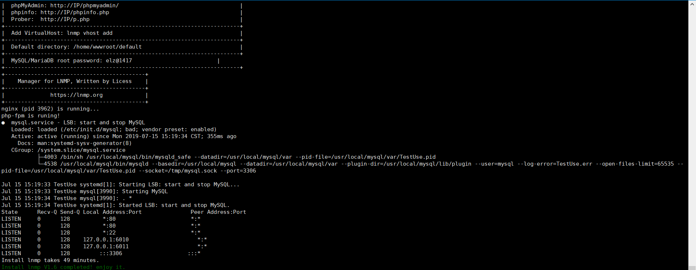
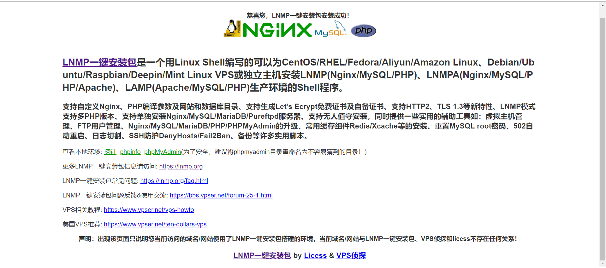

## 进入lnmp官网
https://lnmp.org/download.html

如图:

<!--more-->
## 进入Linux服务器并执行wget命令下载
```
wget http://soft.vpser.net/lnmp/lnmp1.6-full.tar.gz

```

## 解压该压缩包
```
tar -xzvf lnmp1.6-full.tar.gz

```

## 执行安装脚本
```
cd lnmp1.6-full
sh/bash install.sh

```


执行脚本后，会有让你选择对应的mysql版本和php版本，只需输入对应的序列号即可


## 安装成功标志


访问IP对应的效果图如下:
