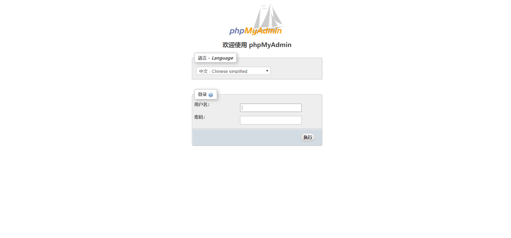

Nginx配置phpmyadmin流程如下:

## 一、准备软件和环境(这里我以ubuntu16.04为例)

### 1.安装php7.1
```
sudo LC_ALL=C.UTF-8 add-apt-repository ppa:ondrej/php
sudo apt-get update
sudo apt-get install php-pear php7.1-cli php7.1-common php7.1-curl \
    php7.1-dev php7.1-fpm php7.1-json php7.1-mbstring php7.1-mcrypt \
    php7.1-mysql php7.1-opcache php7.1-zip php7.1-intl php7.1-gd php7.1-xml

```
#### (1)修改 PHP-FPM 监听方式为127.0.0.1:9000
```
sudo sed -i 's/listen = .*/listen = 127.0.0.1:9000/g' /etc/php/7.1/fpm/pool.d/www.conf

```
#### (2)重启 PHP-FPM 服务进程
```
sudo service php7.1-fpm restart

```
<!--more-->
### 2.安装mysql

#### (1)配置mysql5.7源
```
# 可在 http://dev.mysql.com/downloads/repo/apt/ 页面找到 mysql-apt-config 的最新版本。
wget http://dev.mysql.com/get/mysql-apt-config_0.8.7-1_all.deb
sudo dpkg -i mysql-apt-config_0.8.7-1_all.deb

```

这时会弹出让你选择，将：

MySQL Server修改为： mysql-5.7
MySQL Tools & Connectors (Currently selected: Enabled)修改为Disabled。
MySQL Preview Packages修改过为 Disabled。

#### (2)安装mysql服务端
```
sudo apt-get update
sudo apt-get install mysql-server

```


### 3.下载最新版phpmyadmin，可以到[官网](https://www.phpmyadmin.net/)去下载:
```
wget https://files.phpmyadmin.net/phpMyAdmin/4.8.5/phpMyAdmin-4.8.5-all-languages.zip
unzip phpMyAdmin-4.8.5-all-languages.zip
mv phpMyAdmin-4.8.5-all-languages.zip phpmyadmin

```

### 4.安装nginx:
```
sudo add-apt-repository ppa:nginx/stable
sudo apt-get update
sudo apt-get install nginx

```

## 二、将phpmyadmin复制到/var/www目录下
```
cp -r phpmyadmin /var/www

```

## 三、配置nginx(主要修改nginx.conf配置文件)

这段代码放到http{}里面

```
 server {
 listen 8090;
 root /var/www/phpmyadmin;
 index index.php;

 location ~ \.php$ {
   include snippets/fastcgi-php.conf;
   fastcgi_pass unix:/run/php/php7.1-fpm.sock;
 }


```


四、重启nginx
```
/etc/init.d/nginx restart

```
访问:http://IP地址:8090/即可看到
效果图如下:
