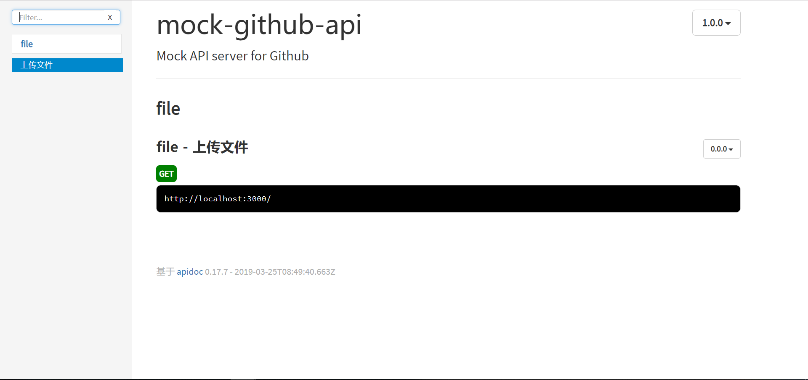

ApiDoc官网地址为:http://apidocjs.com/
在Java中有Swagger及其升级版的Swagger2+Springfox自动生成接口管理文档。而在Node.js中则可以利用ApiDoc生成接口文档。
<!--more-->
参考官网其实步骤，也很简单，也就如下几步。

## 一、安装库
```
npm i apidoc -g   #全局安装

```
## 二、配置package.json
```
{
  "name": "mock-github-api",
  "version": "1.0.0",
  "description": "Mock API server for Github",
  "main": "index.js",
  "scripts": {
    "test": "echo \"Error: no test specified\" && exit 1",
    "start": "node index"
  },
  "repository": {
    "type": "git",
    "url": "https://github.com/mzabriskie/mock-github-api"
  },
  "author": "Matt Zabriskie",
  "license": "MIT",
  "bugs": {
    "url": "https://github.com/mzabriskie/mock-github-api/issues"
  },
  "homepage": "https://github.com/mzabriskie/mock-github-api",
  "dependencies": {
    "@octokit/app": "^2.2.1",
    "apidoc": "^0.17.7",
    "color": "^0.11.3",
    "connect-multiparty": "^2.2.0",
    "cors": "^2.7.1",
    "cos-nodejs-sdk-v5": "^2.5.6",
    "express": "^4.14.0",
    "faker": "^3.1.0",
    "https": "^1.0.0",
    "multer": "^1.4.1",
    "multiparty": "^4.2.1",
    "mysql": "^2.16.0",
    "octokit": "^1.0.0-hello-world",
    "redis": "^2.8.0"
  },
"apidoc": {  
    "title": "接口文档", 
    "url": "http://localhost:3000"
  }
}


```

## 三、在public目录下创建apidoc目录

## 四、使用命令生成apidoc文档
```
apidoc -i routes/ -o public/apidoc/

```
访问地址:http://localhost:3000/apidoc/index.html
效果图如下所示:



源码地址为:https://github.com/developers-youcong/mock-github-api
