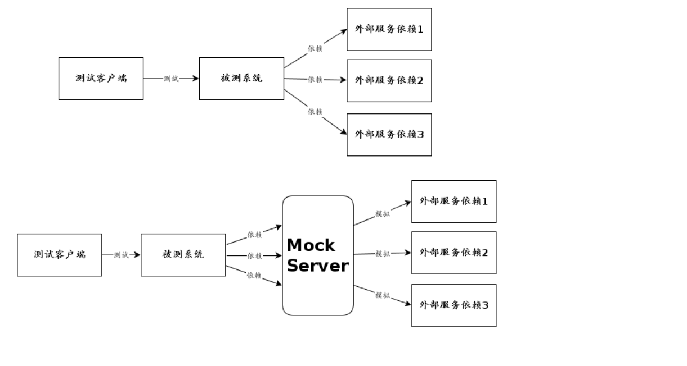

之前学习过node.js接触过express框架，最近为了编写一个mock server正好用到了express。下面正好就跟大家介绍一下关于express。
今天的内容主要围绕这么几个方面?
- express框架初步介绍
- express框架中的app.use和app.get/app.post
- mock server 介绍
- mock server的实现思路

<!--more-->

## 一、express框架初步介绍
关于express框架的介绍，这里我引用菜鸟教程的简介:
Express是一个简洁而灵活的node.js web框架，提供了一系列强大特性帮助你创建各种web应用，和丰富的HTTP工具。使用Express可以快速地搭建一个完整功能的网站。

#### 1.express框架的特性
（1）可以设置中间件来响应HTTP请求；
（2）定义了路由表用于执行不同大的HTTP请求动作；
（3）可以通过向模板传递参数来动态渲染HTML页面；

#### 2.安装express
```
npm install express --save或cnpm install express --save
```

以下几个重要需要与express框架一起安装:
body-parser -node.js中间件，用于处理JSON，Raw，Text和URL编码的数据；
cookie-parser -这就是一个解析Cookie的工具。通过req.cookies可以取到传过来的cookie，并将它们转为对象；
multer - node.js中间件，用于处理enctype=“multipart/form-data”（设置表单mime编码)的表单数据；

安装命令如下所示:
```
npm install body-parser --save
npm install cookie-parser --save
npm install multer --save
```

#### 3.express的入门程序
node_learning.js代码如下:
```
var express = require('express');
var app = express();

app.get('/', function (req, res) {
   res.send('Hello World');
})

var server = app.listen(2019, function () {

  var host = server.address().address
  var port = server.address().port

  console.log("应用实例，访问地址为 http://127.0.0.1:2019", host, port)

})

```

## 二、express框架中的app.use和app.get/app.post
app.use和app.get/app.post其实区别如(引用一位朋友说的):
感兴趣的可以参考这个链接:[作者做了试验测试过的](https://blog.csdn.net/wthfeng/article/details/53366169)
(1)app.use(path,callback)中的callback既可以是router对象又可以是函数
(2)app.get(path,callback)中的callback只能是函数

app.use和app.get/app.post实现几乎大同小异，代码示例如下:
```

var express = require('express');

var app = express();

function testUser(req, res, next){

    // req 参数可以接受一些请求的参数(req.query/req.body) 和 请求头信息

    // res 用于响应信息

    // 调用next()方法则进入下一个中间件
	res.send("测试用户");

}

function testLogin(req,res,next){

	res.send("测试登录");

}


var server = app.listen(2019, function () {

  var host = server.address().address
  var port = server.address().port

  console.log("应用实例，访问地址为 http://127.0.0.1:2019")

})


//路径匹配

app.use('/user',testUser);

app.get('/login',testLogin);
```

关于node.js的express框架就介绍这么多，最近本人因实现某个插件的功能而需要用到的，这与下面说的mock server有比较大的关系。


## 三、mock server 介绍

mock server 翻译过来的意思是模拟服务。
说到这我相信大家就很容易理解了。至于为什么要模拟服务？
比方说现今的业务系统很少有孤立存在的，它们或多或少使用其他公司提供的服务，这给我们联调和测试造成了比较大的麻烦，对于这种情况，常见的解决方案就是搭建一个mock server，模拟那些服务器，提供数据进行联调和测试(这句话，我引用自该链接[Mock Server 入门](https://www.cnblogs.com/fnng/p/7511539.html)



## 四、mock server的实现思路

现在google或者being搜索mock server 实现思路肯定有很多，这里我就不再赘述。
这里我以我自己最近的vscode插件开发来说。
我最近的工作是针对Settings-Sync作二次开发
关于settings-sync插件，感兴趣的可以参考我的博客园[Settings-Sync源码阅读](https://www.cnblogs.com/youcong/p/10380501.html)


如何实现一个mock server 替换github api地址并确保效果一致?

针对目前这个需求，我的实现思路如下:

第一，针对如何实现一个mock server ，可以复用已有，如mock-github-api(其本身是使用node.js的express框架);
第二，如何编写，可以按照express框架编写网络请求的方法，如app.get或app.use等;
第三，为了保持与githu api一致，我需要引入github rest api，如@octokit/rest;
参考api地址为:https://www.npmjs.com/package/@octokit/rest#authentication
```
示例一:
	  octokit.repos.listForOrg({
	  org: 'octokit',
	  type: 'public'
	}).then(({ data, status, headers }) => {
	  // handle data
	  //console.log("status:"+JSON.stringify(headers));
	  //console.log(status);
	  console.log(data);
	})
	返回的octokit相关的api信息(信息太多了，就先简略)
```

```
示例二:
	const clientWithAuth = new Octokit({
    auth: 'token secret123'
    })
	console.log(clientWithAuth)//查看详细信息
	console.log(JSON.stringify(clientWithAuth))//输出简要信息如下
	所示:
	返回的信息:
	{"log":{},"activity":{},"apps":{},"checks":{},"codesOfConduct":{},"emojis":{},
	"gists":{},"git":{},"gitignore":{},"interactions":{},"issues":{},"licenses":{},
	"markdown":{},"meta":{},"migrations":{},"oauthAuthorizations":{},"orgs":{},
	"projects":{},"pulls":{},"rateLimit":{},"reactions":{},"repos":{},"search":{},
	"teams":{},"users":{},"gitdata":{},"authorization":{},"pullRequests":{}
	}
```

第四，根据router.json(node_modules\@octokit\rest\plugins\rest-api-endpoints\routes.json)也就是octokit里面定义github rest api的地方(该文件定义了所需的所有的请求信息)，我可以仿照其编写对应的网络请求（美其名依样画葫芦）；

如果要用一句简单直接的话来概述，模仿github rest api编写一个mock server来替换github，只要接口定义保持一致就可以。
但是目前存在一个问题，我在此停滞不前。正在想办法解决这个问题。
这个问题是，我参考其对应的rest api文档写代码，但是其返回的信息却并没有我想要的，返回是一大堆没有用处的function之类的，而不是具体的信息。
但是以5why原则来看待这个问题：
为什么github api会返回一大堆function?

这些function有什么用?github api不会无缘无故返回没有用的东西

还有就是为什么console.log(clientWithAuth)返回详细信息，console.log(JSON.stringify(clientWithAuth))返回的却是简要信息呢？难道是因为非JSON数据吗？两者返回的都是JSON数据

我查找JSON.stringify()认为应该是这个原因:
JSON.stringify() 方法是将一个JavaScript值(对象或者数组)转换为一个 JSON字符串，如果指定了replacer是一个函数，则可以替换值，或者如果指定了replacer是一个数组，可选的仅包括指定的属性(参考地址为:https://developer.mozilla.org/zh-CN/docs/Web/JavaScript/Reference/Global_Objects/JSON/stringify)

另外前面虽说不讲mock server的实现思路，但是还是要推荐一下一个开源实现框架 moco。

github仓库地址为:https://github.com/dreamhead/moco
