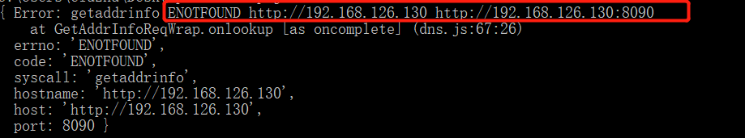

应用场景:
1.VsCode插件开发(主要针对以javascript为主的vscode插件);
2.使用Node.js开发的客户端程序

### Node.js之http请求(客户端)
<!--more-->
代码示例如下:
```
var http = require('http');  
  
var qs = require('querystring');  

var userCode = "1";

var post_data = {  
    userCode: userCode};//这是需要提交的数据  
  
  
var content = qs.stringify(post_data);  
  
var options = {  
    hostname: 'www.test.com',
    port: 80,  
    path: '/test-web/api/sysUser/getUserCodeByInfo',  
    method: 'POST',  
    headers: {  
        'Content-Type': 'application/x-www-form-urlencoded; charset=UTF-8'  
    }  
};  
  
var req = http.request(options, function (res) {  
    console.log('STATUS: ' + res.statusCode);  
    console.log('HEADERS: ' + JSON.stringify(res.headers));  
    res.setEncoding('utf8');  
    res.on('data', function (chunk) {  
        console.log('BODY: ' + chunk);  
		
		var data = JSON.parse(chunk);
		console.log(data.returnCode);
    });  
});  
  
req.on('error', function (e) {  
    console.log('problem with request: ' + e.message);  
});  
  
// 将数据写入请求体
req.write(content);//注意这个地方  
  
req.end();

```


### Node.js之https请求(客户端)
代码示例如下:
```
var querystring = require('querystring');

const https = require("https");
    var userCode = "1";
	var post_data = { userCode: userCode }
	var contents = querystring.stringify(post_data);

	var options = {
		hostname: "www.test.com",
		port: 443, //443
		path: "/test-web/api/sysUser/getUserCodeByInfo?"+contents ,
		method: "POST",
		rejectUnauthorized: false,
		headers: {
			Accept: "*/*",
			"Accept-Encoding": "utf-8",
			"Accept-Language": "zh-CN,zh;q=0.8",
			Connection: "keep-alive",
			Host: "www.test.com"
		},

	};
	var mData = '';
	var req = https.request(options, function (res) {
		res.setEncoding('utf-8');
		
		 res.on('data', function (chunk) {  
		 var data = JSON.parse(chunk);
         console.log('BODY: ' + data);  
    }); 
	});
	// req.write(contents);
	req.on("error", function (e) {
		console.error("====================================================" + e);
	});
	req.end();

```

上面的hostname，如果不是域名修改为ip地址，请修改成这样，将www.test.com改为192.168.126.130，
切不可指定为
http://192.168.126.130

否则会出现请求失败，主要体现为如下错误:


还有一点需要强调，如果参数不用querystring.stringify()包裹的话，会出现如下错误:
```
Request path contains unescaped characters

```

那么为什么需要querystring呢？
因为querystring.stringify()能将对象序列化成URL的形式，以&进行拼接。