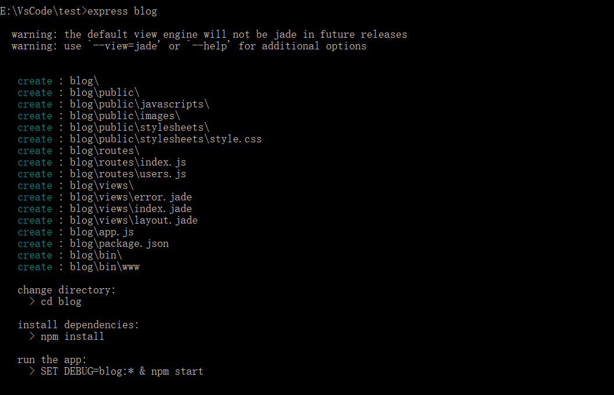
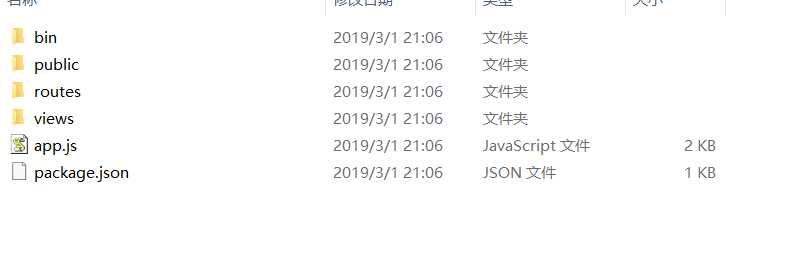
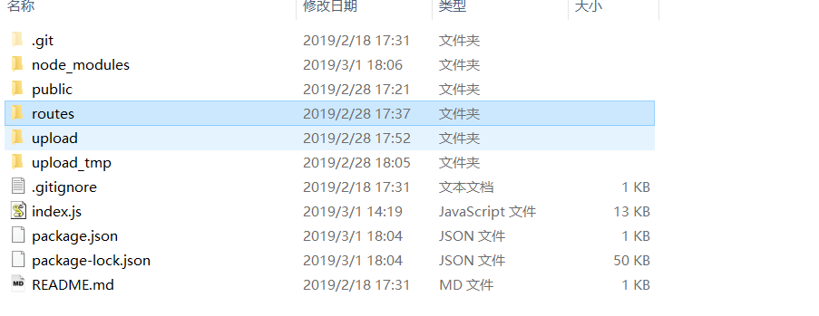
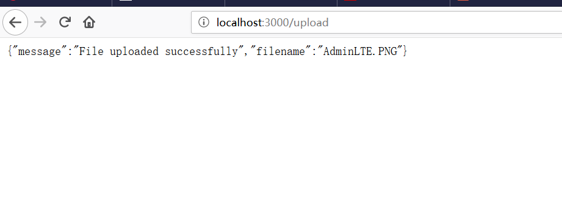

关于node.js使用express框架进行文件上传，主要来自于最近对Settings-Sync插件做的研究。
目前的研究算是取得的比较好的进展。
Settings-Sync中通过快捷键上传文件，其实主要还是请求后端接口。
于是我便使用node.js模拟一个服务，这个服务其实就相当于github api(Settings-Sync实际请求的接口，比如token验证，gist存储创建等都是来自github 对应的api)。
<!--more-->
话不多说，直接代码贴起讲解:

## 1.创建一个node.js项目(这里我以express框架为例)

关于如何创建一个node.js项目我就不详细说，通常通过npm init就可以创建一个node.js项目了。
关于node.js项目详细教程，可以参考该篇文章[nodeJS入门——新建一个项目及代码详解](https://www.jianshu.com/p/7b0a5d4491ba)
当然了，如果你是直接通过这篇文章操作，最先可能会报这个错误，错误信息如下:

```
'express' 不是内部或外部命令，也不是可运行的程序
或批处理文件。
```
解决方式很简单，并不是npm install -g express就可以的，在此之前还需执行npm install -g express-generator

这条命令很好理解，你可以将其理解为你的express框架生成器，以Java中Maven来说，通常ide就把maven结构都弄好了，你只需在创建项目的时候，勾选maven即可，它会自己将所有相关项目包括配置文件一起生成。

虽然说我将地址贴出来，但是我觉得还是实际操作一遍，这样对此有一个感性认识(初学编程的人或者是已经有编程经验的人，是绝对不能忽略这一点的)。

流程如下:
#### a.使用express命令创建express项目
```
express blog

```
##### 效果图如下:


express非常有人性化，已经告诉你怎么进入blog项目及其安装相关的库依赖和启动了，你只需按照它的这个步骤，一步一步来就行了。


#### b.目录结构分析

##### 示意图如下所示:

app.js:——启动文件，也可以说是主文件入口。
package.json——定义了这个项目所需要的各种模块，以及项目的配置信息（比如名称、版本、许可证等元数据）。npm install命令根据这个配置文件，自动下载所需的模块，也就是配置项目所需的运行和开发环境。
node_modules——存放package.json中安装的模块，当你在package.json添加依赖的模块并安装后，存放在这个文件夹下
public——存放image、css、js等文件
routes——存放路由文件
views——存放视图文件或者说模板文件
bin——存放可执行文件


## 2.使用express框架进行文件上传
注意，目录结构如下所示(我主要是复用最近研究的mock-github-api):



#### a.准备html文件
public文件夹主要放置静态文件，如index.html
```
<!DOCTYPE html>
<html lang="en">
<head>
    <meta charset="UTF-8">
    <title>文件上传</title>
</head>
<body>
    <h3>文件上传：</h3>
    选择一个文件上传: <br />
    <form action="/gists" method="post" enctype="multipart/form-data">
        <input type="file" name="content" />
        <br />
        <input type="submit" value="上传文件" />
    </form>
	
</body>
</html>

```


#### b.编写相关的js
像upload.js属于路由，通常放置在routes文件夹下
```
var fs = require('fs');
var express = require('express');
var multer  = require('multer');
var path = require('path');
var router = express.Router();

var upload = multer({dest: 'upload_tmp/'});

router.post('/', upload.any(), function(req, res, next) {
    console.log(req.files[0]);  // 上传的文件信息

    var des_file = "./upload/" + req.files[0].originalname;
    fs.readFile( req.files[0].path, function (err, data) {
        fs.writeFile(des_file, data, function (err) {
            if( err ){
                console.log( err );
            }else{
                response = {
                    message:'File uploaded successfully',
                    filename:req.files[0].originalname
                };
                console.log( response );
                res.end( JSON.stringify( response ) );
            }
        });
    });
});

module.exports = router;

```

#### c.上传文件及其效果

##### 页面图:


##### 上传成功显示图:



##### upload文件夹下会有对应的文件(也就是你刚刚通过页面上传的文件)


最后例子中还有阿里云和腾讯云的图片存储，大家可以做一个参考。

源码地址为:https://github.com/developers-youcong/mock-github-api

希望能够对大家有所启发和帮助

注意，可能遇到的问题:

问题一:静态资源需要放行，否则无法访问
在index.js补充这段代码即可解决这个问题
```
app.use(express.static(path.join(__dirname, 'public')))

```

问题二:socket hang up

我将var bodyParser = require('body-parser')去除就解决了这个问题

参考链接如:https://blog.csdn.net/gsying1474/article/details/52200445

