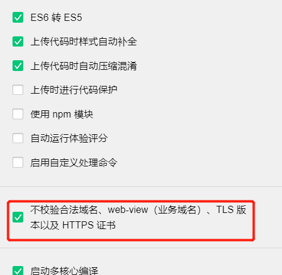

错误信息:request:fail url not in domain list

原因:没有配置服务器域名

解决办法如下:
<!--more-->
(1)参考官方文档提供的解决办法(即配置对应的域名)
  https://developers.weixin.qq.com/miniprogram/dev/framework/ability/network.html
  
(2)可点击开发者工具右上角 详情-项目设置-不校验合法域名、web-view（业务域名）、TLS 版本以及 HTTPS 证书，或者看看域名信息是否配置了各种合法域名。)
如图所示:

参考资料如下:
[小程序运行报错：errMsg: "request:fail url not in domain list"](https://blog.csdn.net/yuhao309/article/details/82378545)
[小程序VM144:1 request:fail url not in domain list](https://blog.csdn.net/E_li_na/article/details/87873082)
