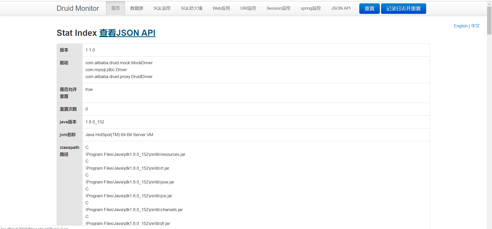

## 一、导入Maven依赖
```
        <dependency>
            <groupId>com.alibaba</groupId>
            <artifactId>druid-spring-boot-starter</artifactId>
            <version>1.1.0</version>
        </dependency>

```
<!--more-->

## 二、application.yml配置
```
spring:
  devtools:
    restart:
      enabled: false


  datasource:
    url: ENC(4k7M62ElZmvr2fECvWBXaYqMh5gz5cR4hn7LU2jaAt+Cv0hfWuvEXwpigYjLXZ6W)
    username: ENC(kJXrMwKAoGen2JxTFdtfgw==)
    password: ENC(r7aiV3zZoSqKN36KqE6jiQ6rmfmFt7WE)
    db-name: ENC(5lFd29y9ciI4HwyIX8BAPg==)
    driver-class-name: com.mysql.jdbc.Driver
    ###################以下为druid增加的配置###########################
    type: com.alibaba.druid.pool.DruidDataSource
    # 下面为连接池的补充设置，应用到上面所有数据源中
    # 初始化大小，最小，最大
    initialSize: 5
    minIdle: 5
    maxActive: 20
    # 配置获取连接等待超时的时间
    maxWait: 60000
    # 配置间隔多久才进行一次检测，检测需要关闭的空闲连接，单位是毫秒
    timeBetweenEvictionRunsMillis: 60000
    # 配置一个连接在池中最小生存的时间，单位是毫秒
    minEvictableIdleTimeMillis: 300000
    validationQuery: SELECT 1 FROM DUAL
    testWhileIdle: true
    testOnBorrow: false
    testOnReturn: false
    # 打开PSCache，并且指定每个连接上PSCache的大小
    poolPreparedStatements: true
    maxPoolPreparedStatementPerConnectionSize: 20
    # 配置监控统计拦截的filters，去掉后监控界面sql无法统计，'wall'用于防火墙
    filters: stat,wall,log4j
    # 通过connectProperties属性来打开mergeSql功能；慢SQL记录
    connectionProperties: druid.stat.mergeSql=true;druid.stat.slowSqlMillis=5000
    # 合并多个DruidDataSource的监控数据
    useGlobalDataSourceStat: true

```

## 三、效果图
