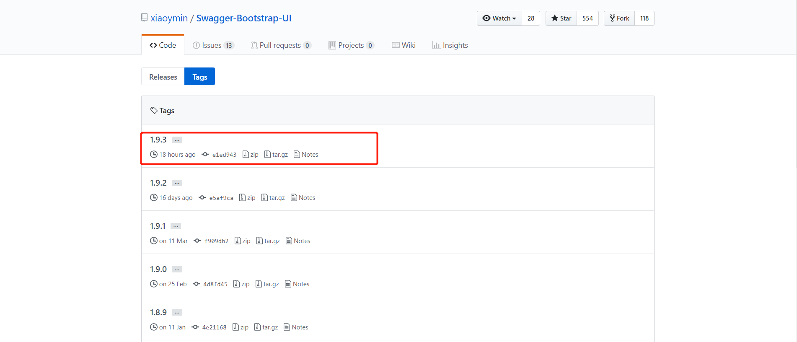

swagger-bootstrap-ui是国内的一个swagger开源项目，从发起到现在已经有三年了。
初次体验了一下，觉得还是挺不错的，就如当初使用mybatis-plus那样，因为有了mybatis的基础，所以过渡到mybatis-plus很没有压力。
现在由swagger2到swagger-bootstrap-ui也是没有压力的，基本上参考官方文档就能弄好了。
<!--more-->
目前我应用在我个人的博客项目上，效果如图:


关于如何搭建步骤，我主要是参考官方文档，我本次写的就作为官方文档的一点补充:

## 一、添加Maven依赖
```
	<dependency>
		   <groupId>com.github.xiaoymin</groupId>
		   <artifactId>swagger-bootstrap-ui</artifactId>
		   <version>1.9.3</version>
	</dependency>

    <dependency>
			<groupId>io.springfox</groupId>
			<artifactId>springfox-swagger2</artifactId>
			<version>2.9.2</version>
	</dependency>
```


## 二、编写配置类
```
import org.springframework.context.annotation.Bean;
import org.springframework.context.annotation.Configuration;
import com.github.xiaoymin.swaggerbootstrapui.annotations.EnableSwaggerBootstrapUI;
import springfox.documentation.builders.ApiInfoBuilder;
import springfox.documentation.builders.PathSelectors;
import springfox.documentation.builders.RequestHandlerSelectors;
import springfox.documentation.service.ApiInfo;
import springfox.documentation.spi.DocumentationType;
import springfox.documentation.spring.web.plugins.Docket;
import springfox.documentation.swagger2.annotations.EnableSwagger2;

@Configuration
@EnableSwagger2
@EnableSwaggerBootstrapUI
public class SwaggerConfiguration {

 @Bean
 public Docket createRestApi() {
     return new Docket(DocumentationType.SWAGGER_2)
     .apiInfo(apiInfo())
     .select()
     .apis(RequestHandlerSelectors.basePackage("com.blog.springboot"))
     .paths(PathSelectors.any())
     .build();
 }

 private ApiInfo apiInfo() {
     return new ApiInfoBuilder()
     .title("swagger-bootstrap-ui RESTful APIs")
     .description("swagger-bootstrap-ui")
     .termsOfServiceUrl("http://www.youcongtech.com")
     .contact("developer@mail.com")
     .version("1.1")
     .build();
 }
}

```

## 三、去下载对应的前端资源
下载地址为:https://github.com/xiaoymin/Swagger-Bootstrap-UI/tags ,如下图所示:



## 四、下载完毕后解压并将swagger-bootstrap-ui放到springboot项目职工的src/main/resources目录下
步骤如图:
找到这个文件夹

并将其迁移到springboot对应的目录


## 五、整个流程完成后，启动应用，访问地址为:http://IP地址:端口号/项目名/doc.html即可访问(如http://localhost:2019/blog-web/doc.html)
参考资料如下:
swagger-bootstrap-ui文档：http://doc.xiaominfo.com
