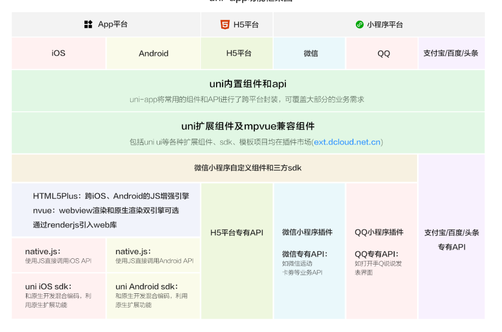
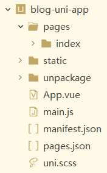

## 一、背景介绍
uni-app官网地址:
https://uniapp.dcloud.io/

### 当前跨平台开发存在的三个问题

#### 1.多端泛滥(公司增加运营成本、开发者增加学习成本)

#### 2.体验不好(app体验不好)

#### 3.生态不丰富(跨平台框架在周边生态不丰富，开发者很难得到更多更好的SDK)
<!--more-->
于是为了解决上述跨平台开发存在的三个问题，uni-app应运而生。

## 二、产品特征

### 1.跨平台更多
- 真正做到"一套代码，多端发行"
- 条件编译:优雅的在一个项目里调用不同平台的特色功能。

### 2.运行体检更好
- 组件、api和微信小程序一致
- 兼容weex原生渲染

### 3.通用技术栈，学习成本更低
- vue的语法、微信小程序的api
- 内嵌mpvue

### 4.开放生态，组件更丰富
- 支持通过npm安装第三方包
- 支持微信小程序自定义组件及SDK
- 兼容mpvue组件及项目
- App端支持和原生混合编码
- DCloud将发布插件市场

## 三、解决跨平台开放存在的问题
1.跨更多平台
2.体验更好
3.学习成本低，容易上手
4.开放生态，组件更丰富

## 四、功能框架示意图

## 五、快速上手
参考uni-app:
https://uniapp.dcloud.io/quickstart

通常有两种方式，一种是通过HbuildX生成uni-app脚手架，另外一种是通过vue命令行方式生成uni-app脚手架，具体可参考上述网址查看详情。

如果你看到官网还不够理解的话，可以看看如下地址的视频教程:
https://ke.qq.com/course/343370?taid=2796517631278410

我个人觉得官网写的很不错，很容易理解。

我为此新建了一个项目(技术学习一定要勤于动手实践)，如图:

