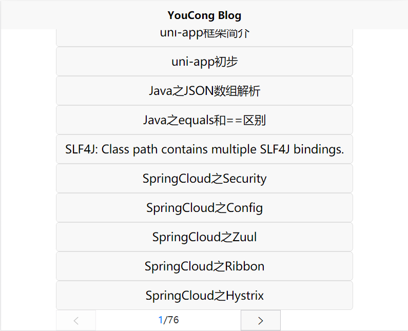
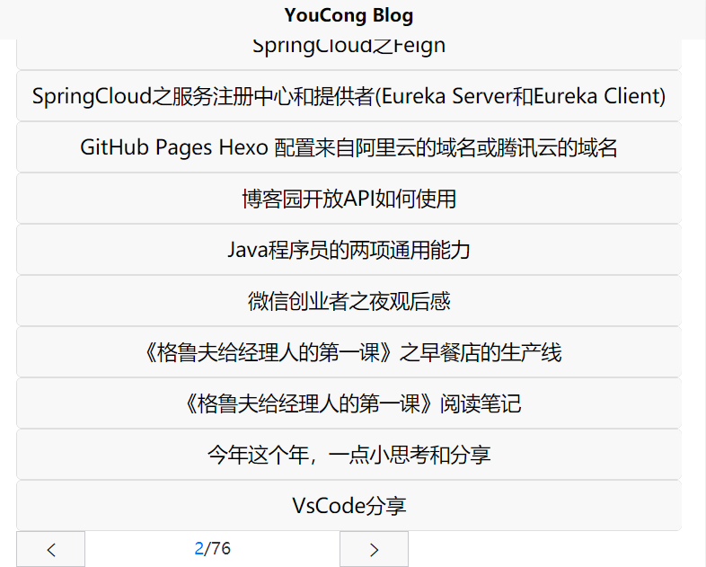

## 一、下载库
官方文档地址为:
https://ext.dcloud.net.cn/plugin?id=32

点击下载zip压缩包即可，下载完毕后解压到放置前端相关组件目录,即components目录。
<!--more-->
## 二、使用

### 1.引入
```
import uniPagination from '../../components/uni-pagination/uni-pagination/uni-pagination.vue'

```

### 2.模板区域使用(在<template></template>里)
```
<uni-pagination @change="handlePage" show-icon="true" :total="postCount" :current="pageNum" :pageSize="pageSize"></uni-pagination>

```

### 3.编写handlePage函数
```
handlePage(params){
			var pageIndex = params.current;
		
		    console.log("this.pageNum:"+pageIndex);
		
			this.getPostListInfo(pageIndex)
		}

```

### 4.我的完整代码如下
```
<template>
	<view class="content">
		<!-- 	<image class="logo" src="/static/logo.png"></image> -->
		<view class="text-area">
			<text class="title">{{ title }}</text>
		</view>
		<view class="uni-list">
			<view class="uni-list-cell" hover-class="uni-list-cell-hover" v-for="(item, index) in list" :key="index">
				<!-- 	<view class="uni-list-cell-navigate uni-navigate-right">{{ item.Title }}</view> -->

				<button type="default" @click="getDetail(item.Title, item.Id, item.Url)">{{ item.Title }}</button>
			</view>
			<uni-pagination @change="handlePage" show-icon="true" :total="postCount" :current="pageNum" :pageSize="pageSize"></uni-pagination>
		</view>
	</view>
</template>

<script>
import common from '../../common/common.js';
import uniPagination from '../../components/uni-pagination/uni-pagination/uni-pagination.vue';
export default {
	components: { uniPagination },
	data() {
		return {
			title: '文章列表',
			postCount: 0,
			pageSize: 10,
			pageNum: 1,
			list: []
		};
	},

	onLoad() {
		this.getPostListInfo(this.pageNum);

		this.getPersonalBlogInfo();
	},
	methods: {
		getPostListInfo(pageIndex) {
			console.log('pageIndex:' + pageIndex);
			uni.request({
				url: common.website_url + '/cnblogs/getPersonalBlogPostList/' + pageIndex,
				method: 'POST',
				success: res => {
					console.log('isSuccess');
					console.log('getPostListInfo:' + JSON.stringify(res.data));
					this.list = res.data;
				},
				fail: function(e) {
					console.log('接口调用失败:' + JSON.stringify(e));
				}
			});
		},

		getPersonalBlogInfo() {
			uni.request({
				url: common.website_url + '/cnblogs/getPersonalBlogInfo',
				method: 'POST',
				success: res => {
					//console.log('getPersonalBlogInfo:' + JSON.stringify(res.data));
					this.postCount = res.data.postCount;
					this.pageSize = res.data.pageSize;
				},
				fail: function(e) {
					console.log('接口调用失败:' + JSON.stringify(e));
				}
			});
		},
		getDetail(Title, Id, Url) {
			console.log('Title:' + Title + '  Id:' + Id);

			uni.navigateTo({
				url: '../post/post/post?Title=' + Title + '&Id=' + Id
			});
		},
		handlePage(params) {
			var pageIndex = params.current;

			console.log('this.pageNum:' + pageIndex);

			this.getPostListInfo(pageIndex);
		}
	}
};
</script>

<style>
.content {
	display: flex;
	flex-direction: column;
	align-items: center;
	justify-content: center;
}

.logo {
	height: 200rpx;
	width: 200rpx;
	margin-top: 200rpx;
	margin-left: auto;
	margin-right: auto;
	margin-bottom: 50rpx;
}

.text-area {
	display: flex;
	justify-content: center;
}

.title {
	font-size: 36rpx;
	color: #8f8f94;
}
</style>


```

### 5.效果图
界面虽然不好看，但功能是Ok的。
#### 当前页


#### 点击下一页
