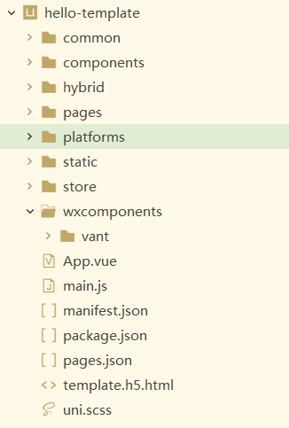

## 一、开发规范

为了实现多端兼容(综合考虑编译速度、运行性能等因素)，uni-app约定了如下开发规范:
- 页面文件遵循[Vue单文件组件SFC规范](https://vue-loader.vuejs.org/zh/spec.html)
- 组件标签靠近小程序规范，详见[uni-app组件规范](https://uniapp.dcloud.io/component/README)
- 接口能力(JS API)靠近微信小程序规范，但需将前缀wx替换为uni，详见[uni-app接口规范](https://uniapp.dcloud.io/api/README)
- 数据绑定及事件处理同Vue.js规范，同时补充了App及页面的生命周期
- 为兼容多端运行，建议使用flex布局进行开发

正所谓"磨刀不误砍柴工"，规范要重视也要遵循，不然写着写着越写越乱，最后不仅仅维护困难，同时功能扩展也非常麻烦，增加开发成本。

## 二、目录结构
使用HbuildX生成uni-app项目脚手架，如图:

<!--more-->
目录结构解释:
```
┌─components            uni-app组件目录
│  └─comp-a.vue         可复用的a组件
├─hybrid                存放本地网页的目录，详见
├─platforms             存放各平台专用页面的目录，详见
├─pages                 业务页面文件存放的目录
│  ├─index
│  │  └─index.vue       index页面
│  └─list
│     └─list.vue        list页面
├─static                存放应用引用静态资源（如图片、视频等）的目录，注意：静态资源只能存放于此
├─wxcomponents          存放小程序组件的目录，详见
├─main.js               Vue初始化入口文件
├─App.vue               应用配置，用来配置App全局样式以及监听 应用生命周期
├─manifest.json         配置应用名称、appid、logo、版本等打包信息，详见
└─pages.json            配置页面路由、导航条、选项卡等页面类信息，详见

```