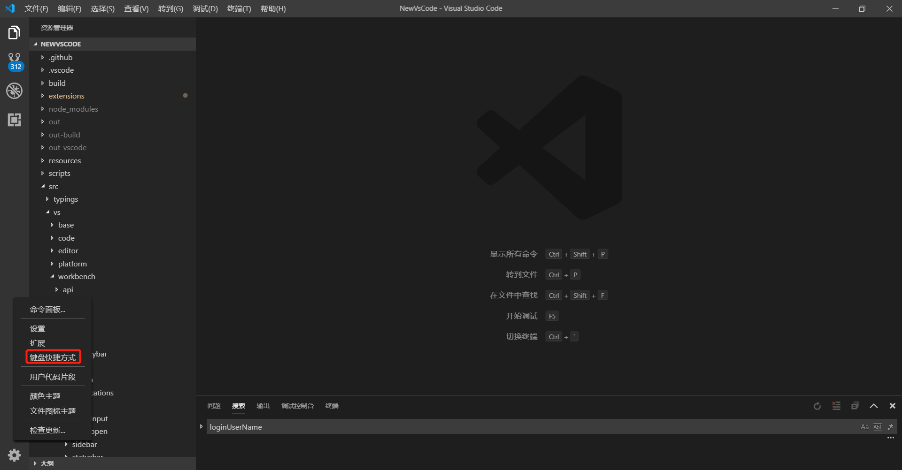
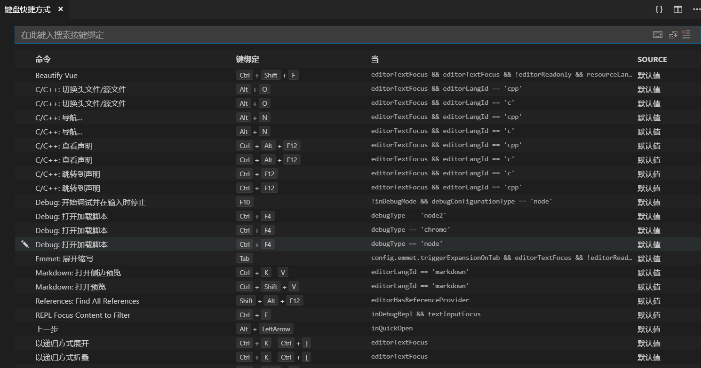

这里以插件开发为例，VsCode之所以那么强大是因为它背后有千千万万的开发者们为其开发大量功能插件，WordPress同理。

那么如何玩转VsCode命令呢(以插件开发为例)?
<!--more-->
## 官方文档必不可少
https://code.visualstudio.com/api

## 要像产品经理那样面对产品时，多点点多看看多想想

举个例子说明:
以关闭VsCode窗口为例
我从VsCode的源码中找到了相关的关闭窗口方法，但是无奈插件API不支持这样的，为此我只得另寻其它方法。最后找到的方法是通过VsCode API命令执行的方式完成此功能。

### 如何查看VsCode快捷键及其对应的命令(记住该功能很重要)



### 键盘快捷方式效果如下

基本上系统自带和所安装的其它扩展命令都在这



## 如何充分玩转这些命令，让其为我所用呢(插件为例)，很简单
如下简单的代码，在我最近开发VsCode插件中十分常用(主要体现在调用VsCode强大丰富的API完成一些特定的功能):
```
vscode.commands.executeCommand('命令放置处');

```
关闭VsCode窗口示例:
```
vscode.commands.executeCommand('workbench.action.closeWindow');

```

当然了，如果想要调用vscode这个API(Node.js中调用的话),需要导入这段代码`const vscode = require('vscode');`


## 总结

基本上把VsCode中系统常用快捷键掌握好(知道怎么查和对应什么意思)，再结合其它插件，你也能开发出一个属于自己的IDE(编辑器)，这个IDE可以叫XXIDE，也可以叫YYIDE，纯看个人兴趣。
