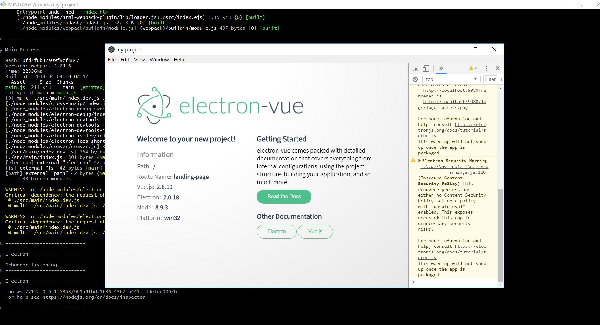

vue-electron官方文档(中文):https://simulatedgreg.gitbooks.io/electron-vue/content/cn
vue-electron官方文档(英文):https://simulatedgreg.gitbooks.io/electron-vue/content/en
## 1.脚手架搭建流程步骤
```
# 安装 vue-cli 和 脚手架样板代码
npm install -g vue-cli
vue init simulatedgreg/electron-vue my-project
<!--more-->
# 安装依赖并运行你的程序
cd my-project
yarn # 或者 npm install
yarn run dev # 或者 npm run dev

```

## 2.效果图



注意:
(1)环境问题:
可以参考我的这篇文章[VsCode源码编译运行](https://www.cnblogs.com/youcong/p/10230091.html)
环境与其保持一致，基本上就不会出什么问题。

(2)包管理工具问题:
关于npm和yarn，两者都是包的管理工具
我用npm install总是在报Error之类的错误，用yarn就好了。


