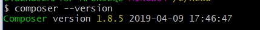

## 下载Composer-Setup.exe
请点击该链接即可[下载Composer](https://getcomposer.org/Composer-Setup.exe)

通常下载完后是一个exe文件，双击安装即可。

注意:默认会搜索你的php安装路径，建议最好把php安装好。

关于php安装，可以去php官网上下载zip包解压某个配置配置环境变量即可。
<!--more-->
## 走完安装流程后，在控制台输入composer --version，出现对应的版本号表示OK


## 更换镜像

执行如下命令:
```
composer config -g repo.packagist composer https://packagist.phpcomposer.com

```

之所以更换镜像，主要是加快相关库的下载速度。

以我搭建ThinkPHP5.0开发环境为例，第一步执行`composer create-project topthink/think tp`就卡了半天不动，当我执行更换镜像后，一下就好了。


参考资料如下:
[Windows环境下Composer的安装教程](https://blog.csdn.net/sanbingyutuoniao123/article/details/70314651)

说明:我并没有完全按照上述参考资料上一步一步的来，不过有几点很关键，那就是必须要下载composer并按照相关步骤操作和本地有php环境。