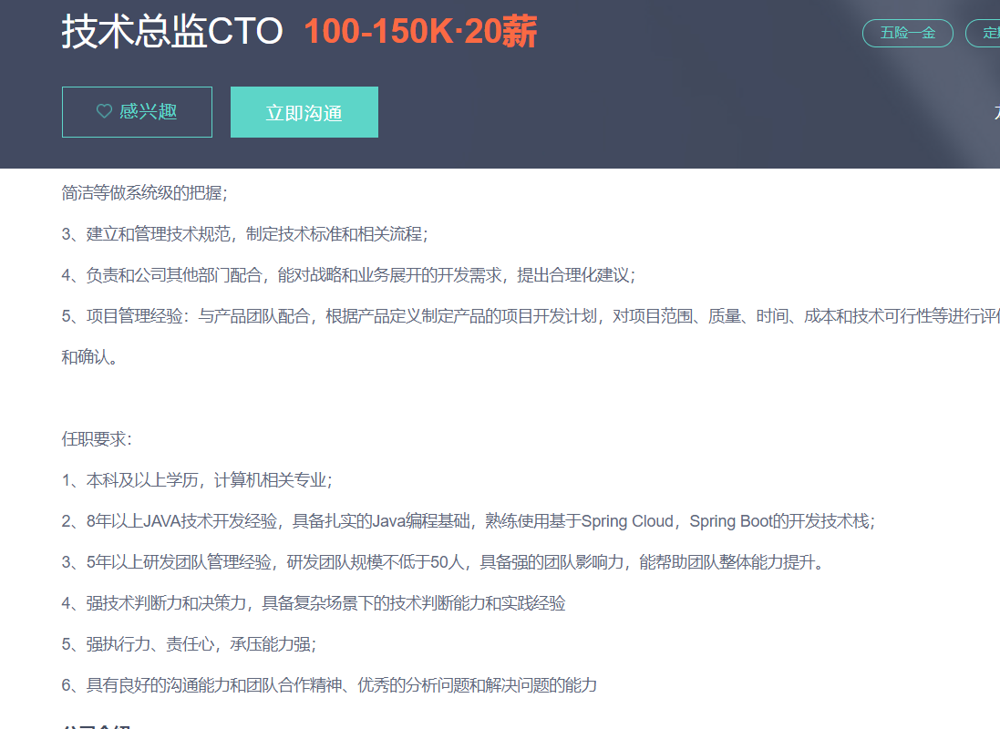
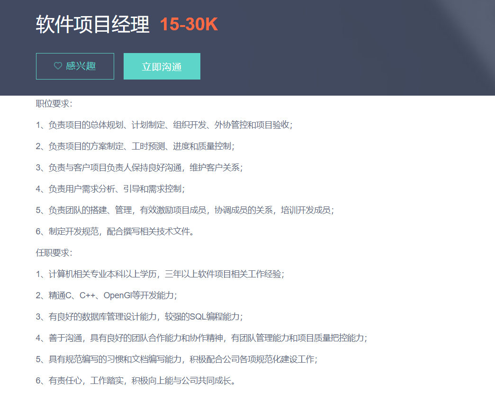
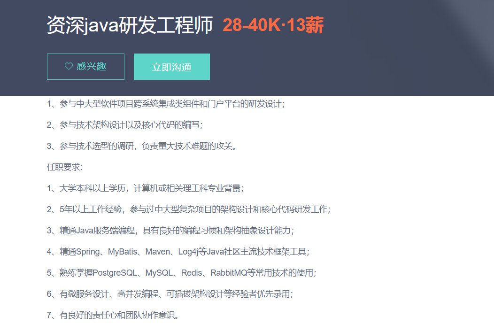
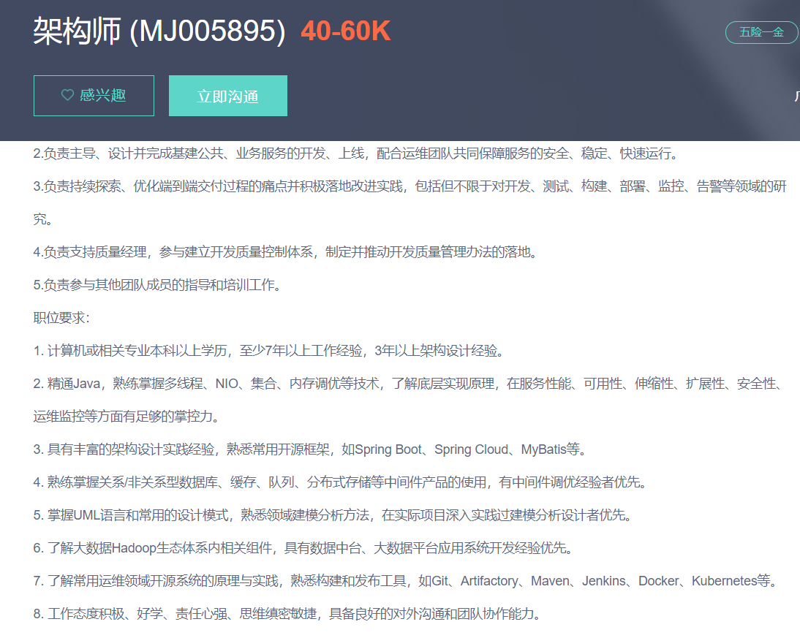

中国工厂系列纪录片只拍了三集，三集围绕以下内容进行讲述:

- [再见老板](https://mp.weixin.qq.com/s?__biz=MzUxODk0ODQ3Ng==&mid=2247484989&idx=1&sn=bd4c1d19ade467c9e271367822c2d0d8&chksm=f980552ecef7dc38293e23f858e2a616604acd666d8a461dc6561aa2b94151342c98871556a5&scene=21#wechat_redirect)；
- [换帅](https://mp.weixin.qq.com/s?__biz=MzUxODk0ODQ3Ng==&mid=2247485160&idx=1&sn=5d10c85e2df1f20f97567cf69308e5dc&chksm=f98055fbcef7dced3d2c98ab120ac8ffdfc3ac1e089fcae54ae449e5b558552555749ca36df2&scene=178&cur_album_id=1805346418614665217#rd)；
- [流水线上的战争](https://mp.weixin.qq.com/s?__biz=MzUxODk0ODQ3Ng==&mid=2247485159&idx=1&sn=64a604de860f54706e2c3ef696dd3101&chksm=f98055f4cef7dce2bfb8bdd32b30ba1f49d3dccffe238c8933092cea8074307e21b2571f11b8&scene=178&cur_album_id=1805346418614665217#rd)。

我个人看了很多遍，每次从中都能有所收获，接下来我进行思考归纳。
<!--more-->

## 一、再见老板

### 1.十年前是员工排着队找工厂，而现在，所有的工厂去找员工。
在我很小的时候，最常听见的一句话就是去广东打工。无论是村里的还是城市里的，只要不再体制内的，去广东打工是一个比较好的出路。也因此不少人达到一定的积累，便因此成为了百万富翁或千万富翁。那个时候有不少人进厂还得托关系，例如某某亲戚在工厂做班长或主管，这时一些人就会送礼托某某让其帮忙疏通关系早日进厂。

### 2.究竟是精神上的残疾可怕，还是身体上？
答案是都可怕，但要从两者之间选其一，我认为精神上的残疾更可怕。
例如纪录片中的小谭时不时就抱怨太累了想回家。而回忆过去我的职业生涯中有一个同事他也是身体上的残疾，小谭看上去是腿瘸了，而我的那个同事整个身体都显得非常不正常，具体是什么原因，从未问过。他非常沉默寡言，写代码方面也不能说很灵光，比别人写的都要慢，理解能力也很差，当初的我刚和他一组时，很嫌弃他，直到一天，来公司拿电脑，当时正是周末，而他一直在那写代码，我很好奇，最初以为他在学习，然后看到他在写业务代码，我问他，周末在家好好休息休息，来公司加班写代码干啥？他回答说，我不是很聪明，工作做的很慢，我想利用周末的时间往前赶赶。正好当天上午也没事，我便陪他一起写代码，帮他写了不少，顺便我们也聊了很多。

### 3.现在的年轻人为什么不愿意进厂?
- **工厂晋升空间小且晋升后工资幅度调整非常有限**；
- **屈才**；
- **没面子**；
- **工作时间长、累、工资低**；
- **工厂不是长久之计**。

### 4.进厂真的是浪费青春吗？
分情况看。工厂的最终归属只能是往上走，即做管理层。
想起曾经一位大叔跟我说，那个时候我在某地打暑假工。他跟说，未来，像工厂里很多东西都会被取代，但有一个很难被取代，那就是管理。除了管理层面外，还有就是技术方面。这个与IT也是有相关性的，技术男到了某个层次后，要么选择往技术发展(走技术专家路线)，要么选择往管理层发展，两条路都不容易，前者仅有为数不多的大公司有相应的资源提供(但僧多肉少，不好走)，而后者才是常态。

### 5.纪录片中的残疾人为何会有这种心态？
一般看纪录片或电影、电视剧之类的，都不喜欢看弹幕，这次我打开弹幕看了下，发现很多人都在指责这个人没出息只会抱怨，换言之，为自己的失败找借口。但换个角度来看，纪录片中的小谭说，他以前也想过改变，但后来发现，改变不了，一切都成定局。那么他为什么会有这样的心态呢？我觉得可能的原因有这么几个？

- 意志力不坚定；
- 身边没有一个导师一样的人引导。

去年有一个人对我说:天将大任于斯人也，必先苦其心智，劳其筋骨....系列的话，其实意思概括起来很简单，那就是要成就一番事业必须要有过于常人的意志力(也可以理解为毅力)。借用梁启超先生在《论毅力》中的中心论点来说，**"天下古今成败之林，若是其莽然不一途也。要其何以成，何以败？曰:有毅力者成，反是者败。"**

回顾我的职业生涯或是人生不同的阶段，尤其是刚出社会那会儿，有一个导师一样的人指导我的前进路线，帮助我战胜了不少困难，也养成了自主学习的习惯。

### 6.记时还是记件好？
一分为二来看，对于想偷懒摸鱼的人来说，记时好。对于想赚更多钱的人来说，记件好，因为多劳多得。但有些时候对于一些人可能真的不公平，例如纪录片中得小谭，可能由于残疾，导致动作方面很慢，记件对于他来说就很不公平，他在纪录片中说到，最初他也加班，但是发现加班以后，工资还是那么低，就没加了，如果是计时的话，可能对于他而言就比较公平，但对于其他同事而言就可能不公平，因为他动作慢，通常团队每天都会有任务指标，这个任务指标是需要在团队整体协作并共同努力的情况才可能完成，这也是一些工厂领导为了提防计时员工的偷懒而设置的。

### 7.招人难?留人也难?
不仅仅是对于工厂。如今各个行业，不少公司都是如此。招人难，难在有不少公司想用最低的成本招聘能为公司带来更多价值的人。留人难，难在画饼充饥只能是一时而不能是一世。

### 8.半自动化与全自动化，衡量的核心在于成本二字
半自动化意味着有机器辅助，但还是需要人力进行处理。全自动化几乎不需要人或者是一两人负责盯机器就行了。拿以前我打暑假工的一个地方，组装某个产品，其实相当于是流水线，但这样的流水线已经在分工厂里推行了机器人进行自动化，但大多数分工厂都还是半自动化，人为主，机器为辅，原因在于成本，机器自动化但每天组装的产品非常有限，不如半自动化。但机器自动化所带来一个直观的改善就是产品质量上提高，比方说，一条线一个小时三百个产品需要组装好，机器人全自动化一个小时能完成两百个，人为的半自动化基本上能超过三百个以上，但是认为的半自动化通常不良品比机器人全自动化要高得多。但对于工厂而言，最重要的就是产品的销量，一定程度上的不良品是可以允许的，所以这个时候半自动化的作用就得到了体现。

### 9.读书真的能改变命运吗？
任何事情不是绝对的。这里的读书指的是上学而非阅读。记得曾看一个香港节目叫《穷富翁大作战》，有一期一个叫田北辰的说了一句话，我至今印象还十分深刻，他说，"这个世界正在惩罚不读书的人"。核心表达的就是学历不高，出了社会后，找工作方面受限很多，首先就是学历，学历是工作的敲门砖，没有学历很难。

### 10.那些上学成绩不好的人，最后的归宿是什么？
在我身边也有这样的例子，其实包括我自己过去上学的时候，成绩也能说是普普通通，说好吧，也没那么好，说差吧，也还过得去。
有些人尽管成绩不好，或者是对学习那些课程丝毫没有兴趣，但他的路仍然很大，因为家庭背景很不错。记得我下铺的一个哥们，高中学业水平考试以后，就没继续参考高考，去了云南，其父在云南开了家具公司，于是他学了家具方面的设计，如今子承父业，成为了家具公司的总经理。

而另外一些人成绩不好，家庭背景差的，选择范围就很少，如果不继续上大学，哪怕是混个毕业证也好之类的。最后的出路无非是进工厂或是服务员、或是如今新兴的送外卖、快递员等等。但也有些例外，例如曾经一个初中同学小A，他初中还没毕业就放弃了上学，历经十多年的苦难，进过工厂当过学徒，也干过其他行业，最后转销售方面，成为广东那边某公司的销售总监。

最后归纳一点，上学成绩不好并不代表这个人不行，但出了社会以后，很多东西是要靠自己的努力来不断去争取的，有背景的，一帆风顺，没背景的，尽管路充满荆棘是曲折的，但只要熬过去，前途始终是光明的。

### 11.提升学历的重要性
如果你是高中文凭，那么你就得想方设法升到大专；
如果你是大专文凭，那么你就得想方设法升到本科；
如果你是本科文凭，那么你就得相方设法考对你自己有帮助得证书或者考研。

一个程序员之路，通常为如下:
初级Java开发工程师->中级Java开发工程师->高级Java开发工程师(Leader)->架构师/项目经理->技术总监

我们来看看这四个岗位的招聘要求(高级Java开发工程师、架构师、项目经理、技术总监CTO):

从以上来看，大多都有学历上的限制，如果不想被学历上限制的话，要么想尽一切办法往上升，要么想尽一切办法提高各方面的能力，争取能力上能一定程度弥补学历上的缺陷。但能力提高后，也不能忘记提高学历方面的。学历提高意味着能够多一些后路或者是多一些选择的方向。

### 12.辞工与感恩之心？
纪录片中老板家的保姆跟老板产生了一些冲突，于是保姆想要辞职。于是纪录片中的潘总便劝保姆，希望保姆能够留下来。保姆态度十分坚决不愿意留下。于是潘总说，人要有一点感恩之心啊，做生不如做熟。但保姆还是决定要走。
关于辞工与感恩之心，从某个角度来看:
当一个人什么相关的经验都没有时，公司愿意给其机会培养，当经验丰富以后，这个人势必会为公司带来很大的价值，这时，当这个人能为公司带来更多价值的时候，公司也需要一定程度上为其提高相应的待遇，例如加薪或升职。在我看来，一个人在一家公司，不仅仅是为了给公司创造更多的价值为公司带来盈利，同样也是为了自己，积累相关经验，丰富人生阅历。至于感恩之心，我个人觉得不应该在辞工方面体现，辞工方面以感恩之心来说，无疑是打感情牌，通过这样的感情牌来留人不见得效果多么的好。

## 二、换帅

改革让每个人必须寻找新的生活方式。新老交替，大浪淘沙，谁能在洗牌过后活下来。

### 1.尽管心不死，但是身已老
"尽管心不死，但是身已老"，这是纪录片中谢志对秦泽静说的的一句话。主要反驳秦泽静所说的，希望研发团队能够被谢志关注，而谢志则认为研发团队不适合当前的形势。
联想如今，其实很多东西还是有共通之处的。从公司的角度来看，当一个人无法带来更多的价值时，有千万种理由让这个人走。至于所谓的年龄问题，只不过是一种理由或借口。

### 2.洗脑术，对于提升团队的士气很有帮助
谢志借团建，提高公司销售团队的士气。回顾这些年来，发现一点，特别是公司创始人，对于一家公司的成败特别重要，这个公司创始人而且还必须要擅长一点，那就是洗脑术。例如当年马云带领着阿里巴巴18罗汉创业那样。这里的洗脑术与传销还是有很大的区别，这里的洗脑术关键在于统一团队的思想让大家朝着共同的方向努力前进。对于创业公司而言，特别是初期团队，如果大家对于创业这个事情，思想不一致时，很容易"中道崩殂(走到半路就死了)"。

### 3.改革是一种洗牌游戏
古人云:"一朝天子，一朝臣"。
以手机的演变历史来看，从"大哥大"到智能手机，很多东西都在消亡，而很多东西都在诞生。消亡的往往是需要淘汰的，诞生的往往是新的时代的需要。手机不断的变革，手机里的软件，无论是通讯，还是网络搜索，或者是游戏，都需要随之改变，不改变的就会被淘汰，被淘汰的只能消亡。

### 5.鱼和熊掌不可兼得
谢志的妻子总想着谢志能够多陪伴陪伴她，她觉得赚钱并不是非常重要，陪伴才是最重要的。
对于谢志而言，为家人创造一个幸福的未来才是最重要的，这个幸福的未来是需要金钱作为基础支撑的，毕竟上面有父母，下面有三个孩子，两女一男，而且妻子也没有工作。
很多时候，鱼和熊掌是不可兼得的，就像工作与生活的平衡，要做到绝对的平衡是不可能的，也非常困难，只能说每个阶段对自己最重要的是什么。

### 6.贫贱夫妻百事哀
纪录片中的彭永辉与哥们在一起喝酒他们说了一些话，归纳如下:

- 没进到这家公司之前，我从来不知道什么叫缺钱，进了这家公司之后，我终于知道了什么叫差钱。
- 我是结了婚才知道什么叫缺钱。
- 作为一个人过来人来说，本来一百块钱没结婚之前当两百块花，结了婚之后，只有二十块花，到了有小孩后，一百块还要负二十块出去花。

归根到底就是没有好的物质基础支撑的婚姻是很难的，就像前面说到的"鱼和熊掌不可兼得"。假如谢志不是总经理，每个月收入也就七八千，那么谢志的妻子很有可能会经常说他赚钱赚的少埋怨之类的话。因为这就是现实。

## 三、流水线上的战争

### 1.工序卡与一个人做事要凭良心，孰优孰劣(核心就是制度与人情)？
一次会议，向安奎向杨总询问:工资计算，现在怎么计算，怎么统计的?
杨总回答到:工资计算还不是他们报上来的。
向安奎说:为什么呢？按工序卡。
杨总说:工序卡，目前我们还没有做到那么细。
向安奎说:五金车间，工资计算本身就有问题。工序卡为什么落实不下去？给个理由给我。现在会有一个什么样的问题，第一个，我发了一千张料，出了多少张成品，谁告诉我？损耗多少？
有人说:那个从系统查得到。
向安奎说:统计是他们说什么就是什么的。
有人说:不至于。
向安奎说:你问问周兵是不是。
周兵说:反正，怎么说呢，一个人做事，凭着自己的良心做事。
向安奎说:如果我们光看账面数据，我都不要现场管理人员啦。

这段对话让我思考良多，对于在创业公司刚刚起步的时候，太多的制度上的约束反而会限制人，但是当创业公司逐步的由四五个人到十几个人，再到上百人，再到上千人这样的，势必要有制度上的约束，否则走不了多远。光靠良心不靠制度，是不行的。这就好像某些资本家光跟员工谈情怀谈理想不谈薪资，纯粹扯蛋。

### 2.不适应公司发展的人，势必会被淘汰
纪录片中的周兵在这家企业待了很多年，从初创到现在，但最后还是被向安奎开了。原因很简单，不适应公司发展的人，势必会被淘汰。当一家公司从过去的小作坊到一切正规化流程化的时候，过去的一些做事风格势必会发生改变，不能适应这些改变的人的，很容易给公司带来不利的影响。这些不利的影响，往往能给一家公司带来毁灭性的打击(如果不及时消除的话)。

### 3.仁慈是不能将企业做大做强的
我看到弹幕里面的人都说向安奎冷血无情，居然将陪伴公司一起十几年的伙伴给无情的开了。我只能说那些人太天真。管理者对下属太好太包容，最后会往往会导致事情很难推进。这是很多事情做实事的人都需要当"恶人"，不当"恶人"不行，不当"恶人"是很难成功的，更何况是带领着企业做大做强这样的。所以说，"慈不掌兵"这句话是正确的。衡量优秀将军的标准就是能带领部队打胜仗，打胜仗意味着手下的人能存活过多，同时也能获得更多。对于公司老板而言，最重要的就是企业盈利，企业能够赚更多的钱，什么年终奖或者十五薪、十六薪、旅游度假之类的都能成为现实。

### 4.我们只有把这批订单做好，才会有下一批订单，要不然就没有下一批
去年我所待的公司也面临这样的局面，如果短暂期限我们不能拿出一个成型的产品来，意味着我们的团队将可能被解散。于是乎，在我们团队共同的努力下成功了，接着经过一系列断断续续的紧张日子，终于有了一些结果，这些结果促使着部门团队从寥寥无几的几个人变成二十多人，接着可能会更多。

### 5.要求高了，势必会让一些混日子的待不下去
工序卡的推行，一方面在于严格把控产品质量，另外一方面防止一些员工偷奸耍滑。工序卡的推行，谁做不好就能找到谁，谁影响了进度，谁就会被问责，这就导致了一些混日子的就待不下去了，同样也暴露了一些管理者的管理上的弊端或任人唯亲，例如周兵在公司与其解除合同的时候，说你们为什么要这么污蔑一个人，我有没有偷又没有抢，还说你们把我开除，冲压车间没有谁做的来，看到时候谁认识谁的亲戚。

### 6.谁都不想一辈子做员工
刘洲所说的几句话，这或许是不少人的自白吧:

- 我也不想一辈子做员工啊，而且我老家又是农村的，条件又比较差呀，我也想跟我们老板一样。
- 讲前途，也许就是我在这里有前途，但是做得好，学得到，以后重用我就有前途。如果以后不行的话，那就连稀饭都喝不上，所以就是这个样子。
- 我觉得我在这里学不了多少，我也不想做了。

### 7.事业其实做到最后的，是一种担当
向安奎说:
我刚开始出来是很痛苦的，我到顺德的第一梦想，就是找一份月薪1500元的工作。但是找不到。我最开始工作的工资是800元。然后我找工作之前租的那个房子是还没建完的那种，就是钉一个床，睡在里面，蚊子咬得半死的那种，150元一个月。我们是在那种环境下找工作的，然后800元一个月。然后我也工作到2003年。工作到2003年，我的最后一份工作才2500元一个月。
事业做到最后，其实是一种担当。有这么多个人跟着呢，你要为他们提供一个更好的工作环境，为他们创造更多的收入和福利，我觉得这是一种担当。这个跟我自己家里有钱多用点，没钱少用点，有很大的区别。因为它是一个庞大的团队，他们后面有涉及到很多家庭，比如我们工厂
现在几百个人，几百个人可能就意味着几百个家庭，那么企业做到最后，我觉得就是说，有一帮人，你能对他负责，他能对你负责。

这段话让我感触良多。

### 8.那些工厂的老油条们
工厂的老油条们最喜欢的就是捉弄新人和老实人，这帮人用一句话来形容就是"搅屎棍"。

### 9.地球离了谁都转
纪录片中那位工人说:如果真的有老员工收一半马上就走，剩下一些新员工在这里，他肯定搞不出来的，他傻的，至少他这一两个月要少很多生意，不黑怎么当老板，不黑你来当。
只能说这帮人太拿自己当回事了，地球离了谁都转。

### 10.单单只有经验，有的时候不管用
向安奎对周兵说，"单单只有经验，有的时候也不管用"。
这句话我非常赞同。经验这东西只在一定程度上适用于一些特定场景，并不能适用所有场景。比方说随之技术不断更新，若干年后SpringCloud这样的分布式微服务体系也会随之落后，但唯一不变的可能就是计算机诸如编译原理、TCP/IP、操作系统、计算机网络、数据结构和算法等这些。若干年前是如此，若干年后还是如此。

### 11.在城市里面是一定要靠自己的实力去争取，去获得一些属于自己的一些东西
回想从2016年到现在，算起来有五年了，这五年里，我一直在不断争取着这一切。

### 12.人的一生有各种不一样的活法，取决于怎样定位自己
每个人选择不一样，选择不一样，人生的道路也会随之发生变化，假如当初没有从那个环境里跳出来，可能我目前很平庸，没有之后的丰富阅历，但换言之，不同的选择，不同的活法，代价也是不一样的。