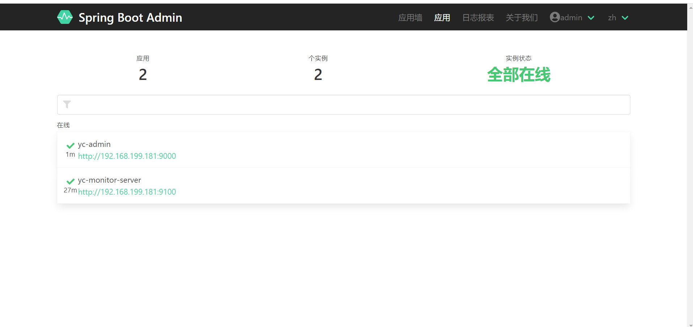
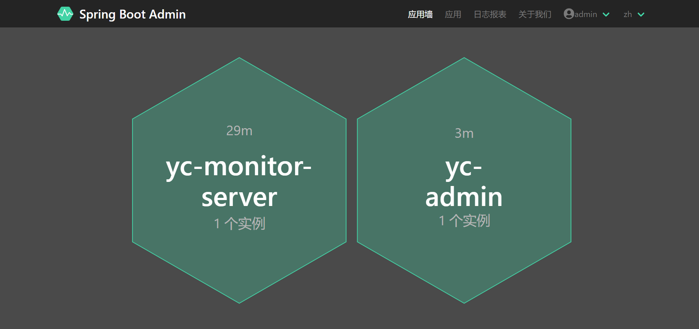
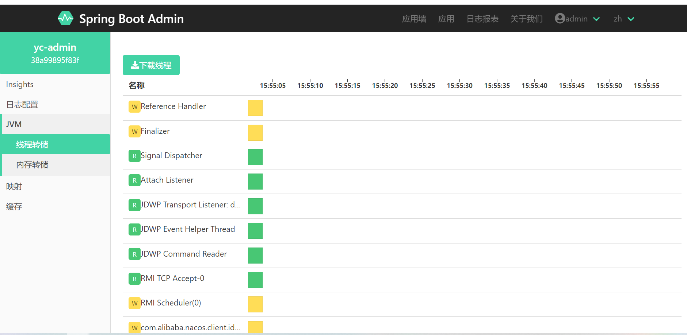

在分布式服务架构下，对于微服务的监控是必不可少的。
<!--more-->

## 一、微服务监控的开源项目有那些？
- 1.Prometheus；
- 2.SigNoz；
- 3.Grafana；
- 4.Zabbix。

当然了，除此之外还有很多。大家可以去Github自行搜索找到。

## 二、为什么要监控微服务？
监控微服务的重要原因是需要确保服务整体可持续地正常运行。针对服务整体下的某些服务可能出现的宕机情况，发送第三方信息(邮件、手机短信、钉钉、企业微信等)通知告知对应的运维人员，让其执行对应的操作，防止因此出现的一系列连锁反应，由此确保服务的整体可用性。

## 三、YC-Framework对于微服务监控采用的是什么组件？
YC-Framework是通过Spring-Boot-Admin(简称SBA)来实现对微服务的监控。

## 四、YC-Framework如何针对对应的微服务进行监控？
只需在对应的微服务添加如下依赖即可：
```
<dependency>
    <groupId>com.yc.framework</groupId>
    <artifactId>yc-common-monitor</artifactId>
</dependency>

```
而yc-common-monitor的核心依赖实际上是：
```
<dependencies>
    <dependency>
        <groupId>org.springframework.boot</groupId>
        <artifactId>spring-boot-starter-actuator</artifactId>
    </dependency>

    <dependency>
        <groupId>de.codecentric</groupId>
        <artifactId>spring-boot-admin-starter-client</artifactId>
    </dependency>
</dependencies>

```

而配置文件是共享的，不管你对应的微服务是否引入对应的监控模块，都不影响服务的正常运行：
```
# 打开客户端的监控
management:
  endpoints:
    sensitive: false
    web:
      exposure:
        include: '*'

```

## 五、示例
启动监控服务端，监控服务端项目名称叫yc-monitor-server，位于yc-modules模块下。在此基础上，启动成功之后，再启动yc-admin。

相关效果如下：






源代码均已开源，开源不易，如果对你有帮助，不妨给个star！！！

YC-Framework官网：
https://framework.youcongtech.com/

YC-Framework Github源代码：
https://github.com/developers-youcong/yc-framework

YC-Framework Gitee源代码：
https://gitee.com/developers-youcong/yc-framework