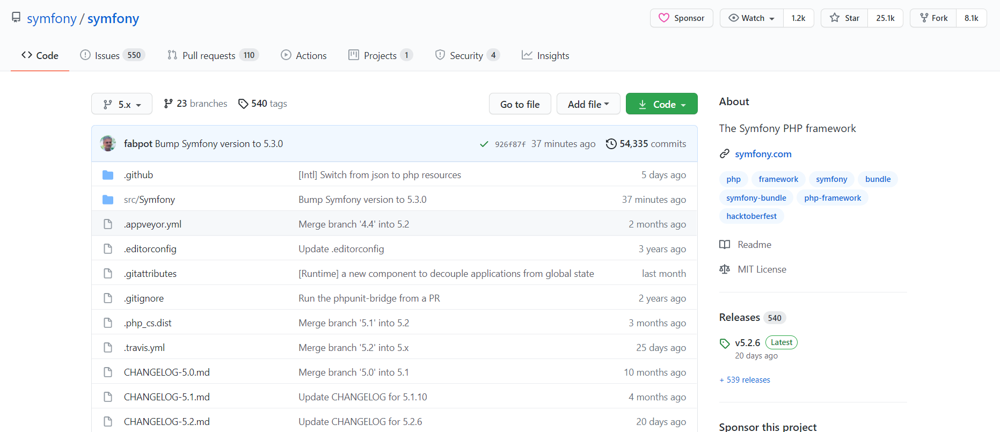

## 一、单体架构

### 1.什么是单体架构？
单体架构也可叫单体系统或单体应用，是一种把系统所有的功能模块耦合在一个应用的架构方式。
<!--more-->

### 2.单体架构的优缺点有哪些？

#### (1)优点
- **部署简单**；
- **技术单一**；
- **用人成本相对低**；
- **项目管理相对较易**；
- **测试相对简单直观**；
- **应用开发相对简单**；
- **横向扩展容易**。

#### (2)缺点
- **项目过于臃肿，bug难以迅速定位**；
- **资源无法隔离**(某个功能模块对应的接口访问量大，直接会影响整体性能)；
- **无法灵活扩展**；
- **交付周期长**(需求->设计->开发->测试->现场实施部署，就传统性质的企业而言)；
- **部署消耗时间长**；
- **可靠性差**；
- **受技术栈限制**；
- **可伸缩性差**；
- **复杂度高**。

### 3.单体架构的技术选型有哪些？
从Java的角度看，有Spring全家桶一站式解决方案和相关的生态比较丰富(国外有GitHub，国内有Gitee，相应的开源框架非常多)。
从PHP的角度看，PHP是Web开发中最好的语言(至于为什么说它是Web开发中最好的语言，我想原因有三个，第一个是通吃方案(网站开发、App后端、小程序等)；第二个许多国内外的网站建设都是基于PHP，早期的淘宝也是如此；第三个容易上手。)

所有的技术选型都离不开一个基本的原则，那就是业务，分布式微服务技术选型也不例外，技术服务于业务，合适的技术框架对业务支撑非常关键。我在2020年的写过这样一篇文章，其中关于对技术的思考提到过，感兴趣的朋友可以阅读这篇文章:[2020年的一些思考和总结](https://youcongtech.com/2020/10/07/2020%E5%B9%B4%E7%9A%84%E4%B8%80%E4%BA%9B%E6%80%9D%E8%80%83%E5%92%8C%E6%80%BB%E7%BB%93/)

#### (1)那么关于技术选型要注重哪些因素呢？
- **业务相关性**；
- **框架流行度**；
- **学习曲线**；
- **文档**；
- **社区支持**；
- **单元测试**；
- **可扩展性**；
- **许可证**。

#### (2)在(1)的基础上举例进行说明
以我曾经在某创业公司对EduSoho二次开发为例:
**从业务相关性的角度，**当时我们做的是编程教育项目，EduSoho是一个在线教育解决方案，业务性与我们完美契合。
**从框架流行度，**EduSoho是基于PHP开发，前面我提到过PHP是Web开发最好的语言，而EduSoho使用的PHP框架是[Symfony](https://github.com/symfony/symfony)，Symfony的框架流行度，以GitHub下图为例说明:

从中可以看出该框架非常流行，start非常多。
**从学习曲线来看，**我觉得Symfony还是蛮简单，感兴趣的朋友，可以参考我这篇文章学习:
[Symfony之入门学习](https://www.cnblogs.com/youcong/p/11143879.html)
只要熟悉Symfony，二次开发EduSoho并不难。
**从文档上来看，**Symfony框架资料非常多(网上有各种各样的博文)，对应的EduSoho官网方面的资料也非常多。
**从社区支持上来看，**如果Symfony出现任何问题，通过搜索引擎不能解决的话，可以去GitHub给开源维护者提issue，详细说明问题，一般都能得到回答(前提把问题说清楚，英文不会也不怕，可以借助翻译工具)。
**从单元测试上来看，**Symfony本身就支持单元测试，不仅仅是PHP相关的框架，Java和Go对应的Web开发框架均支持单元测试。
**从可扩展性上来看，**Symfony发展至今能有这么多关注(前面的Github截图)，说明国内外有不少公司在用它，只要很多公司在用可扩展性自然不差(可扩展性指能适应业务的变化)。
** 从许可证上来看，**EduSoho减少当时我们编程教育项目的从0到1开发的时间，只要项目能够盈利，花钱买许可证也是没问题的，结果我们在C城果然拿下了第一笔订单。

### 4.前面提到的单体架构的缺点(也可叫短板)该如何应对呢？
**用组件化就能解决这个单体架构的缺点。**
#### (1)什么是组件化？它的目的是什么？
组件化是一种高效的处理复杂应用系统，更好的明确功能模块作用的方式。目的是为了解耦，把复杂系统拆分成多个组件，分离组件边界和责任，便于独立升级和维护。

#### (2)组件化的实际例子有哪些？
这里只列举两个例子(实际的例子非常多):
- 曾在某创业公司做VsCode二次开发时，当时写的各种VsCode插件，其实也是一种组件化的体现(本质上都是为了解耦，避免大量的代码耦合混杂)。
- 曾在某教育公司做前后端开发的时候，前端当时使用的是React框架，那个时候我也是第一次使用React，React的组件化，让我可重用大量的代码(这种可重用很少出问题，除非组件本身写的就有问题)，最后不到一天就写某个大功能模块，使我能更好的专注于后端接口的编写和调试。

#### (3)有的朋友可能会问："新的项目我可以最开始通过组件化来避免单体架构的短板，但是老项目该怎么办呢？"
我的回答是只能慢慢来，一点点慢慢抽取出来(一定要在读懂代码的前提下进行)，封装为组件，组件可按照功能区分(公共组件、通信组件、日志组件、权限组件、具体业务组件等)。
另外还有一点，二次开发和老项目的组件化是相通的，如下:
- **项目先运行起来**(不管是二次开发还是新到一家公司，这个流程是绕不开的)；
- **整体了解项目架构并熟悉对应的业务知识**；
- **整体了解项目结构**(每个包下面的代码功能职责是什么)；
- **整体了解数据库表**(可以间接和前面的业务知识对应起来)；
- **跑起来后，通过调用接口，逐步的去了解对应的代码是做什么的**；
- **为了保持原本的代码分支完整性，通过版本控制工具新建分支做实验**；
- **虚心请教，学会提问**(如果是开源项目请教对应的开源维护者，如果是老项目，请教对应的老员工，在此之前一定要有自己的思考，而不是眼睛一看不到10秒，就说看不懂，这种提问是万万不行的)。

## 二、分布式微服务架构

### 1.什么是分布式微服务架构？

#### (1)分布式是什么？为什么要用分布式？分布式要考虑哪些问题？
分布式是指数据和程序可以不位于一个服务器上，而是分散到多个服务器，以网络上分散分布的地理信息数据及受其影响的数据库操作为研究对象的一种理论计算模型。

之所以要用分布式，最关键的是服务器性能问题，单台服务器性能比较有限，综合利用多台服务器，能够提高整体的性能。

分布式要考虑的问题有如下:
- **如何合理的拆分出子系统**。
- **子系统之间如何通信**。
- **通信过程的安全如何保障**。
- **子系统扩展要如何设计**。
- **子系统的可靠性要如何保证**。
- **多个子系统之间相互通信交互数据，如何保证数据的一致性**。

简而言之可以概括为两大问题，一个是数据的一致性，另一个是服务的稳定性。

#### (2)集群是什么？为什么要集群？集群需要考虑哪些问题？
集群是指一组独立的计算机系统构成的一个松耦合的多处理器系统，它们之间通过网络实现进程间的通信。应用程序可以通过网络共享内存进行消息传送，实现分布式计算机。通俗一点来说，就是让若干台计算机联合起来工作(服务)，可以是并行的，也可以是做备份。

之所以要集群，是因为如下三个方面:
- **并发处理能力有限**；
- **容错率低，一旦服务器故障，整个服务无法访问**；
- **单台服务器计算能力低，无法完成复杂的海量数据计算**。

集群需要考虑哪些问题(**最关键的是:是否有必要集群**)？
- **Session共享**(用户鉴权一次，而不是每次轮询后都要再鉴权)；
- **Job(**定时任务只执行一次而不是每台都执行)；
- **DB数据同步**；
- **Cache同步**；
- **集群下的各个服务器性能**(CPU、磁盘、内存等)；
- **应用服务故障切换的时间**；
- **软硬件的集群管理和监控**；
- **成本**。

#### (3)分布式和集群的区别是什么？
- **分布式是指将不同的业务分布在不同的地方**；
- **集群指的是将多台服务器集中在一起，实现同一业务**；
- **分布式的每一个节点，都可以做集群，而集群并不一定就是分布式的**。

#### (4)微服务架构是什么？
微服务架构指的是将大型复杂系统按功能或者业务需求垂直切分成更小的子系统，这些子系统以独立部署的子进程存在，它们之间通过轻量级的、跨语言的同步（比如REST，gRPC）或者异步（消息）网络调用进行通信。

### 2.微服务架构的优缺点

##### (1)优点
- **复杂度可控**；
- **独立按需扩展**；
- **技术选型灵活**；
- **容错可用性高**。

##### (2)缺点
- **多服务增加运维难度**；
- **系统部署依赖**；
- **服务间的通信成本**；
- **数据一致性**；
- **系统集成测试**；
- **性能监控**。

### 3.分布式微服务的技术选型有哪些？
对于Java而言技术选型组合如下:
- **SpringBoot+SpringCloud**；
- **SpringBoot+SpringCloud Alibaba**；
- **SpringBoot+Dubbo**。

上面这三种是比较常见的。
当然了，分布式微服务的技术选型不局限某一类编程语言。
以我当初在某创业公司做的编程教育平台项目为例，涉及的编程语言就有四个，分别为Python、Java、PHP、JavaScript(Node.js、Vue.js、TypeScript等)。至于这些编程语言所涉及的框架组件就更多了。对我在创业公司做项目经历感兴趣的朋友可以阅读我的这篇文章:[一位北漂在创业公司的两年](https://mp.weixin.qq.com/s?__biz=MzUxODk0ODQ3Ng==&mid=2247485439&idx=1&sn=201a791086509ae93a29a669e8d402be&chksm=f98054eccef7ddfac7c6b7d30d40b33a1044cc702850cadf1ee2b0a9b3caca551f56779c719b&token=1979555451&lang=zh_CN#rd)

## 三、总结
从单体架构到分布式微服务架构，基本上我都参与了，有从0到1，也有二次开发，还有从1到2再到3的版本迭代。所遇到的问题很多很多，当时在做这些设计方案的时候，有很多都没有考虑周到，导致最后代码落地的时候非常糟，这些都是教训，接下来我会将这些教训一一总结然后分享出去。

最后此次本文说的内容相对比较全和杂，没有就某一个具体中心点进行深入地讲解，后面将会有系列文章就上面所涉及的内容点进行深入详细地讲解。