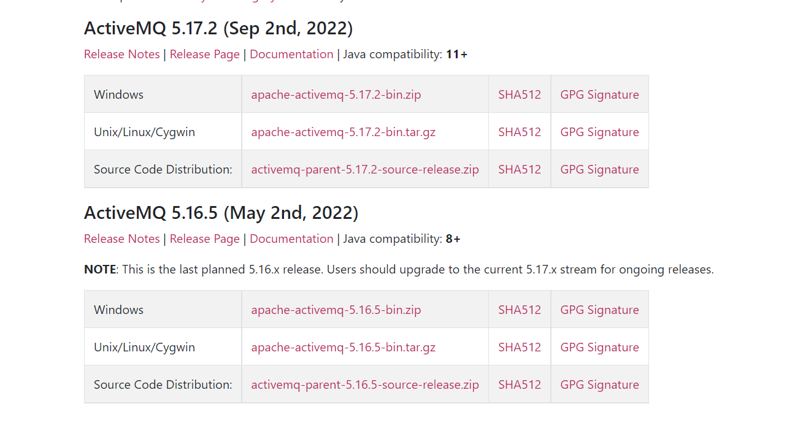

## 一、ActiveMQ是什么？
Apache ActiveMQ® 是最流行的开源、多协议、基于Java的消息代理。它支持行业标准协议，因此用户可以从各种语言和平台的客户端选择中受益。从用JavaScript、C、C++、Python、.Net 等编写的客户端连接。使用无处不在的AMQP协议集成您的多平台应用程序。使用STOMP over websockets在您的 Web 应用程序之间交换消息。使用MQTT管理您的IoT设备。支持您现有的JMS基础架构及其他基础架构。ActiveMQ 提供了支持任何消息传递用例的能力和灵活性。
<!--more-->

## 二、ActiveMQ有哪些应用场景？
- 1.异步处理。
- 2.应用解耦。
- 3.流量削峰。
- 4.消息通讯。

## 三、ActiveMQ有哪些优缺点？
- 1.优点:单机吞吐量万级，时效性 ms 级，可用性高，基于主从架构实现高可用性，消息可靠性较低的概率丢失数据。
- 2.缺点:高吞吐量场景较少使用。

## 四、如何安装ActiveMQ?

### 1.选择合适的版本


### 2.根据需要下载对应的版本

### 3.解压进入bin目录启动即可

## 五、YC-Framework中如何使用ActiveMQ?

### 1.导入对应的依赖
```
<dependency>
    <groupId>com.yc.framework</groupId>
    <artifactId>yc-common-activemq</artifactId>
</dependency>

```

### 2.编写生产者代码
```
@Service("producer")
public class Producer {
    @Autowired
    private JmsMessagingTemplate jmsTemplate;

    public void sendMessage(Destination destination, final String message) {
        jmsTemplate.convertAndSend(destination, message);
    }
}


```

### 3.编写消费者代码
```
@Component
public class Consumer {
    @JmsListener(destination = "yctest.queue")
    public void receiveQueue(String text) {
        System.out.println("Consumer收到的报文为:"+text);
    }
}

```

### 4.编写对应的测试代码
```
@GetMapping("/test")
public String test() {
    Destination destination = new ActiveMQQueue("yctest.queue");
    for (int i = 0; i < 100; i++) {
        producer.sendMessage(destination, "hello yc-framework activemq!");
    }
    return "消息发送成功";
}

```

相关示例代码地址:
https://github.com/developers-youcong/yc-framework/tree/main/yc-example/yc-example-activemq

YC-Framework官网：
https://framework.youcongtech.com/

YC-Framework Github源代码：
https://github.com/developers-youcong/yc-framework

YC-Framework Gitee源代码：
https://gitee.com/developers-youcong/yc-framework

以上源代码均已开源，开源不易，如果对你有帮助，不妨给个star，鼓励一下！！！