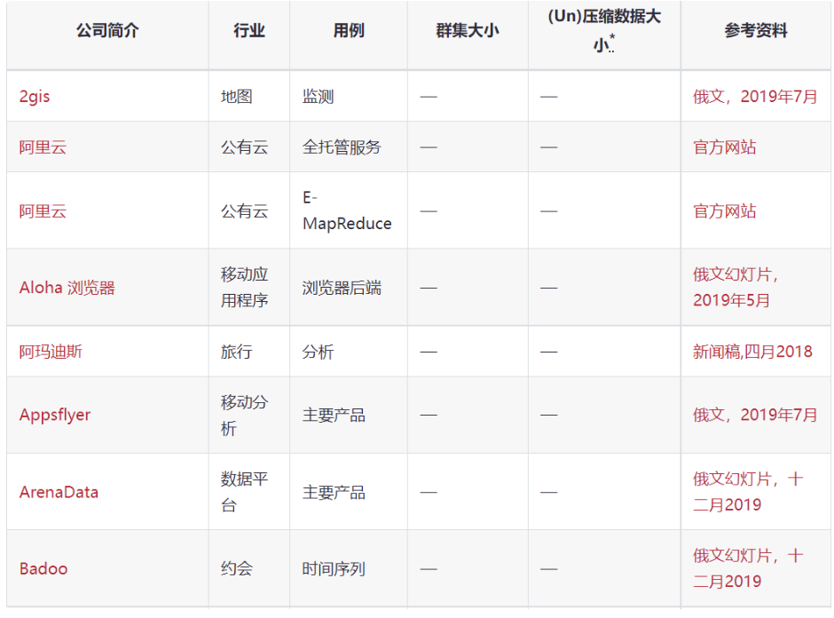
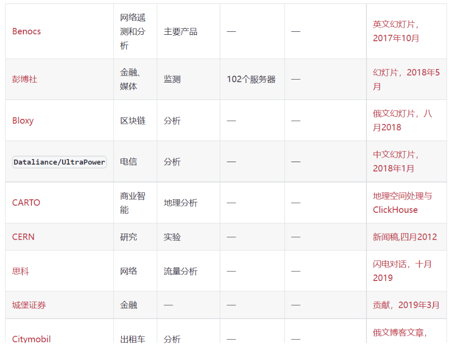
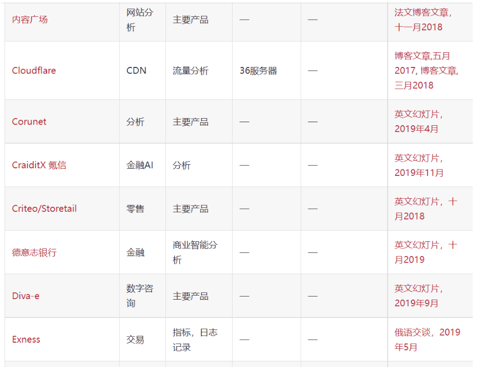
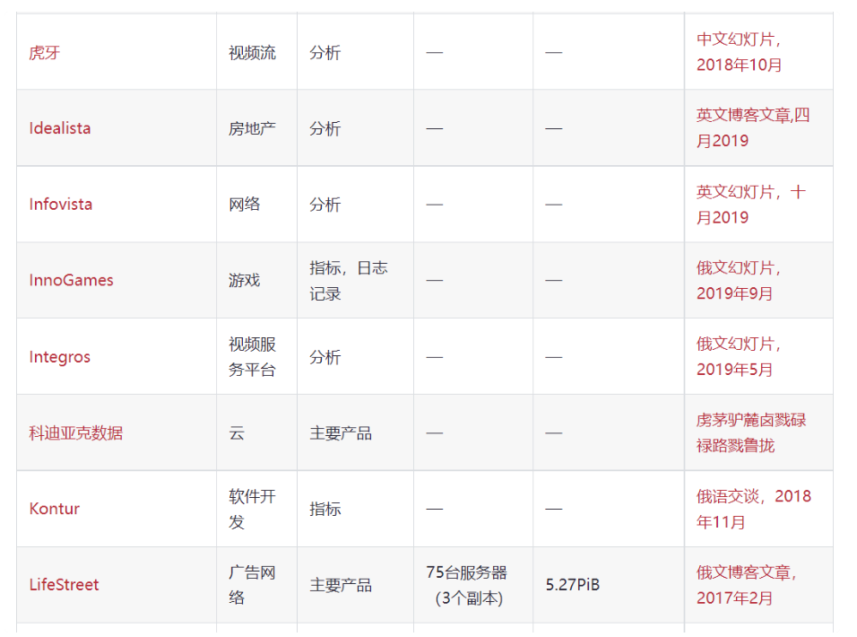

## 一、什么是ClickHouse
ClickHouse是一个用于联机分析(OLAP)的列式数据库管理系统(DBMS)。

<!--more-->

### 1.OLAP是什么？
OLAP是一种软件技术，它使分析人员能够迅速、一致、交互地从各个方面观察信息，以达到深入理解数据的目的。它具有FASMI(Fast Analysis of Shared Multidimensional Information)，即共享多维信息的快速分析的特征。其中F是快速性(Fast)，指系统能在数秒内对用户的多数分析要求做出反应；A是可分析性(Analysis)，指用户无需编程就可以定义新的专门计算，将其作为分析的一部 分，并以用户所希望的方式给出报告；M是多维性(Multi—dimensional)，指提供对数据分析的多维视图和分析；I是信息性(Information)，指能及时获得信息，并且管理大容量信息。

### 2.OLAP场景的关键特征有哪些？
● (1)绝大多数是读请求
● (2)数据以相当大的批次(> 1000行)更新，而不是单行更新;或者根本没有更新。
● (3)已添加到数据库的数据不能修改。
● (4)对于读取，从数据库中提取相当多的行，但只提取列的一小部分。
● (5)宽表，即每个表包含着大量的列
● (6)查询相对较少(通常每台服务器每秒查询数百次或更少)
● (7)对于简单查询，允许延迟大约50毫秒
● (8)列中的数据相对较小：数字和短字符串(例如，每个URL 60个字节)
● (9)处理单个查询时需要高吞吐量(每台服务器每秒可达数十亿行)
● (10)事务不是必须的
● (11)对数据一致性要求低
● (12)每个查询有一个大表。除了他以外，其他的都很小。
● (13)查询结果明显小于源数据。换句话说，数据经过过滤或聚合，因此结果适合于单个服务器的RAM中

## 二、ClickHouse的特性有哪些？
● (1)真正的列式数据库管理系统
● (2)数据压缩
● (3)数据磁盘存储
● (4)多核心并行处理
● (5)多服务器分布式处理
● (6)支持SQL
● (7)向量引擎
● (8)索引
● (9)适合在线查询
● (10)自适应连接算法
● (11)支持数据复制和数据完整性
● (12)角色的访问控制

## 三、ClickHouse的限制因素有哪些？
- 1. 没有完整的事务支持。
- 2. 缺少高频率，低延迟的修改或删除已存在数据的能力。仅能用于批量删除或修改数据，但这符合 GDPR。
- 3. 稀疏索引使得ClickHouse不适合通过其键检索单行的点查询。

## 四、ClickHouse性能怎么样？

性能压测分析报告链接:
https://benchmark.clickhouse.com/

### 1.单个大查询的吞吐量
吞吐量可以使用每秒处理的行数或每秒处理的字节数来衡量。如果数据被放置在page cache中，则一个不太复杂的查询在单个服务器上大约能够以2-10GB／s（未压缩）的速度进行处理（对于简单的查询，速度可以达到30GB／s）。如果数据没有在page cache中的话，那么速度将取决于你的磁盘系统和数据的压缩率。例如，如果一个磁盘允许以400MB／s的速度读取数据，并且数据压缩率是3，则数据的处理速度为1.2GB/s。这意味着，如果你是在提取一个10字节的列，那么它的处理速度大约是1-2亿行每秒。
对于分布式处理，处理速度几乎是线性扩展的，但这受限于聚合或排序的结果不是那么大的情况下。

### 2.处理短查询的延迟时间
如果一个查询使用主键并且没有太多行(几十万)进行处理，并且没有查询太多的列，那么在数据被page cache缓存的情况下，它的延迟应该小于50毫秒(在最佳的情况下应该小于10毫秒)。 否则，延迟取决于数据的查找次数。如果你当前使用的是HDD，在数据没有加载的情况下，查询所需要的延迟可以通过以下公式计算得知： 查找时间（10 ms） * 查询的列的数量 * 查询的数据块的数量。

### 3.处理大量短查询的吞吐量
在相同的情况下，ClickHouse可以在单个服务器上每秒处理数百个查询（在最佳的情况下最多可以处理数千个）。但是由于这不适用于分析型场景。因此我们建议每秒最多查询100次。

### 4.数据的写入性能
我们建议每次写入不少于1000行的批量写入，或每秒不超过一个写入请求。当使用tab-separated格式将一份数据写入到MergeTree表中时，写入速度大约为50到200MB/s。如果您写入的数据每行为1Kb，那么写入的速度为50，000到200，000行每秒。如果您的行更小，那么写入速度将更高。为了提高写入性能，您可以使用多个INSERT进行并行写入，这将带来线性的性能提升。

## 五、ClickHouse常见的应用场景有哪些？
● 监控系统
● AB Test
● 用户行为分析
● BI报表
● 特征分析

## 六、ClickHouse的使用用户有哪些？
来源于官方文档:
https://clickhouse.com/docs/zh/introduction/adopters









由此可知国内外均有应用过ClickHouse到自己的业务中！！！

## 七、ClickHouse如何安装？
官网安装教程:
https://clickhouse.com/docs/zh/getting-started/install

以CentsOS为例，安装步骤如下:
```
sudo yum install -y yum-utils
sudo yum-config-manager --add-repo https://packages.clickhouse.com/rpm/clickhouse.repo
sudo yum install -y clickhouse-server clickhouse-client

sudo /etc/init.d/clickhouse-server start
clickhouse-client # or "clickhouse-client --password" if you set up a password.

```

## 八、YC-Framework如何使用ClickHouse？

### 1.引入依赖
```
<dependency>
    <groupId>com.yc.framework</groupId>
    <artifactId>yc-common-clickhouse</artifactId>
</dependency>

```

### 2.核心配置文件
```
spring:
  datasource:
    type: com.alibaba.druid.pool.DruidDataSource
    click:
      driverClassName: ru.yandex.clickhouse.ClickHouseDriver
      url: jdbc:clickhouse://xx.xx.xx.xx:8123/default
      username: default
      password: 123456
      initialSize: 10
      maxActive: 100
      minIdle: 10
      maxWait: 6000

mybatis-plus:
  mapper-locations: classpath*:mapper/*.xml
  configuration:
    log-impl: org.apache.ibatis.logging.stdout.StdOutImpl
    map-underscore-to-camel-case: true
    cache-enabled: true
    lazy-loading-enabled: true
    multiple-result-sets-enabled: true
    use-generated-keys: true
    default-statement-timeout: 60
    default-fetch-size: 100
  type-aliases-package: com.xrj.clickhouse.pojo

```

相关示例代码地址:
https://github.com/developers-youcong/yc-framework/tree/main/yc-example/yc-example-clickhouse
如果对你有帮助，不妨给个star，鼓励一下！！！

YC-Framework官网：
https://framework.youcongtech.com/

YC-Framework Github源代码：
https://github.com/developers-youcong/yc-framework

YC-Framework Gitee源代码：
https://gitee.com/developers-youcong/yc-framework