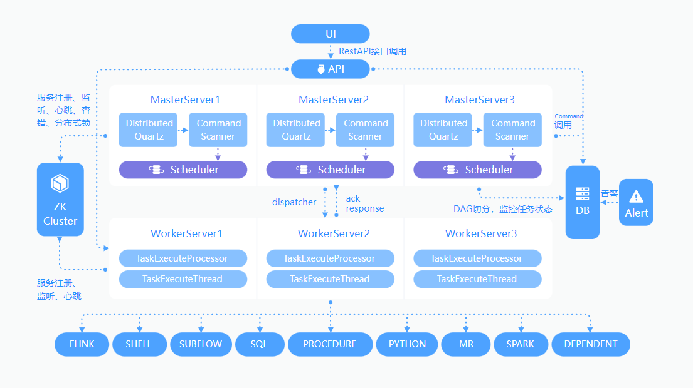
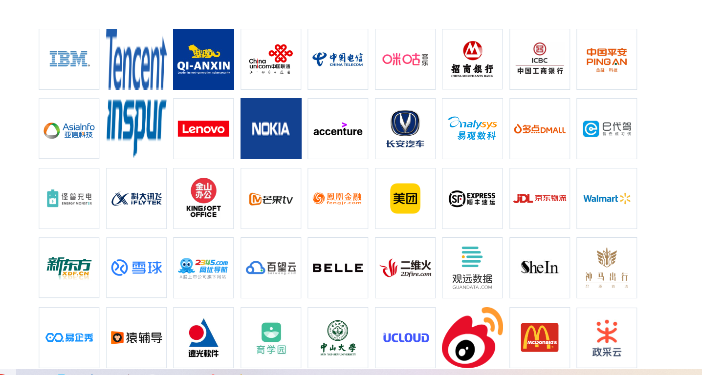

## 一、DolphinScheduler是什么？
Apache DolphinScheduler是一个分布式去中心化，易扩展的可视化DAG工作流任务调度平台。**致力于解决数据处理流程中错综复杂的依赖关系**，使调度系统在数据处理流程中开箱即用。
<!--more-->

## 二、DolphinScheduler具有哪些特性？
- 1.**高可靠性**(去中心化的多Master和多Worker服务对等架构, 避免单Master压力过大，另外采用任务缓冲队列来避免过载)。
- 2.**简单易用**(DAG监控界面，所有流程定义都是可视化，通过拖拽任务完成定制DAG，通过API方式与第三方系统集成, 一键部署)。
- 3.**丰富的使用场景**(支持多租户，支持暂停恢复操作. 紧密贴合大数据生态，提供Spark, Hive, M / R, Python, Sub Process, Shell等近20种任务类型)。
- 4.**高扩展性**(支持自定义任务类型，调度器使用分布式调度，调度能力随集群线性增长，Master和Worker支持动态上下线)。

## 三、DolphinScheduler的系统架构图是怎样的？

## 四、有哪些公司在使用DolphinScheduler？

## 五、DolphinScheduler相关的学习资料有哪些？
官网:
https://dolphinscheduler.apache.org/zh-cn/index.html

官方文档:
https://dolphinscheduler.apache.org/zh-cn/docs/latest/user_doc/about/introduction.html

Github源代码:
https://github.com/apache/dolphinscheduler

## 六、YC-Framework是否支持DolphinScheduler?
答案是支持。欢迎关注YC-Framework！！！

YC-Framework官网：
https://framework.youcongtech.com/

YC-Framework Github源代码：
https://github.com/developers-youcong/yc-framework

YC-Framework Gitee源代码：
https://gitee.com/developers-youcong/yc-framework

以上源代码均已开源，开源不易，如果对你有帮助，不妨给个star，鼓励一下！！！