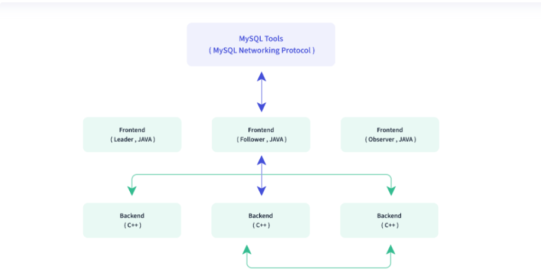
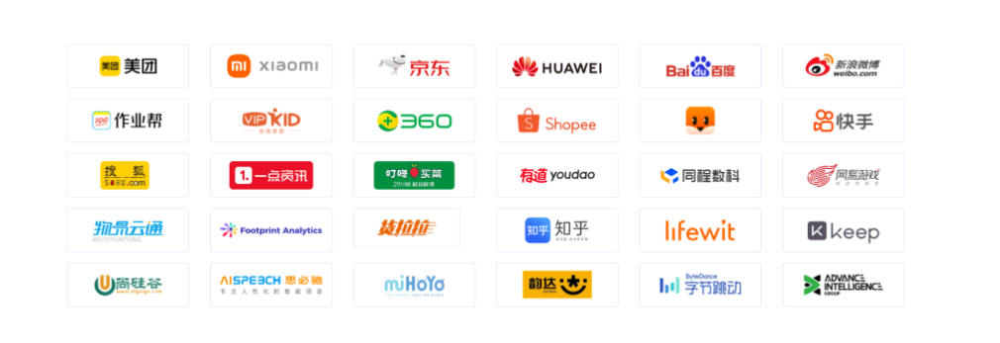

## 一、Doris是什么？
<!--more-->
Apache Doris 是一个基于 MPP 架构的高性能、实时的分析型数据库，以极速易用的特点被人们所熟知，仅需亚秒级响应时间即可返回海量数据下的查询结果，不仅可以支持高并发的点查询场景，也能支持高吞吐的复杂分析场景。基于此，Apache Doris 能够较好的满足报表分析、即席查询、统一数仓构建、数据湖联邦查询加速等使用场景，用户可以在此之上构建用户行为分析、AB 实验平台、日志检索分析、用户画像分析、订单分析等应用。
Apache Doris 最早是诞生于百度广告报表业务的 Palo 项目，2017 年正式对外开源，2018 年 7 月由百度捐赠给 Apache 基金会进行孵化，之后在 Apache 导师的指导下由孵化器项目管理委员会成员进行孵化和运营。目前 Apache Doris 社区已经聚集了来自不同行业近百家企业的 300 余位贡献者，并且每月活跃贡献者人数也接近 100 位。 2022 年 6 月，Apache Doris 成功从 Apache 孵化器毕业，正式成为 Apache 顶级项目（Top-Level Project，TLP）
Apache Doris 如今在中国乃至全球范围内都拥有着广泛的用户群体，截止目前， Apache Doris 已经在全球超过 700 家企业的生产环境中得到应用，在中国市值或估值排行前 50 的互联网公司中，有超过 80% 长期使用 Apache Doris，包括百度、美团、小米、京东、字节跳动、腾讯、网易、快手、微博、贝壳等。同时在一些传统行业如金融、能源、制造、电信等领域也有着丰富的应用。

## 二、Doris具有哪些优势？
● 简单易用(部署只需两个进程，不依赖其他系统；在线集群扩缩容，自动副本修复；兼容 MySQL 协议，并且使用标准 SQL)
● 高性能(依托列式存储引擎、现代的 MPP 架构、向量化查询引擎、预聚合物化视图、数据索引的实现，在低延迟和高吞吐查询上, 都达到了极速性能)
● 统一数仓(单一系统，可以同时支持实时数据服务、交互数据分析和离线数据处理场景)
● 联邦查询(支持对 Hive、Iceberg、Hudi 等数据湖和 MySQL、Elasticsearch 等数据库的联邦查询分析)
● 多种导入(支持从 HDFS/S3 等批量拉取导入和 MySQL Binlog/Kafka 等流式拉取导入；支持通过HTTP接口进行微批量推送写入和 JDBC 中使用 Insert 实时推送写入)
● 生态丰富(Spark 利用 Spark Doris Connector 读取和写入 Doris；Flink Doris Connector 配合 Flink CDC 实现数据 Exactly Once 写入 Doris；利用 DBT Doris Adapter，可以很容易的在 Doris 中完成数据转化)

## 三、Doris的应用场景有哪些？
● 报表分析
  ○ 实时看板 （Dashboards）
  ○ 面向企业内部分析师和管理者的报表
  ○ 面向用户或者客户的高并发报表分析（Customer Facing Analytics）。比如面向网站主的站点分析、面向广告主的广告报表，并发通常要求成千上万的 QPS ，查询延时要求毫秒级响应。著名的电商公司京东在广告报表中使用 Apache Doris ，每天写入 100 亿行数据，查询并发 QPS 上万，99 分位的查询延时 150ms。
● 即席查询（Ad-hoc Query）：面向分析师的自助分析，查询模式不固定，要求较高的吞吐。小米公司基于 Doris 构建了增长分析平台（Growing Analytics，GA），利用用户行为数据对业务进行增长分析，平均查询延时 10s，95 分位的查询延时 30s 以内，每天的 SQL 查询量为数万条。
● 统一数仓构建 ：一个平台满足统一的数据仓库建设需求，简化繁琐的大数据软件栈。海底捞基于 Doris 构建的统一数仓，替换了原来由 Spark、Hive、Kudu、Hbase、Phoenix 组成的旧架构，架构大大简化。
● 数据湖联邦查询：通过外表的方式联邦分析位于 Hive、Iceberg、Hudi 中的数据，在避免数据拷贝的前提下，查询性能大幅提升。

## 四、Doris的整体架构是怎样的？
Doris 架构非常简单，只有两类进程
● Frontend（FE），主要负责用户请求的接入、查询解析规划、元数据的管理、节点管理相关工作。
● Backend（BE），主要负责数据存储、查询计划的执行。
这两类进程都是可以横向扩展的，单集群可以支持到数百台机器，数十 PB 的存储容量。并且这两类进程通过一致性协议来保证服务的高可用和数据的高可靠。这种高度集成的架构设计极大的降低了一款分布式系统的运维成本。

**整体架构如下图所示:**

**在使用接口方面**，Doris 采用 MySQL 协议，高度兼容 MySQL 语法，支持标准 SQL，用户可以通过各类客户端工具来访问 Doris，并支持与 BI 工具的无缝对接。
**在存储引擎方面**，Doris 采用列式存储，按列进行数据的编码压缩和读取，能够实现极高的压缩比，同时减少大量非相关数据的扫描，从而更加有效利用 IO 和 CPU 资源。

## 五、有哪些公司在使用Doris?

## 六、Doris的相关资料有哪些？
官方网站:
https://doris.apache.org/zh-CN/

官方文档:
https://doris.apache.org/zh-CN/docs/summary/basic-summary

下载:
https://doris.apache.org/zh-CN/download

安装部署:
https://doris.apache.org/zh-CN/docs/install/install-deploy

源代码:
https://github.com/apache/doris/

## 七、YC-Framework是否支持Doris?
支持。YC-Framework将大量的博客文章数据存储其中，用于用户画像分析。

**YC-Framework官网：**
https://framework.youcongtech.com/

**YC-Framework Github源代码：**
https://github.com/developers-youcong/yc-framework

**YC-Framework Gitee源代码：**
https://gitee.com/developers-youcong/yc-framework

以上源代码均已开源，开源不易，如果对你有帮助，不妨给个star，鼓励一下！！！