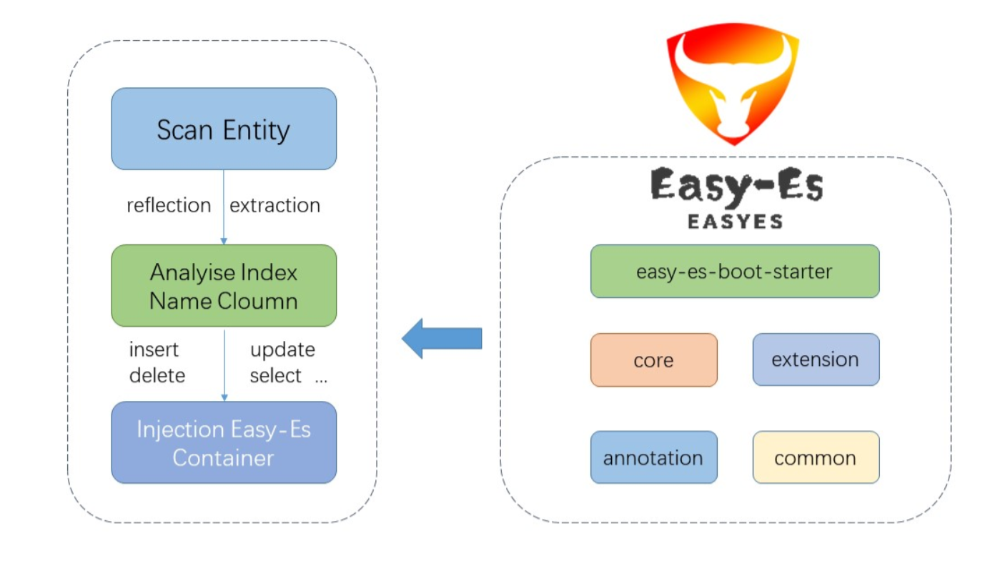

## 一、EasyES是什么？
<!--more-->
Easy-Es（简称EE）是一款基于ElasticSearch(简称Es)官方提供的RestHighLevelClient打造的ORM开发框架，在 RestHighLevelClient 的基础上,只做增强不做改变，为简化开发、提高效率而生,您如果有用过Mybatis-Plus(简称MP),那么您基本可以零学习成本直接上手EE,EE是MP的Es平替版,在有些方面甚至比MP更简单,同时也融入了更多Es独有的功能,助力您快速实现各种场景的开发。

## 二、EasyES的理念是什么？
把简单,易用,方便留给用户,把复杂留给框架。

## 三、EasyES的愿景是什么？
让天下没有难用的ES, 致力于成为全球最受欢迎的ElasticSearch搜索引擎开发框架。

## 四、EasyES的优势有哪些？
- 1.全自动索引托管: 全球开源首创的索引托管模式,开发者无需关心索引的创建更新及数据迁移等繁琐步骤,索引全生命周期皆可托管给框架,由框架自动完成,过程零停机,用户无感知,彻底解放开发者。##
- 2.屏蔽语言差异: 开发者只需要会MySQL语法即可使用Es,真正做到一通百通,无需学习枯燥易忘的Es语法,Es使用相对MySQL较低频,学了长期不用也会忘,没必要浪费这时间.开发就应该专注于业务,省下的时间去撸铁,去陪女朋友陪家人,不做资本家的韭菜。
- 3.代码量极少: 与直接使用RestHighLevelClient相比,相同的查询平均可以节省3-5倍左右的代码量。
- 4.零魔法值: 字段名称直接从实体中获取,无需输入字段名称字符串这种魔法值,提高代码可读性,杜绝因字段名称修改而代码漏改带来的Bug。
- 5.零额外学习成本: 开发者只要会国内最受欢迎的Mybatis-Plus语法,即可无缝迁移至EE,EE采用和前者相同的语法,消除使用者额外学习成本,直接上手,爽。
- 6.降低开发者门槛: Es通常需要中高级开发者才能驾驭,但通过接入EE,即便是只了解ES基础的初学者也可以轻松驾驭ES完成绝大多数需求的开发,可以提高人员利用率,降低企业成本。

## 五、EasyES的特性有哪些？
- 1.**无侵入：**只做增强不做改变，引入它不会对现有工程产生影响，如丝般顺滑。
- 2.**损耗小：**启动即会自动注入基本 CURD，性能基本无损耗，直接面向对象操作。
- 3.**强大的 CRUD 操作：**内置通用 Mapper，仅仅通过少量配置即可实现大部分 CRUD 操作，更有强大的条件构造器，满足各类使用需求。
- 4.**支持 Lambda 形式调用：**通过 Lambda 表达式，方便的编写各类查询条件，无需再担心字段写错段。
- 5.**支持主键自动生成：**支持2 种主键策略，可自由配置，完美解决主键问题。
- 6.**支持 ActiveRecord 模式：**支持 ActiveRecord 形式调用，实体类只需继承 Model 类即可进行强大的 CRUD 操作。
- 7.**支持自定义全局通用操作：**支持全局通用方法注入（ Write once, use anywhere ）。
- 8.**内置分页插件：**基于RestHighLevelClient 物理分页，开发者无需关心具体操作，且无需额外配置插件，写分页等同于普通 List 查询,且保持和PageHelper插件同样的分页返回字段,无需担心命名影响。
- 9.**MySQL功能全覆盖:**MySQL中支持的功能通过EE都可以轻松实现。
- 10.**支持ES高阶语法:**支持高亮搜索,分词查询,权重查询,Geo地理位置查询,IP查询,聚合查询等高阶语法。
- 11.**良好的拓展性:**底层仍使用RestHighLevelClient,可保持其拓展性,开发者在使用EE的同时,仍可使用RestHighLevelClient的功能。

## 六、EasyES的框架结构是怎样的？


## 七、EasyES有哪些应用场景？
ES适用的地方，EasyES同样适用（基本上可满足大多数的场景要求）：

- 1.搜索文库。
- 2.电商商品检索。
- 3.海量系统日志检索。
- 4.在线智能客服。
- 5.机器人。
- 6.打车app。
- 7.外卖app。
- 8.社区团购配送。
- 9.陌生人社交。

## 八、关于EasyES的资料有哪些？
EasyES官方网站:
https://www.easy-es.cn/

EasyES官方文档:
https://www.easy-es.cn/pages/ec7460/

Easy-Es的Gitee仓库：
https://gitee.com/dromara/easy-es

Easy-Es的Github仓库:
https://github.com/dromara/easy-es

开源不易，如果EasyES对你实际中应用ES有所帮助，不妨给个star鼓励一下开源作者。

## 九、在YC-Framework中如何使用EasyES?

### 1.引入依赖
```
<dependency>
    <groupId>com.yc.framework</groupId>
    <artifactId>yc-common-easyes</artifactId>
</dependency>

```

### 2.编写数据实体
```
@Data
public class DocumentEntity {
    /**
     * es中的唯一id
     */
    private String id;
    /**
     * 文档标题
     */
    private String title;
    /**
     * 文档内容
     */
    private String content;
}

```

### 3.编写数据实体访问Mapper
```
@Repository
public interface DocumentMapper extends BaseEsMapper<DocumentEntity> {
}

```

### 4.编写Controller
```
@RestController
public class DocumentController {

    @Autowired
    private DocumentMapper documentMapper;

    @GetMapping("/add")
    public void test() {
        // 测试插入数据
        DocumentEntity document = new DocumentEntity();
        document.setTitle("Hello");
        document.setContent("Hello Easy ES");
        int successCount = documentMapper.insert(document);
        System.out.println(successCount);
    }

    @GetMapping("/query")
    public DocumentEntity query() {
        // 测试查询
        String title = "Hello";
        LambdaEsQueryWrapper<DocumentEntity> wrapper = new LambdaEsQueryWrapper<>();
        wrapper.eq(DocumentEntity::getTitle, title);
        DocumentEntity document = documentMapper.selectOne(wrapper);
        System.out.println(document);
        return document;
    }
}

```

相关示例已上传至Github:
https://github.com/developers-youcong/yc-framework/tree/main/yc-example/yc-example-easyes

YC-Framework官网：
https://framework.youcongtech.com/

YC-Framework Github源代码：
https://github.com/developers-youcong/yc-framework

YC-Framework Gitee源代码：
https://gitee.com/developers-youcong/yc-framework

以上源代码均已开源，开源不易，如果对你有帮助，不妨给个star！！！