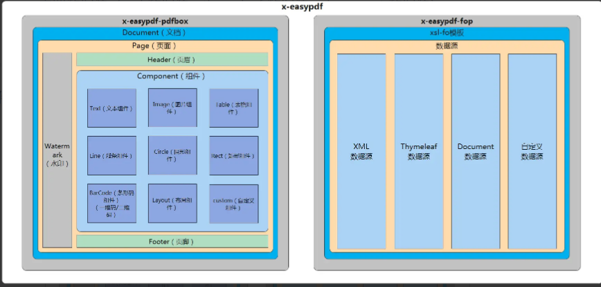

## 一、EasyPdf是什么？
它是一个用搭积木的方式构建pdf的框架（基于pdfbox/fop）。
<!--more-->

## 二、EasyPdf的项目概述有哪些？
x-easypdf基于pdfbox/fop二次封装，拥有两大模块：pdfbox模块极大降低pdfbox的使用门槛，以组件化的形式进行pdf的构建；fop模块采用数据源的方式对xsl-fo模板进行转换。两个模块均可单独使用，也可以结合使用，帮助开发者快速生成pdf文档。

## 三、EasyPdf的软件架构是怎样的？


## 四、关于EasyPdf的资料有哪些？
EasyPdf官网:
https://www.x-easypdf.cn/#/

EasyPdf官方文档:
https://www.x-easypdf.cn/#/README

EasyPdf源代码:
https://gitee.com/dromara/x-easypdf

## 五、YC-Framework中如何使用EasyPdf?

### 1.引入依赖
```
<dependency>
    <groupId>com.yc.framework</groupId>
    <artifactId>yc-common-easypdf</artifactId>
</dependency>

```

### 2.参考文档，编写对应的代码示例测试
```
public class TestEasyPdf {
    // 根据自身情况选择对应保存路径
    private static final String OUTPUT_PATH = "D:\\test\\x-easypdf.pdf";

    public static void main(String[] args) throws IOException {
        // 创建文档
        XEasyPdfDocument document = XEasyPdfHandler.Document.build();
        // 创建页面
        XEasyPdfPage page = XEasyPdfHandler.Page.build();
        // 创建文本组件
        XEasyPdfText text = XEasyPdfHandler.Text.build("It is a test");
        // 将组件添加到页面
        page.addComponent(text);
        // 将页面添加到文档
        document.addPage(page);
        // 保存文档并关闭
        document.save(OUTPUT_PATH).close();
    }
}


```

相关示例代码已上传:
https://github.com/developers-youcong/yc-framework/tree/main/yc-example/yc-example-easypdf

YC-Framework官网：
https://framework.youcongtech.com/

YC-Framework Github源代码：
https://github.com/developers-youcong/yc-framework

YC-Framework Gitee源代码：
https://gitee.com/developers-youcong/yc-framework

以上源代码均已开源，开源不易，如果对你有帮助，不妨给个star！！！

