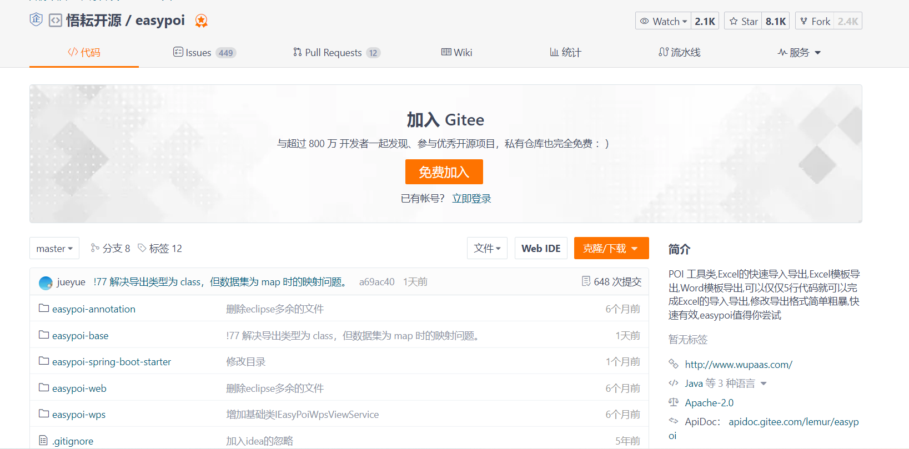
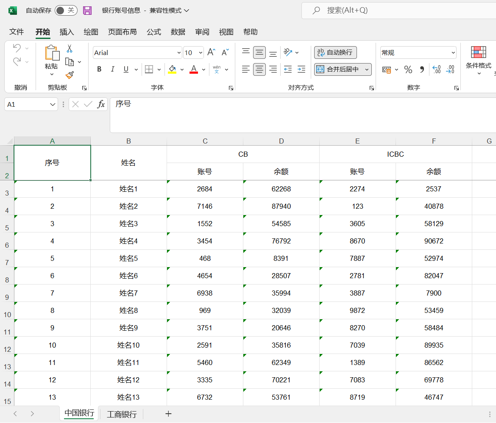

## 一、EasyPoi是为谁而开发的？
<!--more-->

- 1.不太熟悉poi的。
- 2.不想写太多重复太多的。
- 3.只是简单的导入导出的。
- 4.喜欢使用模板的。


## 二、EasyPoi的目标是什么？
EasyPoi的目标不是替代Poi,而是让一个不懂导入导出的快速使用Poi完成Excel和Word的各种操作,而不是看很多api才可以完成这样工作。

## 三、为什么要写EasyPoi？
以前的以前(岁月真TMD的快)我虽然写了不少代码但还是很少写Poi,然后跳到一家公司之后就和业务人员聊上了,来这个需要个报表,这个报表样式是这样的,这个表头是这样的,就这样我写了大量的Poi代码,每次都是大量的篇幅,copy to copy,无聊的一逼,然后加入了Jeecg,Jeecg中有一个小的工具类,虽然我也不知道是谁写的,然是可以用注解搞定最简单的导出,突然豁然开朗,我可以完善,让我从报表的苦海当中脱离出来,这样我花了一周的时间做了第一个版本支持导入导出放到了Jeecg,发现还是不错的,慢慢的用的人越来越多,我就把这块独立出来了,再然后有人提出了模板,然后就加入了模板功能,提出了Word的需求,加入了Word的功能,后来工作忙了虽然没再参与Jeecg,但还是一直维持这EasyPoi的更新,根据见识的增长也不断的重构这代码,直到现在。

## 四、EasyPoi具有哪些独特的功能？
- 1.基于注解的导入导出,修改注解就可以修改Excel。
- 2.支持常用的样式自定义。
- 3.基于map可以灵活定义的表头字段。
- 4.支持一堆多的导出、导入。
- 5.支持模板的导出,一些常见的标签,自定义标签。
- 6.支持HTML/Excel转换,如果模板还不能满足用户的变态需求,请用这个功能。
- 7.支持Word的导出,支持图片,Excel。


## 五、如果是小白该怎样开始？
- 1.下载Demo运行看看,基本上常见的用用法都在里面EasyPoi-test。
- 2.查看几个Util的用法,EasyPoi的主要输出就是这个。
- 3.看看注解的意思。
- 4.看看模板的标签用法。
- 5.可以出师了。

**Demo示例:**
https://gitee.com/lemur/easypoi-test

如果你想了解更多的特性，可以查阅对应的官方文档：
http://doc.wupaas.com/docs/easypoi

EasyPoi源代码:
https://gitee.com/lemur/easypoi

## 六、EasyPoi是否可以商用？
当然可以。官方网站已经给予对应的说明了。如下图所示:


该项目开源活跃情况(迄今为止，该项目已活跃了5年以上):


## 七、有哪些公司在使用EasyPoi？


实际上远远不止上面这么几家公司，还有其它公司，例如:


## 八、YC-Framework是如何支持EasyPoi的？

### 1.引入对应的Maven依赖
```
<dependency>
    <groupId>com.yc.framework</groupId>
    <artifactId>yc-common-easypoi</artifactId>
</dependency>

```

### 2.以多Sheet导出为例
核心代码如下:
```
import cn.afterturn.easypoi.excel.ExcelExportUtil;
import cn.afterturn.easypoi.excel.entity.ExportParams;
import cn.afterturn.easypoi.excel.entity.enmus.ExcelType;
import cn.hutool.core.util.RandomUtil;

import com.yc.example.easypoi.vo.BankVO;
import com.yc.example.easypoi.vo.ChinaBankVO;
import com.yc.example.easypoi.vo.ICBCVO;
import org.apache.poi.ss.usermodel.Workbook;
import org.springframework.web.bind.annotation.GetMapping;
import org.springframework.web.bind.annotation.RestController;

import javax.servlet.http.HttpServletResponse;
import java.io.BufferedOutputStream;
import java.io.OutputStream;
import java.math.BigDecimal;
import java.net.URLEncoder;
import java.util.ArrayList;
import java.util.HashMap;
import java.util.List;
import java.util.Map;

/**
 * @description:
 * @author: youcong
 */

@RestController
public class TestController {

    @GetMapping("/exportExcelTest")
    public void exportExcelTest(HttpServletResponse response) {
        Workbook workbook = null;
        try {
            List<BankVO> dataList1 = new ArrayList<>();
            List<BankVO> dataList2 = new ArrayList<>();
            for (int i = 1; i <= 100; i++) {
                BankVO bankVO = new BankVO();
                bankVO.setNum(i);
                bankVO.setName("姓名" + i);
                List<ChinaBankVO> chinaBankVOList = new ArrayList<>();
                List<ICBCVO> icbcvoList = new ArrayList<>();
                ChinaBankVO cVo = new ChinaBankVO();
                cVo.setAccount(Long.valueOf(RandomUtil.randomNumbers(4)));
                cVo.setTotal(new BigDecimal(RandomUtil.randomNumbers(5)));
                ICBCVO icbcVo = new ICBCVO();
                icbcVo.setAccount(Long.valueOf(RandomUtil.randomNumbers(4)));
                icbcVo.setTotal(new BigDecimal(RandomUtil.randomNumbers(5)));
                chinaBankVOList.add(cVo);
                icbcvoList.add(icbcVo);
                bankVO.setChinaBankVOList(chinaBankVOList);
                bankVO.setIcbcvoList(icbcvoList);
                dataList1.add(bankVO);
                dataList2.add(bankVO);
            }

            List<Map<String, Object>> sheetsList = new ArrayList<>();
            ExportParams siteDayExportParams = new ExportParams();
            siteDayExportParams.setSheetName("中国银行");
            // siteDayExportParams.setStyle(ExcelExportStyler.class);
            ExportParams siteMonthExportParams = new ExportParams();
            siteMonthExportParams.setSheetName("工商银行");
            //siteMonthExportParams.setStyle(ExcelExportStyler.class);
            // 创建sheet1使用得map
            Map<String, Object> siteDayExportMap = new HashMap<>();
            // title的参数为ExportParams类型，目前仅仅在ExportParams中设置了sheetName
            siteDayExportMap.put("title", siteDayExportParams);
            // 模版导出对应得实体类型
            siteDayExportMap.put("entity", BankVO.class);
            // sheet中要填充得数据
            siteDayExportMap.put("data", dataList1);
            // 创建sheet2使用得map
            Map<String, Object> siteMonthExportMap = new HashMap<>();
            siteMonthExportMap.put("title", siteMonthExportParams);
            siteMonthExportMap.put("entity", BankVO.class);
            siteMonthExportMap.put("data", dataList2);

            sheetsList.add(siteDayExportMap);
            sheetsList.add(siteMonthExportMap);

            // Workbook workbook = ExcelExportUtil.exportExcel(new ExportParams(), ExcelTemplateVO.class, dataList);
            workbook = ExcelExportUtil.exportExcel(sheetsList, ExcelType.HSSF);
            // 指定下载的文件名--设置响应头
            response.setHeader("Content-Disposition", "attachment;filename=" + URLEncoder.encode("银行账号信息.xls", "UTF-8"));
            response.setContentType("application/vnd.ms-excel;charset=UTF-8");
            response.setHeader("Pragma", "no-cache");
            response.setHeader("Cache-Control", "no-cache");
            response.setDateHeader("Expires", 0);
            // 写出数据输出流到页面
            OutputStream output = response.getOutputStream();
            BufferedOutputStream bufferedOutPut = new BufferedOutputStream(output);
            workbook.write(bufferedOutPut);
            bufferedOutPut.flush();
            bufferedOutPut.close();
            output.close();
        } catch (Exception e) {
            e.printStackTrace();
        }

    }
}


```

**执行效果图如下所示:**


相关示例参考如下:
https://github.com/developers-youcong/yc-framework/tree/main/yc-example/yc-example-easypoi

以上源代码均已开源，开源不易，如果对你有帮助，不妨给个star！！！

YC-Framework官网：
https://framework.youcongtech.com/

YC-Framework Github源代码：
https://github.com/developers-youcong/yc-framework

YC-Framework Gitee源代码：
https://gitee.com/developers-youcong/yc-framework