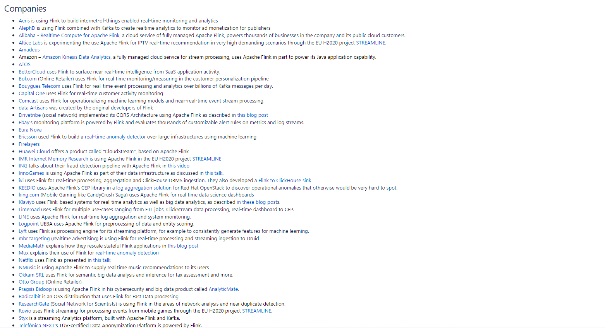

## 一、Flink是什么？
Apache Flink 是一个框架和分布式处理引擎，用于在无边界和有边界数据流上进行有状态的计算。Flink 能在所有常见集群环境中运行，并能以内存速度和任意规模进行计算。
<!--more-->

## 二、Flink主要的应用场景有哪些？
**它的应用场景主要分为三个方面:**

- 1.事件驱动应用。
- 2.数据分析应用。
- 3.数据管道应用。


### 1.事件驱动应用的业务场景有哪些？
- (1)反欺诈；
- (2)异常检测；
- (3)基于规则的报警；
- (4)业务流程监控；
- (5)（社交网络）Web 应用。

### 2.数据分析应用的业务场景有哪些？
- (1)电信网络质量监控；
- (2)移动应用中的产品更新及实验评估分析；
- (3)消费者技术中的实时数据即席分析；
- (4)大规模图分析。

### 3.数据管理应用的业务场景有哪些？
- (1)电子商务中的实时查询索引构建；
- (2)电子商务中的持续 ETL。


## 三、有哪些公司在使用Flink?
以下公司使用案例来自Apache Flink官方文档:


## 四、如何安装Flink？
Flink的安装非常简单，一共可归纳为三个步骤!!!

### 1.下载
```
wget https://archive.apache.org/dist/flink/flink-1.14.2/flink-1.14.2-bin-scala_2.11.tgz


```

### 2.解压
```
tar -zxvf flink-1.14.2-bin-scala_2.11.tgz

```

### 3.启动
```
cd flink-1.7.2/bin/
./start-cluster.sh


```

## 五、有关Flink的相关学习资料有哪些？
Apache Flink官方网站:
https://flink.apache.org/

Flink源代码:
https://github.com/apache/flink


## 六、在YC-Framework中如何使用Flink？

### 1.引入对应的Maven依赖
```
<dependency>
    <groupId>com.yc.framework</groupId>
    <artifactId>yc-common-flink</artifactId>
</dependency>

```
### 2.编写对应的测试类
```
import org.apache.flink.api.common.RuntimeExecutionMode;
import org.apache.flink.api.common.functions.FlatMapFunction;
import org.apache.flink.api.common.functions.MapFunction;
import org.apache.flink.streaming.api.datastream.DataStream;
import org.apache.flink.streaming.api.datastream.DataStreamSource;
import org.apache.flink.streaming.api.datastream.SingleOutputStreamOperator;
import org.apache.flink.streaming.api.environment.StreamExecutionEnvironment;
import org.apache.flink.util.Collector;


public class YCFinkExample {

    public static void main(String[] args) throws Exception {
        // 1.准备环境
        StreamExecutionEnvironment env = StreamExecutionEnvironment.getExecutionEnvironment();
        // 设置运行模式
        env.setRuntimeMode(RuntimeExecutionMode.AUTOMATIC);
        // 2.加载数据源
        DataStreamSource<String> elementsSource = env.fromElements("样本1,样本2,样本3,样本4",
                "样本1,样本2,样本3", "样本1,样本2", "样本1");
        // 3.数据转换
        DataStream<String> flatMap = elementsSource.flatMap(new FlatMapFunction<String, String>() {
            @Override
            public void flatMap(String element, Collector<String> out) throws Exception {
                String[] wordArr = element.split(",");
                for (String word : wordArr) {
                    out.collect(word);
                }
            }
        });
        //DataStream 下边为DataStream子类
        SingleOutputStreamOperator<String> source = flatMap.map(new MapFunction<String, String>() {
            @Override
            public String map(String value) throws Exception {
                return value.toUpperCase();
            }
        });
        // 4.数据输出
        source.print();
        // 5.执行程序
        env.execute("flink-example");
    }
}


```

### 3.pom.xml配置
```
<build>
    <sourceDirectory>src/main/java</sourceDirectory>
    <plugins>
        <!-- 编译插件 -->
        <plugin>
            <groupId>org.apache.maven.plugins</groupId>
            <artifactId>maven-compiler-plugin</artifactId>
            <version>3.5.1</version>
            <configuration>
                <source>1.8</source>
                <target>1.8</target>
                <!--<encoding>${project.build.sourceEncoding}</encoding>-->
            </configuration>
        </plugin>
        <plugin>
            <groupId>org.apache.maven.plugins</groupId>
            <artifactId>maven-surefire-plugin</artifactId>
            <version>2.18.1</version>
            <configuration>
                <useFile>false</useFile>
                <disableXmlReport>true</disableXmlReport>
                <includes>
                    <include>**/*Test.*</include>
                    <include>**/*Suite.*</include>
                </includes>
            </configuration>
        </plugin>
        <!-- 打包插件(会包含所有依赖) -->
        <plugin>
            <groupId>org.apache.maven.plugins</groupId>
            <artifactId>maven-shade-plugin</artifactId>
            <version>2.3</version>
            <executions>
                <execution>
                    <phase>package</phase>
                    <goals>
                        <goal>shade</goal>
                    </goals>
                    <configuration>
                        <filters>
                            <filter>
                                <artifact>*:*</artifact>
                                <excludes>
                                    <!--
                                    zip -d learn_spark.jar META-INF/*.RSA META-INF/*.DSA META-INF/*.SF -->
                                    <exclude>META-INF/*.SF</exclude>
                                    <exclude>META-INF/*.DSA</exclude>
                                    <exclude>META-INF/*.RSA</exclude>
                                </excludes>
                            </filter>
                        </filters>
                        <transformers>
                            <transformer implementation="org.apache.maven.plugins.shade.resource.ManifestResourceTransformer">
                                <!-- 设置jar包的入口类(可选) -->
                                <mainClass>com.yc.example.flink.YCFinkExample</mainClass>
                            </transformer>
                        </transformers>
                    </configuration>
                </execution>
            </executions>
        </plugin>
    </plugins>
</build>

```

### 4.打包并上传至Flink

相关示例代码地址:
https://github.com/developers-youcong/yc-framework/tree/main/yc-example/yc-example-flink

YC-Framework官网：
https://framework.youcongtech.com/

YC-Framework Github源代码：
https://github.com/developers-youcong/yc-framework

YC-Framework Gitee源代码：
https://gitee.com/developers-youcong/yc-framework

以上源代码均已开源，开源不易，如果对你有帮助，不妨给个star，鼓励一下！！！