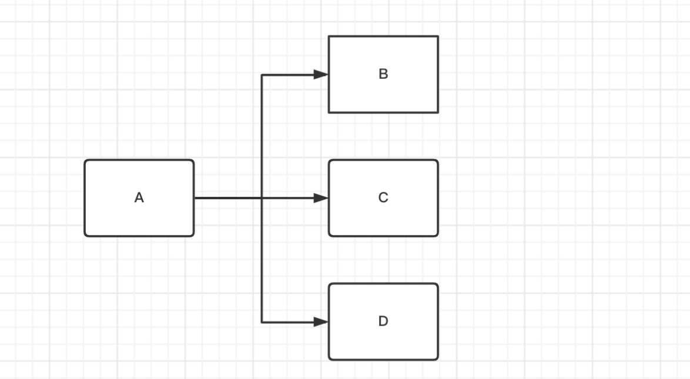
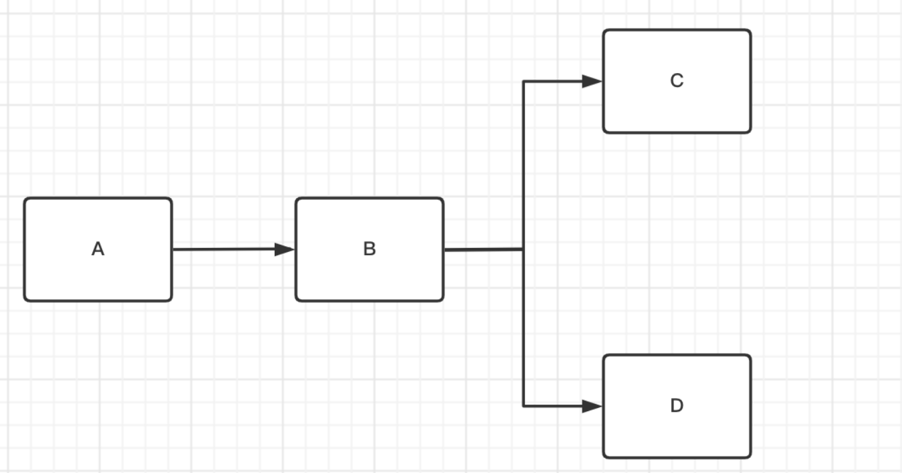
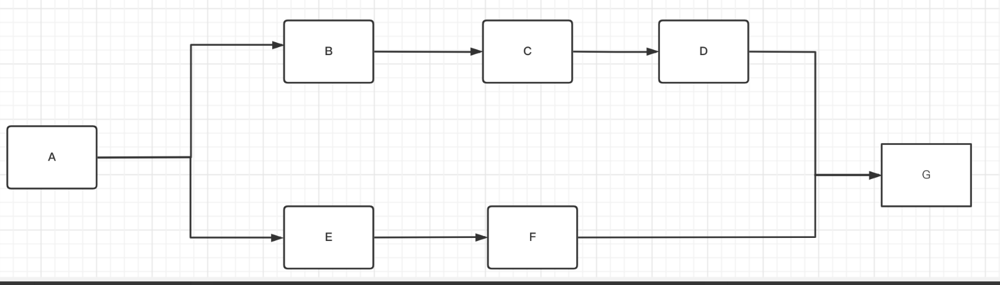
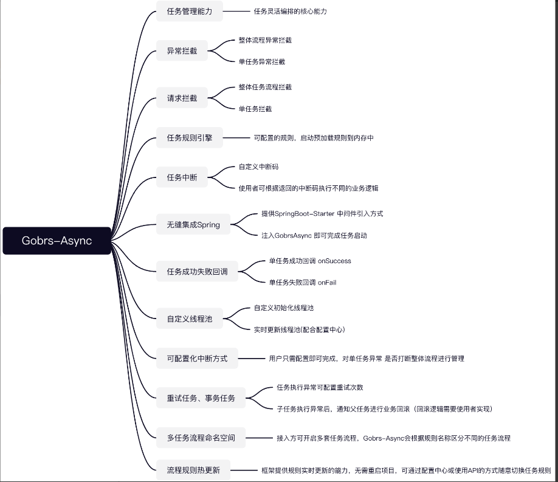
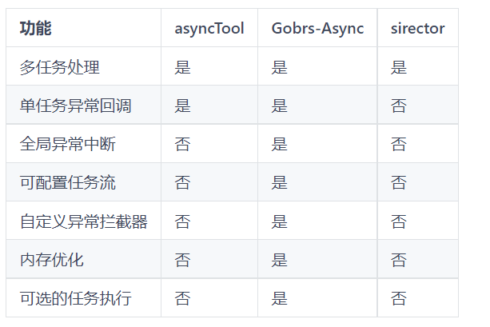
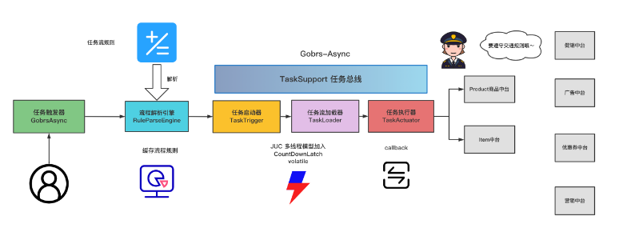
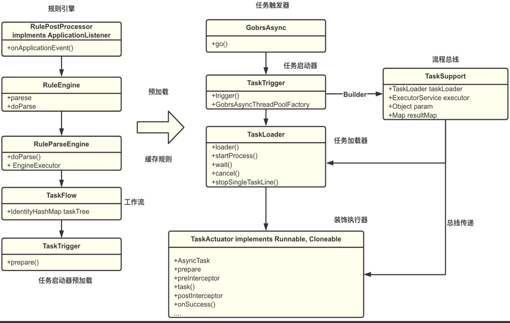

## 一、Gobrs-Async是什么？
<!--more-->
Gobrs-Async是一款功能强大、配置灵活、带有全链路异常回调、内存优化、异常状态管理于一身的高性能异步编排框架。为企业提供在复杂应用场景下动态任务编排的能力。 针对于复杂场景下，异步线程复杂性、任务依赖性、异常状态难控制性； Gobrs-Async为此而生。

## 二、Gobrs-Async能解决什么问题？
能解决CompletableFuture所不能解决的问题。 怎么理解呢？

传统的Future、CompleteableFuture一定程度上可以完成任务编排，并可以把结果传递到下一个任务。如CompletableFuture有then方法，但是却无法做到对每一个执行单元的回调。譬如A执行完毕成功了，后面是B，我希望A在执行完后就有个回调结果，方便我监控当前的执行状况，或者打个日志什么的。失败了，我也可以记录个异常信息什么的。

此时，CompleteableFuture就无能为力了。

Gobrs-Async框架提供了这样的回调功能。并且，如果执行成功、失败、异常、超时等场景下都提供了管理线程任务的能力！

## 三、Gobrs-Async的场景概述是什么？

### 1.场景一


**说明:**
任务A执行完了之后，继续执行B、C、D。

### 2.场景二


**说明:**
任务A执行完了之后执行B然后再执行C、D。

### 3.场景三


**说明:**
任务A 执行完了之后执行B、E 然后按照顺序 B的流程走C、D、G。 E的流程走F、G

## 四、Gobrs-Async的核心能力包含哪些？


## 五、Gobrs-Async与其它多任务异步编排框架对比的结果是怎样的？


## 六、Gobrs-Async能解决哪些问题？
- 1.客户端请求服务端接口，该接口需要调用其他N个微服务的接口。
- 2.并行执行N个任务，后续根据这1-N个任务的执行结果来决定是否继续执行下一个任务。
- 3.需要进行线程隔离的多批次任务。
- 4.单机工作流任务编排。
- 5.其他有顺序编排的需求。

## 七、Gobrs-Async具有怎样的特性？
Gobrs-Async 在开发时考虑了众多使用者的开发喜欢，对异常处理的使用场景。并被运用到电商生产环境中，在京东经历这严酷的高并发考验。同时框架中 极简灵活的配置、全局自定义可中断全流程异常、内存优化、灵活的接入方式、提供SpringBoot Start 接入方式。更加考虑使用者的开发习惯。仅需要注入GobrsTask的Spring Bean 即可实现全流程接入。

Gobrs-Async 项目目录及其精简:

- 1.gobrs-async-example：Gobrs-Async 接入实例，提供测试用例。
- 2.gobrs-async-starter：Gobrs-Async 框架核心组件。

Gobrs-Async在设计时，就充分考虑了开发者的使用习惯，没有依赖任何中间件。对并发框架做了良好的封装。主要使用 CountDownLatch 、ReentrantLock 、volatile 等一系列并发技术开发设计。

## 八、Gobrs-Async的整体架构是怎样的？



### 1.任务触发器
任务流的启动者，负责启动任务执行流。

### 2.规则解析引擎
负责解析使用者配置的规则，同时于Spring结合，将配置的 Spring Bean 解析成 TaskBean，进而通过解析引擎加载成 任务装饰器。进而组装成任务树。

### 3.任务启动器
负责通过使用解析引擎解析的任务树。结合 JUC 并发框架调度实现对任务的统一管理，核心方法有

- (1)trigger 触发任务加载器，为加载任务准备环境。

### 4.任务加载器
负责加载任务流程，开始调用任务执行器执行核心流程：

- (1)load 核心任务流程方法，在这里阻塞等待整个任务流程。
- (2)getBeginProcess 获取子任务开始流程。
- (3)completed 任务完成。
- (4)errorInterrupted 任务失败 中断任务流程。
- (5)error 任务失败。

### 5.任务执行器
最终的任务执行，每一个任务对应一个TaskActuator 任务的 拦截、异常、执行、线程复用 等必要条件判断都在这里处理

- (1)prepare 任务前置处理。
- (2)preInterceptor 统一任务前置处理。
- (3)task 核心任务方法，业务执行内容。
- (4)postInterceptor 统一后置处理。
- (5)onSuccess 任务执行成功回调。
- (6)onFail 任务执行失败回调。

### 6.任务总线
任务流程传递总线，包括 请求参数、任务加载器、 响应结果， 该对象暴露给使用者，拿到匹配业务的数据信息，例如： 返回结果、主动中断任务流程等功能 需要任务总线(TaskSupport)支持。

## 九、Gobrs-Async的核心类图是怎样的？



## 十、在YC-Framework中如何使用Gobrs-Async?

### 1.引入依赖
```
<dependency>
    <groupId>com.yc.framework</groupId>
    <artifactId>yc-common-gobrs-async</artifactId>
</dependency>

```

### 2.编写配置类
```
@Configuration
public class ThreadPoolConfig {

    @Autowired
    private GobrsAsyncThreadPoolFactory factory;

    /**
     * Gobrs thread pool executor.
     */
    @PostConstruct
    public void gobrsThreadPoolExecutor(){
        ThreadPoolExecutor threadPoolExecutor = new ThreadPoolExecutor(300, 500, 30, TimeUnit.SECONDS,
                new LinkedBlockingQueue());
        factory.setThreadPoolExecutor(threadPoolExecutor);
    }

}

```

### 3.编写多个Task（具体参照YC-Framework对应的Example)

### 4.编写Service
```
@Service
public class GobrsService {

    @Autowired
    private AService aService;

    @Autowired
    private BService bService;
    
    @Autowired
    private CService cService;
    
    @Autowired
    private DService dService;

    @Autowired
    private EService eService;

    @Autowired
    private FService fService;

    @Autowired
    private GService gService;

    @Resource
    private GobrsAsync gobrsAsync;

    @Resource
    private RuleThermalLoad ruleThermalLoad;

    /**
     * The Executor service.
     */
    ExecutorService executorService = Executors.newCachedThreadPool();


    /**
     * Gobrs async.
     */
    public void gobrsAsync() {
        gobrsAsync.go("test", () -> new Object());
    }


    /**
     * Future.
     */
    public void future() {
        List<AsyncTask> abList = new ArrayList<>();
        abList.add(aService);
        abList.add(bService);
        List<Future> futures = new ArrayList<>();
        for (AsyncTask task : abList) {
            Future<Object> submit = executorService.submit(() -> task.task(new Object(), null));
            futures.add(submit);
        }

        for (Future future : futures) {
            try {
                Object o = future.get();
            } catch (InterruptedException e) {
                e.printStackTrace();
            } catch (ExecutionException e) {
                e.printStackTrace();
            }
        }

        List<AsyncTask> cdList = new ArrayList<>();
        cdList.add(cService);
        cdList.add(dService);
        List<Future> futurescd = new ArrayList<>();
        for (AsyncTask task : cdList) {
            Future<Object> submit = executorService.submit(() -> task.task(new Object(), null));
            futurescd.add(submit);
        }

        for (Future future : futurescd) {
            try {
                Object o = future.get();
            } catch (InterruptedException e) {
                e.printStackTrace();
            } catch (ExecutionException e) {
                e.printStackTrace();
            }
        }


        List<AsyncTask> efList = new ArrayList<>();
        efList.add(eService);
        efList.add(fService);
        List<Future> futuresef = new ArrayList<>();
        for (AsyncTask task : efList) {
            Future<Object> submit = executorService.submit(() -> task.task(new Object(), null));
            futuresef.add(submit);
        }

        for (Future future : futuresef) {
            try {
                Object o = future.get();
            } catch (InterruptedException e) {
                e.printStackTrace();
            } catch (ExecutionException e) {
                e.printStackTrace();
            }
        }


        Future<Object> submit = executorService.submit(() -> gService.task(new Object(), null));
        try {
            submit.get();
        } catch (InterruptedException e) {
            e.printStackTrace();
        } catch (ExecutionException e) {
            e.printStackTrace();
        }


    }

    /**
     * Update rule.
     *
     * @param rule the rule
     */
    public void updateRule(Rule rule) {
        Rule r = new Rule();
        r.setName("ruleName");
        r.setContent("AService->CService->EService->GService; BService->DService->FService->HService;");
        ruleThermalLoad.load(rule);
    }
}


```

### 5.编写拦截器
```
@Slf4j
@Component
public class GobrsInterceptor implements AsyncTaskExceptionInterceptor {


    @SneakyThrows
    @Override
    public void exception(ErrorCallback errorCallback) {

        log.error("Execute global interceptor  error{}", JsonUtil.obj2String(errorCallback.getThrowable()));
    }
}

```

### 6.编写Controller
```
@RestController
@RequestMapping("gobrs")
public class GobrsController {

    @Resource
    private GobrsAsync gobrsAsync;

    @Autowired
    private GobrsService gobrsService;

    /**
     * Gobrs test string.
     *
     * @return the string
     */
    @RequestMapping("testGobrs")
    public String gobrsTest() {
        Map<Class, Object> params = new HashMap<>();
        params.put(AService.class, "A的参数");
        AsyncResult test = gobrsAsync.go("test", () -> params);
        return "success";
    }


    /**
     * Future.
     */
    @RequestMapping("future")
    public void future() {
        long start = System.currentTimeMillis();
        gobrsService.future();

        long coust = System.currentTimeMillis() - start;
        System.out.println("future " + coust);

    }


    /**
     * Sets gobrs async.
     */
    @RequestMapping("gobrsAsync")
    public void setGobrsAsync() {
        //开始时间: 获取当前时间毫秒数
        long start = System.currentTimeMillis();
        gobrsService.gobrsAsync();
        //结束时间: 当前时间 - 开始时间
        long coust = System.currentTimeMillis() - start;
        System.out.println("gobrs-Async " + coust);

    }

    /**
     * Update rule.
     *
     * @param rule the rule
     */
    @RequestMapping("updateRule")
    public void updateRule(@RequestBody Rule rule) {
        gobrsService.updateRule(rule);
    }
}

```

相关示例代码，已上传至Github:
https://github.com/developers-youcong/yc-framework/tree/main/yc-example/yc-example-gobrs-async

YC-Framework官网：
https://framework.youcongtech.com/

YC-Framework Github源代码：
https://github.com/developers-youcong/yc-framework

YC-Framework Gitee源代码：
https://gitee.com/developers-youcong/yc-framework


以上源代码均已开源，开源不易，如果对你有帮助，不妨给个star！！！