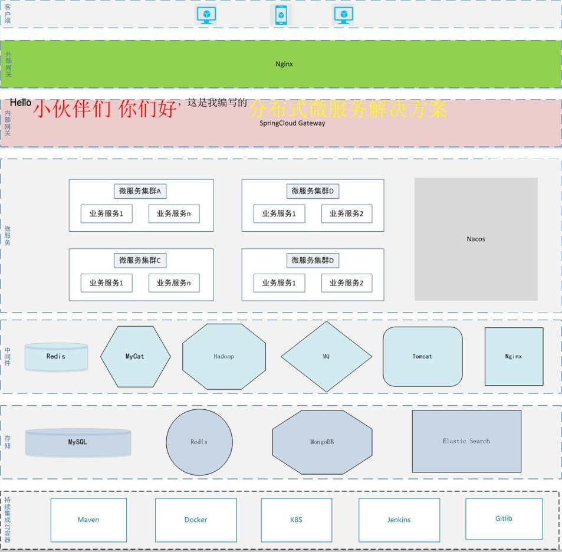
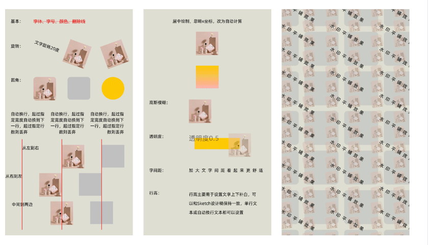

## 一、Image-Combiner是什么？
ImageCombiner是一个专门用于Java服务端图片合成的工具，没有很复杂的功能，简单实用，从实际业务场景出发，提供简单的接口，几行代码即可实现图片拼合（当然用于合成水印也可以），素材上支持图片、文本、矩形三种，支持定位、缩放、旋转、圆角、透明度、颜色、字体、字号、删除线、居中绘制、文本自动换行等特性，足够覆盖图片合成的日常需求。
<!--more-->

## 二、Image-Combiner诞生的背景是什么？
**该开源作者这样叙述:**
最近公司上了不少传播方面的需求，免不了合成各种营销图片，图片合成本身并不是什么高深的技术，但用底层api去搞确实繁琐，于是抽时间封装了一个小工具，初衷是解放生产力，后来发现挺好使，那就开源吧，花了一个整天重新整理了一下代码，作为自己从业十年第一个开源项目（打破零记录，哈哈），希望能够帮助到需要的小伙伴~。

## 三、Image-Combiner的UML图是怎样的？


## 四、Image-Combiner如何使用？
ImageCombiner使用起来相当简单，主要的类只用一个，new一个ImageCombiner对象，指定背景图片和输出格式，然后加入各种素材元素，设置元素的位置、大小和效果（如圆角、颜色、透明度等），调用combine()方法即可。combine()方法直接返回BufferedImage对象，也可以调用getCombinedImageStream()获得流，方便上传oss等后续操作，或者调用save()方法保存到本地，调试的时候比较方便。

YC-Framework已集成该工具，**具体示例如下:**
```
import com.freewayso.image.combiner.ImageCombiner;
import com.freewayso.image.combiner.element.TextElement;
import com.freewayso.image.combiner.enums.OutputFormat;
import java.awt.*;

public class TestImageCombiner {

    public static void dynamicWidthDemoTest() throws Exception {
        String bg = "https://framework.youcongtech.com/_media/%E6%8A%80%E6%9C%AF%E6%9E%B6%E6%9E%84%E5%9B%BE-V1.0.jpg";
        ImageCombiner combiner = new ImageCombiner(bg, OutputFormat.JPG);
        String str1 = "Hello";
        String str2 = "小伙伴们 你们好";
        String str3 = "，这是我编写的";
        String str4 = "分布式微服务解决方案";
        int fontSize = 20;
        int xxxFontSize = 40;
        int offsetX = 20;   //通过计算前一个元素的实际宽度，并累加这个偏移量，得到后一个元素正确的x坐标值
        int y = 200;

        //第一段
        TextElement element1 = combiner.addTextElement(str1, fontSize, offsetX, y);
        offsetX += element1.getWidth();     //计算宽度，并累加偏移量

        //第二段（内容不定，宽度也不定）
        TextElement element2 = combiner.addTextElement(str2, xxxFontSize, offsetX, y)
                .setColor(Color.red);
        offsetX += element2.getWidth();

        //第三段
        TextElement element3 = combiner.addTextElement(str3, fontSize, offsetX, y);
        offsetX += element3.getWidth();

        //第四段（内容不定，宽度也不定）
        TextElement element4 = combiner.addTextElement(str4, xxxFontSize, offsetX, y)
                .setColor(Color.YELLOW);
        offsetX += element4.getWidth();

        combiner.combine();
        combiner.save("d://test//demo.jpg");
    }

    public static void main(String[] args) throws Exception {
        dynamicWidthDemoTest();
    }
}


```

该代码运行效果图如下所示:


相关示例已上传至Github:
https://github.com/developers-youcong/yc-framework/tree/main/yc-example/yc-example-image-combiner

以上源代码均已开源，开源不易，如果对你有帮助，不妨给个star！！！

YC-Framework官网：
https://framework.youcongtech.com/

YC-Framework Github源代码：
https://github.com/developers-youcong/yc-framework

YC-Framework Gitee源代码：
https://gitee.com/developers-youcong/yc-framework

## 五、相关作品集的效果图有哪些？


