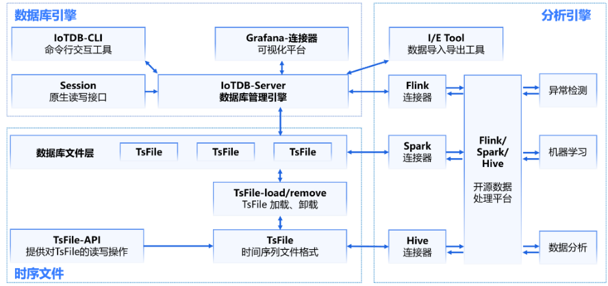

## 一、IoTDB是什么？
Apache IoTDB（物联网数据库）是一体化收集、存储、管理与分析物联网时序数据的软件系统。 Apache IoTDB 采用轻量式架构，具有高性能和丰富的功能，并与Apache Hadoop、Spark和Flink等进行了深度集成，可以满足工业物联网领域的海量数据存储、高速数据读取和复杂数据分析需求。
<!--more-->

## 二、IoTDB的主要特点有哪些？
● 高吞吐量读写(Apache IoTDB中可以支持数百万个低功耗和智能联网设备的高速写访问。 它还提供数据快速读取访问以查询)
● 高效的树形元数据结构(Apache IoTDB可以对拥有复杂组织关系的物联网设备进行树形结构管理，并使用通配符对这些元数据进行模糊匹配)
● 丰富的查询语义(Apache IoTDB可以支持跨设备和传感器的时间对齐查询，在时间维度上的聚合（降采样）等)
● 硬件成本低(Apache IoTDB可以实现磁盘存储的高压缩率)
● 灵活的部署(Apache IoTDB可以为用户提供云上的一键式安装、终端访问工具以及边-云之间的协同（数据同步工具）)
● 与开源系统的紧密集成(Apache IoTDB支持许多大数据软件生态系统，例如Hadoop、Spark、Flink和Grafana（可视化工具）)

## 三、IoTDB的应用场景有哪些？

### 1.本地控制器
在工厂现场，LAN网络下有数十台设备。 IoTDB可以安装在工厂的本地控制器服务器上，以从这些设备接收数据。 安装有IoTDB的本地服务器（普通PC或工作站）可以使用类SQL存储和查询数据。 此外，使用TsFile-Sync工具，可以将本地控制器上的TsFile文件传输到云上安装有IoTDB实例的数据中心。

### 2.云数据管理
在高速网络（车联网等）的场景中，安装有传感器的汽车可以以一定频率收集自身的监视信息（行驶状态等）。 通常，这些汽车设备的硬件配置有限，并且难以进行复杂的应用。 轻量级的IoTDB（IoTDB客户端）应运而生。 借助JDBC API（或MQTT），它可以使用窄带IoT或4G/5G发送数据，从而将设备和云连接在一起。

### 3.高端设备
在高端制造业中，有很多设备配备有传感器来收集工作状态数据，例如气象站，风力涡轮机是常见的高端设备。这些设备如果支持Java或Go（正在开发中），则可以运行TsFile在本地存储数据。通过这种方式，TsFile可以提供具有高吞吐、高压缩率和毫秒级查询延迟的数据管理功能。结合TsFile-Sync工具，可以将TsFiles同步到数据中心。

## 四、IoTDB的系统架构是怎样的？


## 五、如何安装IoTDB?

### 1.下载
```
wget https://dlcdn.apache.org/iotdb/1.0.0/apache-iotdb-1.0.0-all-bin.zip

```

### 2.解压
```
unzip apache-iotdb-1.0.0-all-bin.zip

```

### 3.启动
```
bash sbin/start-standalone.sh
或
sbin\start-standalone.bat

```

## 六、IoTDB相关资料有哪些？
官网:
https://iotdb.apache.org/zh/

文档:
https://iotdb.apache.org/zh/UserGuide/Master/QuickStart/QuickStart.html

下载:
https://iotdb.apache.org/zh/Download/

源代码:
https://github.com/apache/iotdb

## 七、YC-Framework是否支持？
支持。在做物联网相关的项目会用到IoTDB。

YC-Framework官网：
https://framework.youcongtech.com/

YC-Framework Github源代码：
https://github.com/developers-youcong/yc-framework

YC-Framework Gitee源代码：
https://gitee.com/developers-youcong/yc-framework

以上源代码均已开源，开源不易，如果对你有帮助，不妨给个star，鼓励一下！！！